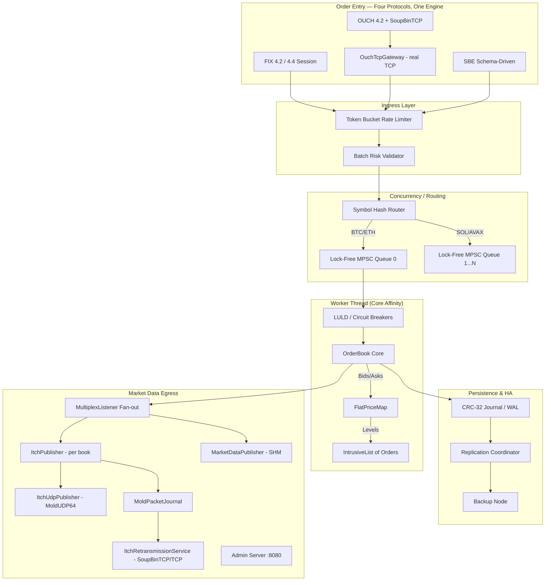

# Order Matching Engine - Architecture & Design

This document details the architectural decisions, component lifecycles, failure modes, and engineering trade-offs of the C++20 Order Matching Engine. It serves as a guide for contributors, system architects, and researchers exploring high-performance trading infrastructure.

---

## 1. Design Philosophy & Key Trade-offs

The architecture is driven by three primary constraints: **predictable low latency**, **deterministic execution**, and **high availability**.

### Why Not Traditional Mutexes?
A naive matching engine protects the order book with a `std::mutex`. Under high load, threads spend more time context-switching and fighting for the lock than executing trades. 
**Our Trade-off:** We use a **Thread-per-Symbol (Sharded) Model**. Each thread owns specific instruments exclusively. Producers (Gateway/API) push orders into lock-free Multi-Producer Single-Consumer (`MpscQueue`) ring buffers. The matching thread never blocks on locks.

### Why Not `std::map`?
`std::map` is a Red-Black tree. Traversing it means jumping across random heap allocations, destroying CPU cache locality.
**Our Trade-off:** We built `FlatPriceMap`, a contiguous array indexed directly by price ticks. Finding the next best price is an $O(1)$ pointer arithmetic operation. It costs more memory (pre-allocating the price range) but guarantees cache-hot O(1) lookups.

### Why Intrusive Lists?
Using `std::list` or `std::vector` for orders at a price level requires dynamic heap allocations (`new`/`delete`), which induce unpredictable OS-level latency spikes.
**Our Trade-off:** We use an `ObjectPool` to pre-allocate millions of `Order` structs at startup. The `Order` struct itself contains the `next` and `prev` pointers. When an order is added, it is simply linked into the `IntrusiveList`. Zero heap allocations happen on the hot path.

---

## 2. System Topology & Data Flow



### The Component Lifecycle

**Order entry**:
1. **Wire framing**: bytes arrive on TCP. The connection's session class (`FixSession` for FIX 4.2/4.4 text, `OuchSession` for NASDAQ OUCH binary, `SbeSession` for FIX-TG SBE) handles framing. OUCH is additionally wrapped in `SoupBinTcpSession` (3-byte length+type envelope, login/heartbeat/logout).
2. **Pre-Trade Risk**: the order passes through `RateLimiter` and `BatchRiskValidator` (notional, fat-finger, kill-switch).
3. **Routing**: `MatchingEngine` hashes `SymbolId` and pushes the order into the appropriate thread's `MpscQueue`.
4. **Dequeue & Validate**: the worker thread pops the order. `LULDManager` (Limit Up-Limit Down) bands verify the instrument isn't halted.
5. **Matching**: `OrderBook` matches against resting liquidity. `WashTradeDetector` applies Self-Trade Prevention.
6. **Persistence**: trades and book updates are appended to the `Journal` (Write-Ahead Log).

**Market data egress** (parallel to order entry):
7. **Fan-out**: every engine event reaches `MultiplexListener`, which dispatches to all registered `EventListener`s simultaneously.
8. **ITCH encoding**: `ItchPublisher` translates engine events to ITCH 5.0 frames (`A` AddOrder, `E` Executed, `D` Delete, `H` TradingAction reflecting `TradingState`, `R` StockDirectory, `Q` CrossTrade, etc.).
9. **MoldUDP64 publish**: `ItchUdpPublisher` wraps each frame in a sequenced MoldUDP64 packet and `sendto`s a UDP multicast group. The same frame is recorded in `MoldPacketJournal` keyed by the assigned sequence number.
10. **Gap recovery**: a subscriber that detects a sequence gap connects to `ItchRetransmissionService` (TCP, SoupBinTCP-framed), sends a re-request packet (`R` tag + start/count), and receives the missing frames byte-exactly as journaled.

The order-entry and market-data paths share no synchronous coupling — a subscriber that's slow or absent never backpressures order matching.

### Admin HTTP Server Endpoints (`:8080`)

The `AdminServer` exposes a lightweight HTTP interface for ops tooling and container orchestration. All endpoints except where noted require the `Authorization: Bearer <token>` header (configurable via `OB_ADMIN_TOKEN`).

| Endpoint | Auth required | Description |
| :--- | :--- | :--- |
| `GET /health` | No | Liveness probe: returns 200 while the process is running. |
| `GET /readyz` | No | Readiness probe (k8s `readinessProbe`): returns HTTP 503 until `admin.setReady(true)` is called after warmup (or backup replay-mode entry), then 200. Auth-exempt so k8s can poll it without credentials. |
| `GET /metrics` | Yes | JSON snapshot of internal counters and gauges. |
| `GET /prometheus` | Yes | Prometheus text-exposition format: `journal_entries_committed_total`, `replication_entries_shipped_total`, `replication_bytes_sent_total`, etc. |
| `GET /version` | Yes | Returns `gitSha` (12-char), UTC `buildTime`, and `engineVersion` captured at CMake configure time. |
| `POST /kill-switch` | Yes | Toggles the graduated kill-switch for a participant. |

---

## 3. Deep Dive: Core Components

### 3.1 OrderBook & Data Structures
The core of the engine is purely single-threaded and deterministic.
- **`Order`**: A 192-byte `alignas(64)` struct containing ID, price, quantity, participant ID, and intrusive pointers (`sizeof(Order) == 192`).
- **`FlatPriceMap`**: A fixed-size array covering the valid tick range of an instrument. If BTC trades from \$0 to \$100,000 at \$0.01 increments, the map has 10,000,000 slots. Memory is cheap; cache misses are expensive.
- **`FlatHashMap`**: Used for O(1) order cancellation by `OrderId`. It uses Robin-Hood open-addressing to maintain cache density.

### 3.2 ShardedOrderBook & Horizontal Scaling
To scale beyond a single core, the engine utilizes the `ShardedOrderBook`.
Instead of placing all instruments in one book, instruments are sharded across $N$ instances. Each worker thread runs an independent event loop pinned to a specific CPU core. Affinity is set inline at thread startup in `MatchingEngine.cpp` — `pthread_setaffinity_np` with a `cpu_set_t` on Linux, and `thread_policy_set(..., THREAD_AFFINITY_POLICY, ...)` on macOS. Cross-symbol interactions are heavily restricted to maintain this isolation.

### 3.3 ShadowEngine (Dark Launching)
For algorithmic testing and capacity planning, the `ShadowEngine` allows cloning production state. It consumes production traffic (via a fork or replay) but suppresses all outbound executions and market data. By taking a read-only snapshot of the production book and replaying subsequent events from a specific journal offset, the shadow instance accurately mirrors live execution logic without corrupting the production order book or impacting live network egress. This allows safe, realistic load testing of new engine versions against live market flow.

### 3.4 Structured Logging & Observability

The engine emits structured events through the `StructuredSink` interface defined in `StructuredLog.h`. Typed helper functions enforce required fields for each event class and forward to the active `obSink()` backend:

- **`NullSink`**: no-op, used in production builds where log volume is unacceptable.
- **`JsonStderrSink`**: serialises each event to a single-line JSON object on stderr — suited for container log aggregators (Fluentd, Vector).
- **`CapturingSink`**: accumulates events in memory; used in unit tests to assert that specific events are emitted.

`OrderBook.cpp` wires **7 typed call sites** through the sink: order accepted (×2 paths — new and replace), order cancelled, order rejected (risk limit), trade fill, circuit breaker trip, and trading state change. Swapping the backend (e.g. from `NullSink` to `JsonStderrSink`) requires no changes to call sites. Verified by `StructuredLogTest`.

### 3.5 Regulatory & Compliance Controls
- **WashTradeDetector (SMP)**: Prevents participants from matching against themselves.
- **LULDManager**: Dynamically updates acceptable price bands based on recent trade prices, halting matching if prices gap too quickly.
- **GraduatedKillSwitch**: Automatically disables trading for participants who breach soft/hard risk limits.
- **MOC/LOC On-Close Orders**: `TradingState`-aware admission — MOC/LOC orders park in `onCloseOrders_` during Continuous/PreOpen/AuctionOpen; released to the book at `AuctionClose`; LOC remainder cancelled via `cancelLocOrders()` after uncross. Enables closing cross participation without continuous-session cross risk.
- **LMM/DMM Floor Guarantee**: `ParticipantRole` per participant (`Regular`, `LMM`, `DMM`). ProRata allocation redistributes from Regular participants to ensure LMM/DMM orders receive at least 40% of their available qty; rounding remainders distributed to privileged roles before Regular participants.
- **CAT Regulatory Audit Trail**: `CatReporter` writes NDJSON event records (order events, cancels, trades) with nanosecond timestamps for CAT/MiFID II compliance.
- **Fee/Rebate Engine**: `FeeEngine` calculates maker-taker schedules in real-time on every trade event.
- **Hierarchical Risk Manager**: `HierarchicalRiskManager` enforces multi-tier position limits (Firm/Account/Strategy/Trader) plus fat-finger checks (max notional, percentage away from NBBO).

### 3.6 Wire Protocol Stack

Four wire protocols dispatch into the same `MatchingEngine`. The session class is the only thing that changes between them; the engine doesn't know which codec it's driving.

| Protocol | Spec family | Wire format | Endianness | Session layer | Used by |
| :--- | :--- | :--- | :--- | :--- | :--- |
| **FIX 4.2 / 4.4** | FIX Trading Community | ASCII tag=value with SOH delimiter + checksum | n/a (text) | `FixSession.h` — Logon/Heartbeat/ResendRequest state machine, OrdRejReason mapping, TransactTime validation on 4.4 inbound | Most B-Ds and retail brokers |
| **OUCH 4.2** | NASDAQ | Fixed-width binary, big-endian, ASCII-decimal slots | BE | `OuchSession.h` + `SoupBinTcpSession.h` (3-byte envelope, login, heartbeat, logout) | NASDAQ direct order entry |
| **ITCH 5.0** | NASDAQ | Fixed-width binary, big-endian | BE | One-way feed (publish only) — `ItchPublisher.h` + `ItchUdpTransport.h` wrapping `MoldUDP64.h` for multicast | NASDAQ market data |
| **SBE** | FIX-TG | Schema-driven binary, length-prefixed blocks, **forward-compatible** | LE (native) | `SbeSession.h` — versioned `MessageHeader`, `templateId` dispatch | CME, ICE, several modern venues |

**SBE forward-compatibility, in detail**: every SBE message starts with an 8-byte `MessageHeader` that includes the `blockLength` of the fixed-size block that follows. When a v2 schema adds a field at the end of a block:
- v2 publishers emit `blockLength=v2_size`. Their messages include the new field.
- v1 readers ignore the unknown trailing bytes (they only read up to `v1_size`).
- v1 readers see the original fields **byte-identically** because the v1 block IS a prefix of the v2 block. No codec branch, no version dispatch — just `read up to my known size`.
- v2 readers handle a v1 message by using `blockLength=v1_size` from the header to skip the absent new fields; they fill in documented defaults.

This is proven byte-exactly via test in `SbeProtocolTest`: encoding a struct with the v2 codec, then byte-comparing the first `v1_size` bytes against the v1 encoding of the same field set, asserts equality. This is the property that makes SBE viable for incremental schema evolution at production scale.

**Wire versioning**: `ProtocolVersion.h` provides a single source-of-truth for wire format version numbers. Backward and forward compatibility are asserted by `ProtocolVersioningTest` — every version bump triggers a compile-time check that both an old decoder and a new decoder can round-trip each other's messages without data loss.

**Gap-recovery flow** (market data side):
1. `MoldUDP64Publisher` assigns a sequence number to each ITCH frame as it enters the batch.
2. `ItchUdpPublisher::publish()` writes the MoldUDP64 datagram via `sendto`.
3. The same frame is appended to `MoldPacketJournal` keyed by its sequence.
4. A subscriber notices `received_seq > expected_seq` and fires `onGapDetected(expected, received)`.
5. The subscriber's gap handler opens a TCP connection to `ItchRetransmissionService`, completes SoupBinTCP login, and sends a re-request: `[type='R' | start_seq | count]`.
6. The service looks up the range in `MoldPacketJournal` and streams each found message back as a SoupBinTCP `SequencedData` packet.
7. The journal is bounded (ring of N most-recent messages); a subscriber too far behind hits the eviction wall and must take a full snapshot from the Glimpse/snapshot service (not implemented here — that's a separate venue concern).

---

## 4. Resilience & High Availability

To achieve institutional-grade uptime, the engine implements a Primary-Backup HA model.

### 4.1 Write-Ahead Logging (CRC-32 Journal)
Before sending execution reports to the client, the engine writes the state mutation to a binary `Journal`. 
- Every entry has a CRC-32 checksum.
- A virtual clock (GTD/DAY expirations) ensures time-based events replay deterministically.
- `Checkpointing`: Periodically, the engine writes a compressed snapshot of the entire resting book to disk and prunes the old journal to bound recovery time.

### 4.2 Replication Coordinator & Epoch Fencing (wired end-to-end)
The `ReplicationCoordinator` is instantiated in `src/main.cpp` when `OB_NODE_ROLE` is set (`primary` or `backup`). Primary listens on `OB_REPLICATION_PORT`; backup connects to `OB_PRIMARY_HOST:OB_PRIMARY_REPLICATION_PORT`. It manages TCP log-shipping between primary and backup, with the following mechanisms — all empirically verified by the 19-scenario chaos suite in `deploy/chaos/`:

- **Journal commit hook**: Primary's `Journal::onCommit` fires for every fsync-durable batch, calling `coord->replicateEntry()` per entry. Backup's `applyReplicatedEntry` writes incoming entries to its own local journal so the replica is durable across its own restarts.
- **Heartbeats**: 100 ms interval, 500 ms timeout. `HeartbeatMonitor` exposes `isAlive()` to the coordinator and admin endpoints.
- **LeaderLease + LeaseGrant propagation**: Primary broadcasts a `LeaseGrant` with `durationMs` payload every heartbeat tick. Backup's local lease state is refreshed by the same-epoch-from-same-holder path in `acceptRemoteLease`. `BackupPromote` is gated on BOTH heartbeat-miss AND local-lease-expiry — prevents split brain under partial network failure (asymmetric partition, packet loss, clock skew).
- **Transport auto-reconnect**: `receiveLoop` retries `connectTo()` against saved host/port after socket loss. ~3 ms recovery measured in chaos tests. Reconnect retries use **exponential backoff** (500 ms → 1 s → 2 s → … → 30 s cap), resetting to 500 ms on successful connect, to avoid hammering the primary socket during sustained outages.
- **Snapshot catchup on join**: Primary's `setOnPeerJoined` hook fires after `acceptOne` succeeds; iterates engine state via `MatchingEngine::streamSnapshot` and ships every resting order as a `JournalEntry::Snapshot`. Idempotent on receiver — safe to overlap with live replication.
- **Atomic teardown**: `peerFd_`, `listenFd_`, `sendSeq_` are `std::atomic`; `stop()` calls `shutdown(2)` before `close()` to wake blocked `recv`. `ReplicationProtocolTest` runs TSan-clean under CI.

### 4.3 Formal Verification
Concurrency is notoriously difficult to test. We rely on **12 TLA+ Specifications**:
- `MatchingEngine.tla`: 454M states verified — NoNegativeQuantity, FIFO_Preservation, GTD_Expiry_Correctness.
- `Replication.tla`: Realistic lease-propagation model. `BackupPromote` requires heartbeat-miss AND local-lease-expiry; no god-mode `~primaryAlive` guard. Verified at `MaxEntries=10` / `LeaseTimeout=7`, zero violations. A bug-injected variant (lease check stripped from `BackupPromote`) reproduces split brain in 188 states, confirming the verification is genuine.
- `MpscQueue.tla`: Verifies linearizability and lack of race conditions in our lock-free ring buffer.
- `EngineConsumer.tla`: Verifies worker thread shutdown safety.
- `Snapshot.tla` / `SnapshotLocked.tla`: Verifies the snapshot read/write mutex prevents torn snapshots.
- `Auction.tla`: Opening/closing auction uncross correctness, price collar admission.
- `EpochDurability.tla`: Epoch-store durability invariant under crash.
- `FixSession.tla`: FIX session state machine safety (logon/heartbeat/gap-fill).
- `Oco.tla`: OCO one-cancels-other atomicity.
- `Risk.tla`: Hierarchical risk limit enforcement.

---

## 5. Failure Modes & Mitigations

Designing for low latency means knowing exactly how the system behaves when under stress.

| Failure Mode | Impact | Mitigation |
| :--- | :--- | :--- |
| **Microburst / News Event** | High ingress rate overwhelms matching thread. | `MpscQueue` depth triggers **Queue Backpressure**. Gateway immediately replies with `RejectReason::QueueFull`. Rate limiting throttles at the ingress edge. |
| **Disk I/O Stall** | Journal fsync() blocks the matching thread. | Journal uses `SyncPolicy::GroupCommit` or asynchronous OS buffers. Engine relies on network HA replication for strict durability rather than local fsync. |
| **Primary Server Crash** | Connection dropped, engine stops. | Backup detects missing heartbeats within ~400 ms (chaos-measured); promotion is then gated on local-lease-expiry (~5 s) — see `deploy/chaos/test_failover_detection.py`. Backup `setReplayModeAllBooks(false)` flips it into a writable primary. Clients reconnect to backup gateway. **Verified empirically**: 200 orders → 192 primary-committed → 192 on backup, **0 lost across SIGKILL** (`test_committed_loss.py`). |
| **Memory Exhaustion** | System runs out of RAM under load. | `ObjectPool` pre-allocates everything at startup. `CapacityMonitor` triggers soft-rejects if pool utilization exceeds 90%, preventing OS OOM killer. |
| **Corrupted Disk / Bit Flip** | Journal file is mutated by hardware failure. | CRC-32 validation on every read. `JournalReplay` halts exactly before the corrupted entry. Data is recovered from the replication peer. |

## 6. Microstructure Research Infrastructure

A self-contained quantitative research layer embedded in the codebase, enabling empirical microstructure analysis and strategy development directly against the live `OrderBook`.

### Architecture

The research layer consumes engine events via the `EventListener` interface — the same interface used by production ITCH publisher and SHM publisher. This means research code runs against the real matching logic, not a simulation approximation.

```
OrderBook ──events──▶ ResearchHarness ──snapshots──▶ BacktestEngine
                                │                          │
                                ▼                          ▼
                         MicrostructureMetrics      CalibrationPipeline
                         (VPIN, spread decomp,       (Nelder-Mead optim.)
                          flow analytics)
```

### Components

| Component | Purpose |
|-----------|---------|
| `SimulationDriver` | Drives multi-agent market simulation: `NoiseTrader` (random walk), `MarketMaker` (spread quoting), `InformedTrader` (directional signal) |
| `VPINCalculator` | Welford online variance for trade classification; VPIN computed per bucket |
| `SpreadDecomposition` | Huang-Stoll (order processing + inventory + adverse selection) and Glosten-Harris (λ, ψ, γ components) decomposition |
| `OrderFlowAnalytics` | Roll effective spread, queue imbalance signal, logistic fill-probability model |
| `ImpactModel` | Almgren-Chriss permanent/temporary impact model + square-root market impact law |
| `OptimalExecution` | Almgren-Chriss execution schedule for TWAP/VWAP-bounded optimal liquidation |
| `ExecutionAnalytics` | Arrival-price slippage, VWAP deviation, participation rate tracking |
| `CalibrationPipeline` | Nelder-Mead minimization against observed spread decomposition to calibrate model parameters |
| `BacktestEngine` | Replays historical order tape against calibrated models |
| `SignalGenerator` | Multi-factor signal composition: momentum + spread + VPIN + imbalance |
| `PaperTrader` | Header-only signal-driven paper trading loop; submits IOC orders based on `compositeSignal()`, tracks position and P&L analytically |
| `ResearchDashboard` / `ResearchSerializer` | Result visualization and persistence (JSON/CSV output) |

### SIGHUP Hot-Reload

The main engine binary supports live config reload via SIGHUP:
```cpp
static std::atomic<bool> g_reload_config{false};
static void sighupHandler(int) { g_reload_config.store(true, std::memory_order_release); }
// In main event loop:
if (g_reload_config.exchange(false, std::memory_order_acq_rel))
    cfg.loadFile(configPath);
```
This is async-signal-safe: the signal handler only sets a flag; the actual reload happens on the main thread. Start the engine with `--config /path/to/engine.conf`.

SIGHUP also propagates to `RateLimiter::reconfigure()` — all participant token buckets are reset to the new default rate/burst so no client is grandfathered on stale limits. Additionally, the main loop performs a journal size check on each SIGHUP tick: if the journal file exceeds `OB_JOURNAL_MAX_SIZE_MB`, `engine.checkpoint()` is triggered automatically to bound recovery time.

---

## 7. Conclusion
The Order Matching Engine prioritizes mechanical sympathy. By aligning data structures with CPU cache lines, eliminating heap allocations on the hot path, and isolating state behind lock-free message passing, the engine achieves deterministic sub-100ns processing times while retaining the necessary regulatory and HA infrastructure required by modern exchanges.
