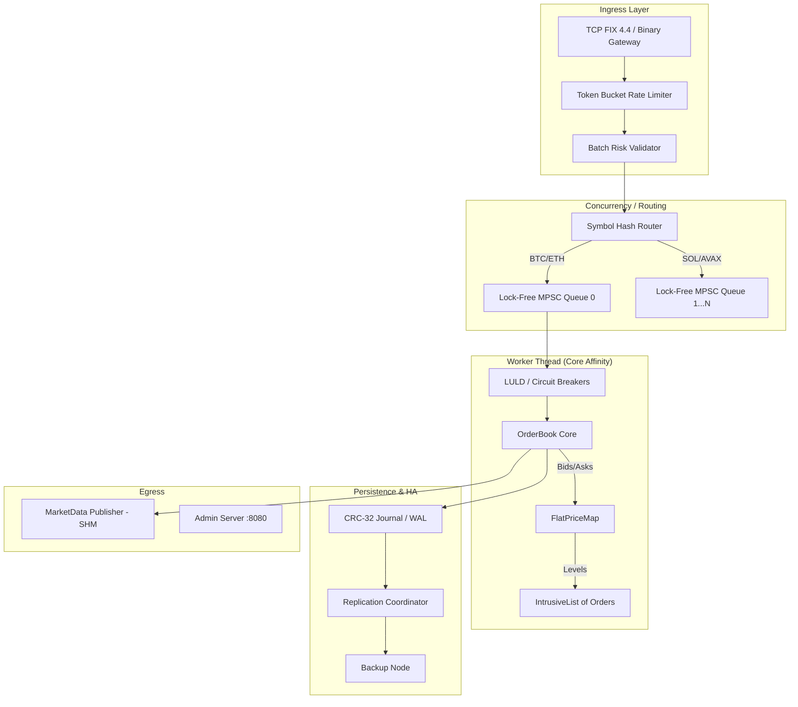

# Order Matching Engine - Architecture & Design

This document details the architectural decisions, component lifecycles, failure modes, and engineering trade-offs of the C++20 Order Matching Engine. It serves as a guide for contributors, system architects, and researchers exploring high-performance trading infrastructure.

---

## 1. Design Philosophy & Key Trade-offs

The architecture is driven by three primary constraints: **predictable low latency**, **deterministic execution**, and **high availability**.

### Why Not Traditional Mutexes?
A naive matching engine protects the order book with a `std::mutex`. Under high load, threads spend more time context-switching and fighting for the lock than executing trades. 
**Our Trade-off:** We use a **Thread-per-Symbol (Sharded) Model**. Each thread owns specific instruments exclusively. Producers (Gateway/API) push orders into lock-free Multi-Producer Single-Consumer (`MpscQueue`) ring buffers. The matching thread never blocks on locks.

### Why Not `std::map`?
`std::map` is a Red-Black tree. Traversing it means jumping across random heap allocations, destroying CPU cache locality.
**Our Trade-off:** We built `FlatPriceMap`, a contiguous array indexed directly by price ticks. Finding the next best price is an $O(1)$ pointer arithmetic operation. It costs more memory (pre-allocating the price range) but guarantees cache-hot O(1) lookups.

### Why Intrusive Lists?
Using `std::list` or `std::vector` for orders at a price level requires dynamic heap allocations (`new`/`delete`), which induce unpredictable OS-level latency spikes.
**Our Trade-off:** We use an `ObjectPool` to pre-allocate millions of `Order` structs at startup. The `Order` struct itself contains the `next` and `prev` pointers. When an order is added, it is simply linked into the `IntrusiveList`. Zero heap allocations happen on the hot path.

---

## 2. System Topology & Data Flow

### The Component Lifecycle
1. **Ingress**: A TCP payload arrives. The `FixSession` parses it using a zero-copy `FIXParser` or binary framer.
2. **Pre-Trade Risk**: The order passes through the `RateLimiter` and `BatchRiskValidator` to check limits (Notional, Fat-Finger, Kill Switch).
3. **Routing**: The `MatchingEngine` hashes the `SymbolId` and pushes the order into the appropriate thread's `MpscQueue`.
4. **Dequeue & Validate**: The worker thread pops the order. It checks `LULDManager` (Limit Up-Limit Down) bands to ensure the instrument isn't halted.
5. **Matching**: The `OrderBook` executes matching against resting liquidity. `WashTradeDetector` applies Self-Trade Prevention (e.g., Cancel-Taker).
6. **Persistence**: The resulting trades and book updates are appended to the `Journal` (Write-Ahead Log).
7. **Egress**: Updates are pushed to `MarketDataPublisher` (POSIX shared memory) and asynchronously replicated to backup nodes.

---

## 3. Deep Dive: Core Components

### 3.1 OrderBook & Data Structures
The core of the engine is purely single-threaded and deterministic.
- **`Order`**: A 128-byte packed struct containing ID, price, quantity, participant ID, and intrusive pointers.
- **`FlatPriceMap`**: A fixed-size array covering the valid tick range of an instrument. If BTC trades from \$0 to \$100,000 at \$0.01 increments, the map has 10,000,000 slots. Memory is cheap; cache misses are expensive.
- **`FlatHashMap`**: Used for O(1) order cancellation by `OrderId`. It uses Robin-Hood open-addressing to maintain cache density.

### 3.2 ShardedOrderBook & Horizontal Scaling
To scale beyond a single core, the engine utilizes the `ShardedOrderBook`.
Instead of placing all instruments in one book, instruments are sharded across $N$ instances. Each worker thread runs an independent event loop pinned to a specific CPU core using `CPUAffinity`. Cross-symbol interactions are heavily restricted to maintain this isolation.

### 3.3 ShadowEngine (Dark Launching)
For algorithmic testing and capacity planning, the `ShadowEngine` allows cloning production state. It consumes production traffic (via a fork or replay) but suppresses all outbound executions and market data. By taking a read-only snapshot of the production book and replaying subsequent events from a specific journal offset, the shadow instance accurately mirrors live execution logic without corrupting the production order book or impacting live network egress. This allows safe, realistic load testing of new engine versions against live market flow.

### 3.4 Regulatory & Compliance Controls
- **WashTradeDetector (SMP)**: Prevents participants from matching against themselves.
- **LULDManager**: Dynamically updates acceptable price bands based on recent trade prices, halting matching if prices gap too quickly.
- **GraduatedKillSwitch**: Automatically disables trading for participants who breach soft/hard risk limits.

---

## 4. Resilience & High Availability

To achieve institutional-grade uptime, the engine implements a Primary-Backup HA model.

### 4.1 Write-Ahead Logging (CRC-32 Journal)
Before sending execution reports to the client, the engine writes the state mutation to a binary `Journal`. 
- Every entry has a CRC-32 checksum.
- A virtual clock (GTD/DAY expirations) ensures time-based events replay deterministically.
- `Checkpointing`: Periodically, the engine writes a compressed snapshot of the entire resting book to disk and prunes the old journal to bound recovery time.

### 4.2 Replication Coordinator & Epoch Fencing
The `ReplicationCoordinator` manages TCP log-shipping to the `JournalFollower` (Backup Node).
- **Heartbeats**: Used for failure detection.
- **LeaderLease Fencing**: The primary holds an epoch-based lease. If it fails, the backup promotes itself, increments the epoch, and rejects any delayed packets from the old primary (preventing split-brain).

### 4.3 Formal Verification
Concurrency is notoriously difficult to test. We rely on **TLA+ Specifications**:
- `MpscQueue.tla`: Verifies linearizability and lack of race conditions in our lock-free ring buffer.
- `Replication.tla`: Verifies that leader election and log shipping never result in data loss or split-brain.
- `EngineConsumer.tla`: Verifies worker thread shutdown safety.

---

## 5. Failure Modes & Mitigations

Designing for low latency means knowing exactly how the system behaves when under stress.

| Failure Mode | Impact | Mitigation |
| :--- | :--- | :--- |
| **Microburst / News Event** | High ingress rate overwhelms matching thread. | `MpscQueue` depth triggers **Queue Backpressure**. Gateway immediately replies with `RejectReason::QueueFull`. Rate limiting throttles at the ingress edge. |
| **Disk I/O Stall** | Journal fsync() blocks the matching thread. | Journal uses `SyncPolicy::GroupCommit` or asynchronous OS buffers. Engine relies on network HA replication for strict durability rather than local fsync. |
| **Primary Server Crash** | Connection dropped, engine stops. | Backup node detects missing heartbeats, promotes itself via `JournalFollower::promote()`. Clients reconnect to backup gateway. |
| **Memory Exhaustion** | System runs out of RAM under load. | `ObjectPool` pre-allocates everything at startup. `CapacityMonitor` triggers soft-rejects if pool utilization exceeds 90%, preventing OS OOM killer. |
| **Corrupted Disk / Bit Flip** | Journal file is mutated by hardware failure. | CRC-32 validation on every read. `JournalReplay` halts exactly before the corrupted entry. Data is recovered from the replication peer. |

## 6. Conclusion
The Order Matching Engine prioritizes mechanical sympathy. By aligning data structures with CPU cache lines, eliminating heap allocations on the hot path, and isolating state behind lock-free message passing, the engine achieves deterministic sub-100ns processing times while retaining the necessary regulatory and HA infrastructure required by modern exchanges.
