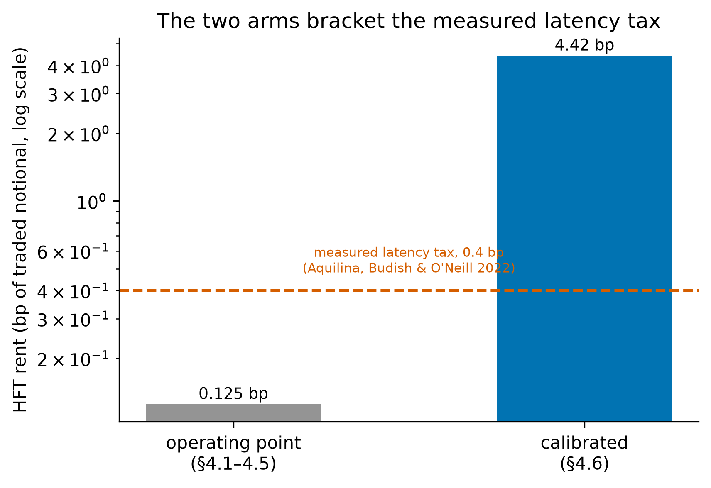
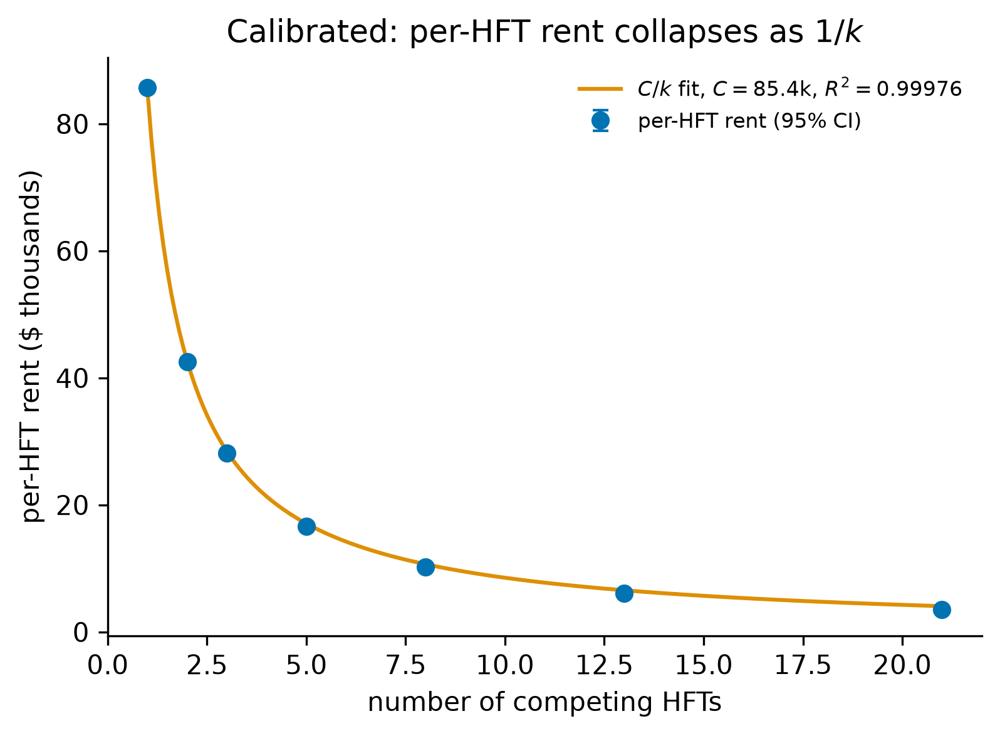
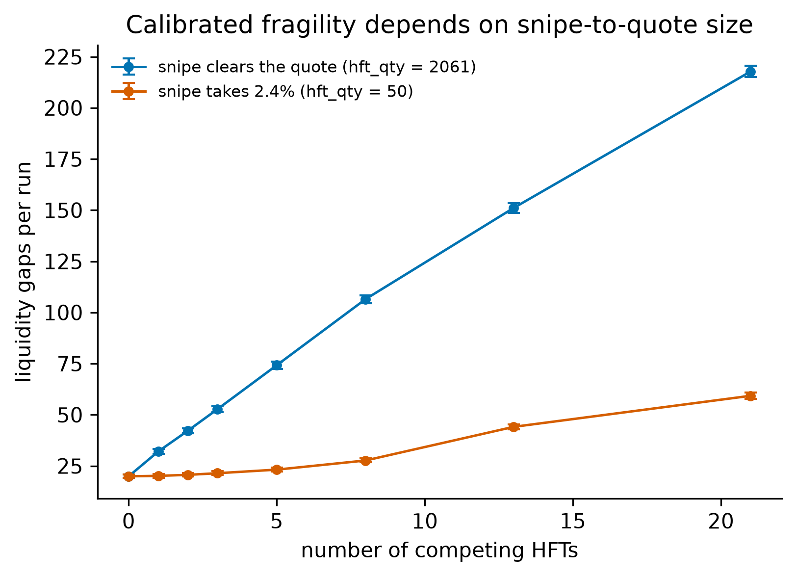
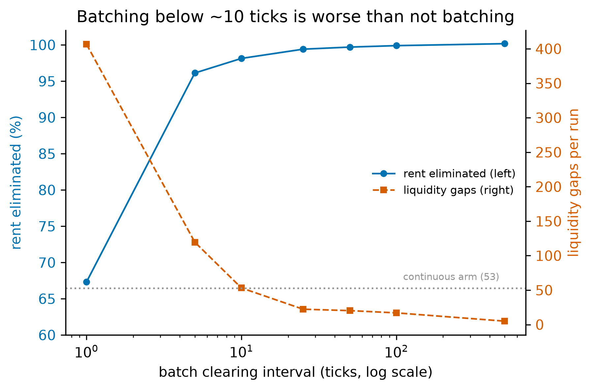

# Who Bears the Latency Tax? Incidence of the HFT Arms Race on a Model-Checked Limit Order Book

**Atharva Patil**

Xavier Institute of Engineering

## Abstract

Budish, Cramton, and Shim argue that the continuous limit order book's latency arms race taxes liquidity providers, but which participants bear it is an open empirical question rather than a settled implication. We map incidence over snipe-to-quote ratio, HFT count, and the number of competing makers on a C++ limit order book whose matching core is model-checked in TLA+, with the welfare decomposition closing to machine precision throughout. Our headline result is within the liquidity-providing class: at the snipe-to-depth ratio measured on 86 hours of BTCUSDT-perpetual data, the fastest maker gains in every cell tested at two and three makers, while the slowest funds both it and the snipers. The class-level answer is structure-dependent: a single maker inverts the prediction and profits — through reduced pickoff losses, not higher noise revenue — while competitive supply restores it. Frequent batch auctions recover maker welfare above a minimum clearing cadence.

## 1. Introduction

### 1.1 The arms-race argument

Budish, Cramton, and Shim (2015, hereafter BCS) argue that the continuous limit order book—the dominant design of modern equity and futures markets—contains a structural flaw that has nothing to do with any individual participant's conduct. Because the book processes messages serially in continuous time, each arrival of public information creates a fleeting, mechanical arbitrage opportunity: whichever trader reacts first can pick off the stale quotes of liquidity providers before those quotes can be revised. The competition to be first is a contest over speed rather than price, and in equilibrium it dissipates real resources into a socially wasteful arms race while transferring rent from liquidity providers (and, indirectly, the investors they serve) to the fastest "snipers." Crucially, the resulting latency tax widens effective spreads and degrades liquidity without improving price discovery; it is a prisoner's dilemma baked into the market's microstructure. BCS propose frequent batch auctions—discrete-time, uniform-price clearing—as a design remedy that converts competition on speed back into competition on price, neutralizing the mechanical sniping advantage.

### 1.2 Why a model-checked substrate matters

What a verified substrate buys is best stated as something that happened rather than as a principle, and this paper can point at the episode. While closing the last unverified seam in the harness — routing Experiment 4's batch clearing through the engine's own `uncross` instead of through a Python re-implementation of the same rule — the two implementations disagreed. The replica had been checked against the C++ source line by line, and an earlier draft of this paper described it as faithful; the first time the two were run against the same book, they cleared a volume-tied auction at different prices (§3.2). The disagreement was not academic. Re-running the 50,000-tick grid with the batch clearing rerouted to the engine moves three of the seven batch cells across zero in both significance and sign, while the continuous arm — which never calls `uncross` — returns byte-identical, which is what confines the cause to the substituted code path (§5.2). The verified matcher is what made that error findable and what makes the corrected numbers trustworthy now that it is fixed: the defect lived in the component we had verified least, and the instrument that exposed it was the component we had verified most. It is a specific instance of the general problem that motivates the design.

Testing this argument by simulation confronts a methodological problem that has dogged agent-based market models since their inception: when an emergent pathology appears, one cannot easily tell whether it reflects the economics under study or an artifact of the bespoke, unverified matching machinery on which the agents trade. A subtle bug in order-priority handling, partial-fill accounting, or event sequencing can manufacture exactly the kind of liquidity gaps and welfare transfers a researcher hopes to observe. Our contribution to internal validity is to run the entire BCS mechanism—latency-differentiated observation of a common fundamental value and a submission-timing race—as a Python scheduler sitting atop a C++ limit order book whose matching core has been model-checked in TLA+, accessed through a pybind11 bridge. Because the matcher is deterministic and model-checked against its specification (at bounded scope, with zero invariant violations, and now including the cross action that produces fills), any emergent arms-race dynamics, liquidity evaporation, or crash behavior we report are attributable to agent incentives rather than to design-level matching error; the precise reach of that guarantee is stated at the end of this subsection. This pairing of a verified substrate with a closed, auditable welfare-accounting identity is, to our knowledge, novel in the market-microstructure literature.

The provenance behind that substrate is supporting context rather than a finding of this paper, and its reach can be checked rather than inferred from the phrase "model-checked." The engine's matching specification (`MatchingEngine.tla`) is model-checked by TLC with zero invariant violations. As of this revision the specification models the continuous matching/cross action itself—price-cross execution and FIFO selection of the earliest-timestamped resting order—checking the `FIFOExecution` and `MatchingConservation` invariants alongside the book-management invariants (`NoNegativeQuantity`, `FIFO_Preservation`, `GTD_Expiry_Correctness`); the deepest exhaustive run (`MatchingEngine4.cfg`: `MaxOrders=4`, `MaxTime=2`, `Prices={100,200}`) generates 368,192,427 states and explores 171,187,419 distinct reachable states to BFS depth 11, terminating with an empty queue — complete exploration — and zero violations (`docs/Verification.md`, run of 2026-07-12). A faster default configuration at `MaxOrders=3` covers $1.26\times10^6$ distinct states and is used for routine checks. `MaxOrders=5` was attempted and does not converge on commodity hardware (over $2.28\times10^8$ distinct states with more than $2\times10^8$ still queued), so four orders is the largest exhaustively checkable bound — and it is the regime in which price-time defects can manifest at all, since it admits three resting orders at one price level crossed by a fourth. These counts are engine-verification artifacts recorded with the spec, not experimental results of this paper, and we cite them as such rather than as findings of the experiments below. For the session-lifecycle specification (`Auction.tla`, §3.1) we did not recover a model-checked state count from the spec tree, and none is reported. The substantive claim we rely on throughout is qualitative and verifiable: the matching layer's safety properties—now including price-time execution correctness, not only book management—were model-checked at bounded scope with zero invariant violations.

Two boundaries of this provenance deserve equal precision, because "model-checked" is easy to over-read. First, TLC's guarantee is exhaustive only within the stated bounds — a handful of orders, two prices, short horizons — so it certifies the matching *design* against its invariants at bounded scope; it does not prove unbounded correctness. Second, the object that is verified is the TLA+ specification, not the C++ source: no refinement proof links the two, and the correspondence between spec and implementation rests on construction and conformance testing. Wherever this paper says "verified engine," both qualifications are attached. The divergence with which this subsection opened is the second boundary made concrete rather than an aside: correspondence claims that are only source-verified can be wrong, and ours was. What the provenance does buy, and what our internal-validity argument actually uses, is the elimination of design-level matching errors — the kind that could manufacture spurious gaps or transfers — within the checked scope, on the code path every trade in both arms traverses.

### 1.3 Preview of findings

This paper's claim concerns the *incidence* of the latency tax — which class of participant actually bears it — and §§4.7–4.8 pose and answer that question jointly. The four experiments preceding them are not four co-equal findings. They establish the properties an incidence claim has to be able to assume, each run first at a pre-registered operating point chosen for mechanism clarity and then re-run at parameters fitted to real order flow.

- **The transfer is real and the accounting closes (Experiment 1, §4.1).** With latency-advantaged HFTs present we measure a positive HFT rent of \$34.70 (95% CI [26.25, 44.80]) that is a near-exact zero-sum transfer from the market maker and noise traders, the welfare residual closing to machine zero (mean $2.8\times10^{-12}$), while liquidity gaps rise from 2.84 [2.47, 3.26] in the matched no-HFT baseline to 9.70 [9.15, 10.27] in treatment; the result holds in all nine cells of a $3\times3$ sensitivity-by-decay grid. Absent a decomposition that closes, any statement about who bears the tax would be an accounting artifact.
- **The mechanism carries no hidden threshold (Experiment 2, §4.2).** Rent rises with market-maker staleness at approximately \$10.46 per tick, and the data do not distinguish a linear specification from a segmented one (ΔBIC = −0.17, inside the range of indifference), with rent first becoming statistically distinguishable from zero at roughly two ticks. A boundary mapped across a smooth mechanism is a boundary rather than an artifact of a discontinuity.
- **Aggregate rent is fixed, and competition surfaces as fragility (Experiment 3, §4.3).** As competitors enter, per-HFT rent collapses while *total* extracted rent stays flat (mean \$34.4, range \$33.70–\$34.93 across $k=1\ldots21$); the marginal social cost of added speed competition appears not as rising aggregate rent but as rising fragility, liquidity gaps growing approximately linearly in $k$ (fitted $\approx 2.1k+3.7$, $R^2=0.997$), roughly $17\times$ by 21 HFTs. This is what makes HFT count a real second axis of the incidence surface rather than a proxy for aggregate pressure.
- **The clearing rule drives the outcome (Experiment 4, §4.4).** Switching the engine to frequent batch-auction clearing recovers market-maker welfare monotonically over intervals $\geq 5$ — about 97% of the loss by an interval of 500 (MM loss \$28.5 → \$0.7) — and this MM-recovery signal is the robust one; HFT-rent point estimates also fall, but only the interval-5 arm attains a rent interval clearing zero. An interval of 1 backfires (MM loss worsens to \$41.3, about 137 gaps), so the remedy helps only away from that degenerate corner.
- **The environment is disciplined by real order flow (§3.7, §4.6).** Fitting to 27 days of BTCUSDT-perpetual order flow and re-running all four experiments at the fitted parameters leaves every qualitative finding intact, and supplies the magnitude the operating point cannot: normalised by traded notional, HFT rent is 0.125 bp at the operating point and 4.42 bp calibrated. The calibrated figure is an upper bound, because a single latency-disadvantaged maker absorbs the whole race.

With those four properties in hand — a decomposition that closes, a mechanism without thresholds, a fixed rent pool whose social cost surfaces as fragility, and a clearing rule demonstrably driving the outcome — and with the environment disciplined by real flow, the incidence question becomes answerable rather than rhetorical. Two sections answer it, and they must be read together.

- **Incidence inverts under single-maker supply (§4.7).** Mapping a 63-cell surface over snipe-to-quote size ratio and HFT count, holding liquidity supply at a single maker throughout, yields a monotone regime boundary: the maker bears the tax when snipes are large relative to quoted depth, and at small snipe sizes it gains instead, with noise traders bearing the entire transfer. Decomposing that gain shows it is loss reduction rather than revenue capture: the maker's noise-flow revenue *falls* when it widens, since widening sheds volume faster than it recovers edge per fill, and the gain comes from the accompanying drop in adverse-fill losses, with inventory carry supplying a third to a half of the net effect (§4.7). The ratio measured on 86 complete book-and-trade hours of the perpetual, 0.0072 at the median, falls inside that maker-gains region at every HFT count we test.
- **Competitive supply restores BCS, and within-class incidence is redistributive (§4.8).** Re-running the surface at maker counts $M \in \{1,2,3,5\}$ — 441 cells, the $M=1$ column nesting §4.7 to zero absolute difference — the maker-gains region at the tape band vanishes at $M=2$, the smallest competitive case, and the maker's PnL delta turns negative with its interval excluding zero. The noise-trader toll reverses in step, so competition reinstates the incidence BCS predicts rather than merely cancelling the inversion. But that aggregate is a sum over unlike makers, and decomposing it at $n=100$ shows every arm is redistributive: the fastest maker still gains in all eighteen tape-band cells while the slowest funds both it and the snipers.

The result is therefore a boundary over two structural axes rather than a verdict on a class. Whether liquidity providers bear the latency tax depends on how many of them supply the book and on how the class is weighted; at the measured ratio, slow makers bear it and fast makers do not. §§4.1–4.6 are what license that reading.

### 1.4 Contribution statement

This paper makes five contributions, and we lead with the one we regard as most consequential.

**First, and most consequentially,** it identifies the *incidence* of the latency tax as an empirical question distinct from its existence, and maps it over two structural axes rather than answering it with a verdict. Sweeping snipe-to-quote size ratio against HFT count, holding liquidity supply at a single maker, yields a monotone regime boundary: the maker bears the tax when snipes are large relative to quoted depth and gains at small ones — not because widening earns it more from noise flow, which the leg decomposition shows falls, but because widening reduces its adverse-fill losses, with inventory carry supplying a third to a half of the net. The ratio measured on 86 complete book-and-trade hours of BTCUSDT-perpetual data, 0.0072 at the median, falls inside that maker-gains region at every HFT count we test, so under single-maker supply the BCS prediction inverts (§4.7). Adding the maker-count axis then reverses it back: at two competing makers the maker-gains region at the tape band is gone, the maker's delta turns negative with its interval excluding zero, and the noise-trader toll falls in step, so competitive supply reinstates the incidence BCS predicts (§4.8). The two sections are one result. Incidence is a function of market structure — of snipe size, sniper count, and the number of makers supplying the book — and neither BCS nor the direct message-level measurement of Aquilina, Budish, and O'Neill (2022) treats it as one.

**Second,** and cutting across the first, incidence within the liquidity-providing class is redistributive, so the class-level question is not well posed without a weighting. Decomposing the aggregate maker PnL at $n=100$ across the tape-measured band shows the summed figure conceals opposite signs in every arm tested: at two makers the leading one gains in all eighteen band cells with its interval excluding zero, while the slowest pays in all eighteen and funds both it and the snipers (§4.8e). The aggregate turns negative because the slow maker's loss exceeds the fast maker's gain, not because liquidity provision loses as an activity. The defensible statement is accordingly narrower than either the inversion or its reversal: *slow* liquidity providers bear the latency tax. We also report an unexplained anomaly against this picture — at three calibrated makers the ordering is not monotone in latency, the middle maker being the sole consistent winner — rather than fitting a mechanism to it.

Third, the substrate. Agent-based study of latency arbitrage is not itself new — Wah and Wellman (2013) established it — so what we contribute is not the method but what the method runs on: a matching engine whose core is model-checked in TLA+, in the precise and bounded sense of §1.2, paired with a welfare identity that closes to machine precision in every cell we report — all sixty-three of the single-maker surface, and all 441 of the maker-count extension at a maximum absolute residual of $1.26\times10^{-9}$. That pairing removes design-level matching error and accounting leakage as explanations of either the inversion or its reversal, which is the specific way an agent-based incidence claim would otherwise fail.

Fourth, the welfare decomposition of Experiments 1–3 establishes the properties that make the §§4.7–4.8 surface a credible extension rather than a standalone claim: the arms race is a transfer rather than value destruction, its cost scales smoothly in latency with no phase transition, and as competitors multiply the aggregate rent pool stays fixed while the social cost surfaces as rising fragility. A boundary mapped across a mechanism with those properties is a boundary, not an artifact of a discontinuity or of a rent pool that grows with the axis being swept.

Fifth, the batch-auction treatment supplies the policy-relevant result the validated harness makes available: the BCS remedy restores liquidity-provider welfare monotonically above a minimum clearing cadence and backfires below it, the interval-1 arm worsening the maker's loss rather than repairing it. MM recovery is the robust signal there; the rent-reduction point estimates are not.

The negative and nuanced results — linear rather than threshold scaling, fragility rather than rising rent, MM recovery as the clean remedy signal, and the failure of incidence to reduce to aggregate snipe pressure — are integral to the contribution.

## 2. Related Literature

This paper sits at the intersection of five strands of work: the market-design theory of the HFT arms race and its direct measurement, the theory of speed and exchange design, the game theory of predatory liquidity provision, the empirical and physics-of-markets literature on endogenous fragility, and the methodological tradition of agent-based modeling. We synthesize each in turn and then state our differentiator.

**The arms race and its remedy.** Our central reference is Budish, Cramton, and Shim (2015), who reframe latency competition not as a behavior to be regulated but as a symptom of the continuous limit order book's serial-processing design, and who propose frequent batch auctions as the corrective. BCS pair a theoretical model with reduced-form empirical evidence (notably the persistence of mechanical arbitrage opportunities in correlated instruments). Our work is, in effect, a controlled experimental instantiation of their model: we build the latency-differentiated observation structure and submission-timing race they describe, reproduce their predicted treatment effects (rent transfer and liquidity degradation), and test their proposed remedy by switching the clearing rule of the very same verified engine. We complement rather than re-derive their theory, supplying a closed welfare decomposition that their reduced-form empirics cannot directly observe. The empirical scale of the race has since been measured directly: Aquilina, Budish, and O'Neill (2022), using message-level exchange data that records failed race attempts alongside successful ones, find latency-arbitrage races occurring roughly once per minute per FTSE 100 symbol, decided by microseconds, and summing to a latency-arbitrage "tax" of about 0.4 basis points of trading volume — with the implication that eliminating the race would cut the market's cost of liquidity by roughly 17%. Their measurement and our experiment are two views of the same transfer: they infer it from races visible in exchange messages; we observe every leg of it — sniper, maker, noise trader — under a conserved accounting identity, at magnitudes that are internally consistent rather than calibrated to theirs. Menkveld (2016) takes stock of the field between those two poles, cataloguing HFT's double role as liquidity supplier and as a source of adverse selection and observing how little of the literature settles the net welfare sign for any given participant class. The incidence question of §4.7 is one sharpening of precisely that unsettled sign: not whether the tax exists, but which class ends up paying it.

**Speed and exchange design.** Two theoretical strands refine the BCS diagnosis and bear directly on our treatment arms. Menkveld and Zoican (2017) show that exchange speed is not neutral infrastructure: a faster matching engine accelerates snipers and market makers alike, raising the frequency of speed duels, so lower exchange latency can *worsen* liquidity when news arrival is high relative to liquidity-motivated trade. Our degenerate interval-1 cell in Experiment 4 — where the most aggressive clearing cadence amplifies the pathology it was meant to cure — is a discrete-clearing cousin of that comparative static, and Experiment 2 traces its analogue in the market maker's own staleness. Baldauf and Mollner (2020) embed sniping in a model with costly information acquisition and compare design responses — frequent batch auctions and asymmetric speed bumps that delay marketable orders but not cancellations — showing that both blunt the sniping externality, with different side effects on price discovery. Our apparatus tests the first of those designs experimentally; the second is a natural extension, implementable entirely in the latency scheduler without touching the verified matcher. Du and Zhu (2017) come at the same design question from the opposite side, asking not whether discrete clearing helps but what trading frequency is optimal: batching longer lets more information accumulate into each clearing price, while batching too long delays incorporation and thins participation, so frequency is a genuine trade-off rather than a monotone knob. Experiment 4 is the experimental counterpart of that trade-off — the interval-1 arm backfires while intervals $\geq 5$ recover maker welfare monotonically — and what we add to their frequency analysis is a closed welfare decomposition on a model-checked substrate and a fragility channel, liquidity gaps, that an optimal-frequency calculation does not price. Hoffmann (2014) supplies the equilibrium logic for the behaviour our maker executes mechanically: in a dynamic limit order market with fast and slow traders, the fast traders' ability to revise ahead of news concentrates picking-off risk on slow limit-order submitters, who rationally respond by quoting less aggressively. Our market maker's adverse-selection widening (§3.3) is that response imposed as a rule rather than derived, which is what makes its parameterization a limitation we test directly (§5.2).

**Predatory versus cooperative liquidity.** Carlin, Lobo, and Viswanathan (2007) provide the strategic micro-foundation for why liquidity can evaporate endogenously: when cooperation among strategic traders breaks down, agents race to trade ahead of a distressed counterparty, withdraw liquidity, and amplify price impact, producing episodic crises that owe nothing to exogenous fundamental shocks. The BCS sniping mechanism is, in this light, a latency-mediated modern instance of the predatory equilibrium they formalize. We build on their insight by showing the predatory outcome emerging mechanically from rational speed competition on a concrete book, and by attaching a quantitative welfare price tag to it; we differ in implementing an explicit agent-based experiment with a closed accounting identity rather than a stylized analytic game. Foucault, Kozhan, and Tham (2017) isolate the informational subset of these episodes empirically, showing that *toxic* arbitrages — those triggered by news rather than by transient liquidity imbalance — are the ones that impose adverse selection on liquidity providers and widen spreads in response. Their toxic/non-toxic split is the empirical analogue of our maker's adverse-fill classifier (§3.3), which widens only on fills against informed flow and leaves noise fills alone; the incidence result of §4.7 turns on exactly how much that widening earns back from the non-toxic side.

**Endogenous fragility and flash crashes.** Kirilenko, Kyle, Samadi, and Tuzun (2017) dissect the May 2010 Flash Crash from audit-trail data and find that HFTs, while not the trigger, consumed liquidity and passed inventory among themselves at the critical moment, accelerating the decline. This is the canonical fragility episode our flash-crash diagnostics are motivated by, and our Experiment 3 speaks directly to it by asking whether such fragility can arise from rational HFT behavior alone, with no exogenous shock; we find that it grows with the number of competing HFTs. Where Kirilenko et al. perform forensics on a single historical event, we offer a fully observable, reproducible counterfactual in which HFT count, latency, and market design are experimental knobs. Complementing this, Filimonov and Sornette (2012) introduce the branching ratio of a self-exciting Hawkes process as a measure of market endogeneity (reflexivity), reporting that it spikes toward criticality around fragile periods. We adopt their branching ratio as an independent diagnostic—estimated on our simulated order flow via a Hawkes bridge—to test whether the crashes we model are genuinely self-excited rather than fundamental-driven; the advantage of our setting is that the data-generating process is known and controllable, so the branching ratio can be tied causally to HFT count and latency rather than inferred post hoc from market data of unknown structure.

**Agent-based modeling and its verifiability gap.** Methodologically, our work extends the agent-based computational finance tradition (Farmer and Foley, 2009; LeBaron, 2006), which argues that bottom-up simulation of heterogeneous, boundedly rational agents can generate emergent, out-of-equilibrium phenomena—fat tails, volatility clustering, bubbles and crashes—that representative-agent equilibrium models cannot. That tradition's well-known weaknesses are sensitivity to ad hoc behavioral assumptions, weak calibration discipline, and limited reproducibility or verifiability of the simulation machinery itself. The closest agent-based precursor to this paper is Wah and Wellman (2013), who build a tactical agent-based model of latency arbitrage across fragmented markets and find that a latency arbitrageur profits at the expense of other traders while degrading allocative efficiency — qualitatively the transfer we decompose, established a decade before us. Our departure from that work is therefore not the agent-based method, which it had already applied to this mechanism, but the substrate the method runs on and the question we ask of its output. We inherit the tradition's strength (emergent crash dynamics from rational behavior) while directly confronting its central weakness: rather than building on a bespoke, unverified simulator whose matching logic could itself generate the observed artifacts, we drive a TLA+-verified C++ matching engine, and we impose calibration and welfare-accounting discipline in the form of a closed, near-zero welfare residual.

**Differentiator.** Agent-based study of latency arbitrage is not itself new: Wah and Wellman (2013) modelled it and recovered the same qualitative transfer, so novelty of approach is not what we claim. What distinguishes this paper is, to our knowledge, the first experimental test of the BCS welfare decomposition on a *model-checked* matching engine, and the first treatment of the latency tax's *incidence* as a question distinct from its existence. BCS is theory plus reduced-form empirics, since joined by the direct message-level measurement of Aquilina, Budish, and O'Neill (2022); the agent-based tradition, Wah and Wellman included, runs on bespoke simulators whose matching layer is a candidate source of the very effects under study. Here the entire BCS mechanism lives in a Python scheduler atop a deterministic matcher whose continuous-matching specification was model-checked with zero invariant violations (per the engine's TLC verification log, `docs/Verification.md`), reached through a pybind11 bridge, so emergent arms-race dynamics, liquidity gaps, and crash behavior cannot plausibly be artifacts of the matching design (in the bounded sense of §1.2). On that substrate we decompose welfare into market-maker, noise-trader, and HFT components, show the arms race is a transfer that closes to a machine-precision zero-sum residual, trace the mechanism across latency and HFT-count sweeps (with the findings that scaling is linear rather than threshold and that aggregate rent is flat while fragility rises), and confirm the BCS remedy experimentally via the batch-auction treatment, with a placebo-validated endogeneity diagnostic in the Filimonov–Sornette spirit that returns a null at our operating point. It is the joint presence of a verified engine, a closed welfare identity, and an experimental confirmation of both the pathology and its proposed cure that situates this paper relative to the literature it builds on.

## 3. Model and Experimental Design

This section describes the simulation apparatus. The design rests on a deliberate separation of concerns: a single model-checked C++ matching engine adjudicates every trade — continuous matching and batch-auction uncrossing alike — while a Python layer above it supplies the agents, the latency model, and the batch-auction cadence. The verified engine is the part we trust to be correct; the Python layer is the part we vary. The boundary between them is the pybind11 bridge, and it is drawn precisely where the engine's formal guarantees end.

### 3.1 The Matching Engine (C++20, TLA+-verified)

All trades in the continuous arm are produced by one C++ matching engine, `OrderMatcher::MatchingEngine`, the same object that is the subject of the project's TLA+ specification suite. In the BCS harness the engine is run in **synchronous** mode: `EngineHarness::start()` calls `engine_.start()` rather than `startAsync()`, so `submitOrder()` dispatches matching on the calling thread and the `OrderBook`'s `EventListener` fires inline. Draining trades immediately after a submit therefore returns exactly the fills that order produced, which keeps the harness deterministic and free of cross-thread or GIL concerns (`bcs_research/bindings/engine_bindings.cpp`, lines 5–16). The engine offers price-time priority matching, best bid/ask, depth snapshots, VWAP, and an optional circuit breaker; the breaker is disabled in this harness via `setCircuitBreakerThreshold(1e18)` when `start(disable_circuit_breaker=True)` so that simulation control, not an exchange-level halt, governs the dynamics (lines 81–83). Prices are fixed-point: a quoted price of 100.00 is `100 * PRICE_PRECISION`, with `PRICE_PRECISION` re-exported as `bcs_engine.PRICE_PRECISION` (line 186).

Critically, **the engine has no notion of agent latency.** The comment at `engine_bindings.cpp` lines 15–16 states this explicitly: the entire BCS latency/race mechanism lives in the Python scheduler above this layer. The engine's job is only to be a correct continuous double-auction matcher, and that correctness is what the spec suite certifies.

The directly relevant specification is **`Auction.tla`** (`spec/Auction.tla`), which models the engine's session lifecycle over the seven legal `TradingState`s (`PreOpen`, `AuctionOpen`, `Continuous`, `AuctionClose`, `PostClose`, `Halted`, `VolatilityAuction`) and the discrete uncross that is the only way trades emerge from an auction state. Under `Auction.cfg` (`BROKEN_NO_REOPEN=FALSE`, `MaxOrders=3`, `MaxEvents=6`, `Prices={100,200}`), TLC checks the following **invariants**:

- **`TypeOK`** — the type invariant.
- **`ValidState`** — every reachable state is one of the seven legal `TradingState`s.
- **`NoMatchOutsideContinuousExceptUncross`** — no trade prints in an auction, halt, or closed state except a discrete uncross whose source is a true auction state (`PreOpen`, `AuctionClose`, or `VolatilityAuction`). Each trade carries an `inState` history field, which gives the invariant teeth.
- **`SingleClearingPrice`** — every uncross firing produces trades at exactly one price drawn from `Prices`. This is the code path the batch arm now clears through via the bridge's `uncross` (§3.2).
- **`NoTradeWhileHalted`** — no trade record may carry `inState=Halted`.

As temporal/action **properties** it checks **`ValidTransitions`** (`[][ state'=state \/ <<state,state'>> \in LegalEdges ]_state` — every step is either a self-loop or a legal directed edge of the session state machine) and the **liveness** property **`VolatilityEventuallyReopens`** (`)`, proved under weak fairness `WF_vars(ReopeningUncross)`). Non-vacuity is established by a companion `AuctionBroken.cfg` (`BROKEN_NO_REOPEN=TRUE`) that disables the reopening uncross so TLC reports a liveness counterexample, confirming the property is not vacuously true.

**We did not recover a model-checked state count for `Auction.tla`**: a `states/` directory and TLC trace (`.bin`) artifacts exist in the spec tree, but we did not parse them, and no state count is reported for it. The large reachable-state count cited elsewhere for the engine (§1.2) pertains to `MatchingEngine.tla` and is recorded in `docs/Verification.md`, not derived from `Auction.tla`.

`Auction.tla` sits within a broader suite (`spec/`) that verifies the surrounding engine and infrastructure. We summarize the checked properties rather than restate every configuration:

| Spec | Checked properties (per `.cfg`) |
|---|---|
| `MatchingEngine.tla` | `NoNegativeQuantity`, `FIFO_Preservation`, `GTD_Expiry_Correctness`, plus the continuous cross action's `FIFOExecution` and `MatchingConservation` (deepest exhaustive config `MatchingEngine4.cfg`: `MaxOrders=4`, `MaxTime=2`, `Prices={100,200}` — 171,187,419 distinct states, complete exploration; the `MaxOrders=3` default is the fast routine check at $1.26\times10^6$ distinct. A companion `MatchingEngineBroken.cfg` allows non-FIFO fills so TLC reports a `FIFOExecution` counterexample, establishing non-vacuity) |
| `FixSession.tla` | `TypeOK`, `DeliveredInOrder` (`BROKEN_NO_GAP_DETECT=FALSE`; constraint `BoundedDelivered`, `MaxSeq=3`) |
| `Risk.tla` | `TypeOK`, `FirmWithinCap`, `TradersWithinCap`, `FirmIsSumOfTraders` (`BROKEN_NO_FIRM_AGG=FALSE` non-vacuity switch) |
| `Oco.tla` | `TypeOK`, `ValidStates`, `AtMostOneWinnerPerGroup`, `WinnerSilencesSiblings` (`BROKEN_NO_OCO_CANCEL=FALSE`) |
| `Snapshot.tla` | `TypeOK`, `SnapshotEntriesAreReal` verified; `SnapshotIsPointInTime` and `NoDoubleSidedSnapshot` are documented anti-properties that fail under lockless reads (enabled one at a time to produce torn-read counterexamples); companion `SnapshotLocked.tla` |
| `Replication.tla` | `NoCommittedLoss`, `NoDuplicateExecution`, `NoSplitBrain` (lease-based replication; `MaxEntries=6`, `HeartbeatTimeout=2`, `LeaseTimeout=5`) |
| `EpochDurability.tla` | `TypeOK`, `NoRegression`, `DurableTracksMax` (`BROKEN_NO_PERSIST=FALSE` resets the epoch on restart so TLC finds the regression; `MaxEpoch=3`) |
| `MpscQueue.tla` | `TypeOK`, `NoSpuriousItems`, `NoDuplicates`, `PerProducerFIFO`; liveness `EventuallyDrained` (under weak fairness on every action) |
| `EngineConsumer.tla` | `TypeOK`, `NoSpuriousItems`, `NoDuplicates`; liveness `EventuallyDrained` (leads-to: every item placed in any producer queue eventually reaches the consumer log) |

The payoff is that any artifact the simulation reports — a fill, a price, a snapshot, a zero-sum residual — is produced by a matcher whose price-time priority, FIFO preservation, non-negativity, and single-clearing-price behaviour have been model-checked, not merely tested.

### 3.2 The pybind11 Bridge

A pybind11 module named `bcs_engine` bridges the verified C++ engine to Python (`engine_bindings.cpp`, `PYBIND11_MODULE` at line 212). It exposes a single entry class, `EngineHarness`, with: `add_symbol` (which must precede `start()`; `start()` freezes the book registry, after which `add_symbol` throws/no-ops, lines 64–70), `start(disable_circuit_breaker=True)`, `stop`, `submit_order(symbol, order_id, participant_id, side, price, quantity, order_type=Limit, tif=GTC)`, `submit_cancel`, `best_bid`, `best_ask` (with `INT64_MAX` normalized to 0 when the ask side is empty, lines 129–134), `mid` (0 if either side is empty), `drain_trades`, `snapshot(depth=10)`, `vwap`, `trade_count`, and — added to close the matcher seam described below — `uncross` (one uniform-price call-auction clearing of the resting book) together with `set_trading_state`/`trading_state` over the session states of `Auction.tla` (lines 163–189). Fills are captured by a per-symbol `TradeCollector` that buffers every trade on the book and clears on `drain_trades`; Python attributes each fill to agents by `buyer_id`/`seller_id`. The enums `Side`, `OrderType` (`Limit`/`Market`/`IOC`/`FOK`/`PostOnly`), `TimeInForce` (`GTC`/`GTD`/`DAY`), and `RejectReason`, plus read-only `Trade`, `PriceLevel`, and `MarketDataSnapshot` classes, are exposed alongside.

Python agents drive the verified engine entirely through this surface: each tick they emit orders and cancels, the scheduler submits them via `submit_order`/`submit_cancel`, and because the engine is synchronous, the scheduler drains the resulting fills inline and routes them back to the agents. The agents never touch C++ state directly; the bridge is the only channel, which is what lets the verified matcher remain the sole adjudicator of trades.

An earlier revision of this harness carried a methodological seam here: the bridge did not expose `uncross`, so the frequent batch (call) auction could not be run through the engine at all and was instead re-implemented in Python (`discover_uncross_price`), replicating `OrderBook::discoverUncrossPrice` by source inspection. That seam is now closed. The bridge exposes `uncross`, `set_trading_state`, and `trading_state`; the batch arm (`BatchAuctionScheduler`) parks the book in `AuctionOpen` — where orders accumulate instead of matching on arrival — collects the window's orders, and clears through the engine's own `uncross`, the code path `Auction.tla` proves `SingleClearingPrice` over. Both arms of Experiment 4 therefore run on the same verified matcher, and the batch arm's fills are engine fills, drained through the same `TradeCollector` as continuous fills.

Closing the seam produced a finding in its own right. The retired Python re-implementation had been checked against the C++ source line by line, and an earlier draft of this paper described it as replicating the rule "faithfully" — a claim we noted was source-verified rather than results-verified. When the two implementations could finally be run against the same book, they disagreed. On a book where two prices tie on maximum executable volume (bids 102×50 and 101×30 against asks 99×40 and 100×60, so 80 units clear at either 100 or 101), the Python rule clears at 100 and the verified engine clears at 101 — a divergence inside the tie-break cascade, invisible to any volume-based check and material to every metric that depends on execution price, rent above all. The divergence is pinned in the test suite (`tests/test_batch_auction.py::test_python_matcher_divergence_pinned`) so it cannot regress silently, and `discover_uncross_price` is retained only as a cross-check. The episode is a compact argument for this paper's central methodological claim: a re-implementation that is source-verified can still differ from the verified artifact the first time it is results-verified.

**The divergence is causally localized to the `uncross` path, and the experiment contains its own control.** A natural objection to the preceding paragraph is that two runs of a stochastic simulation differ for many reasons, so a changed result need not indict the matcher at all. The design answers this objection without requiring us to argue it. Experiment 4's long grid comprises seven batch arms and one continuous arm, and the continuous arm does not call `uncross` — it matches on arrival, exactly as Experiments 1–3 do. When the grid is re-run with the batch clearing rerouted from the retired Python re-implementation to the engine, the continuous arm returns 578.1 [449, 709], **byte-identical** to its pre-port value, while three batch cells move across zero in both significance and sign (§5.2). Seeds, fundamental paths, agent realizations, run length and every environment parameter are held fixed across the two runs; the single thing that differs is which implementation clears the batch. A control arm that is bit-for-bit unchanged therefore rules out seed variation, drift in the agent code, and environment differences as explanations, and confines the effect to the code path that was substituted. This is a stronger form of evidence than the tie-break counterexample above: the counterexample shows the two rules *can* disagree on a constructed book, whereas the byte-identical control shows the disagreement *did* propagate into published economic quantities and nothing else plausibly did. We draw the general methodological lesson in §5.2, but state the identification here, in the methods, because it is a property of the experimental design rather than an interpretation of the results.

### 3.3 Agents

All agents are Python objects driven by the scheduler. They share a common interface — `act(t, market, fundamental)` returns a list of `Action`s, and `on_fill(trade, is_buyer)` receives routed fills — and each holds its own cash and inventory for the welfare accounting of §3.5.

**`FundamentalValueProcess`** (`bcs_research/agents/fundamental_value.py`) is the exogenous true value `V(t)`, a discrete random walk in fixed-point price space. On `step(t)` it draws `dv = sigma * N(0,1)` (per-step volatility, independent of tick size; `dt_us` is wall-clock metadata only), updates `current_v += dv`, and records `(t, current_v)`. Its `observe(t, latency_us)` returns the most recent recorded `V` at or before `t - latency_us` via bisection — this latency-delayed read is the BCS information gap that distinguishes a fast agent from a slow one. The undelayed `current_v` exposes the true value used for the market maker's adverse-fill check. The initial value is `v0 = 100 * PRICE_PRECISION` in Experiment 1, and a NumPy `default_rng(seed)` provides determinism.

**`BCSMarketMaker`** (`bcs_research/agents/bcs_market_maker.py`, `participant_id = MM_ID = 1`) is an adverse-selection-aware two-sided quoter. On each requote tick (every `requote_every` ticks) it first decays its half-spread toward the base — `current_half_spread = current_half_spread * (1 - spread_decay) + base_half_spread * spread_decay` — then observes `V` with its larger latency (`latency_us = 3000 us` in Experiment 1, so its quotes are stale), and posts `bid = round(v - hs - skew)`, `ask = round(v + hs - skew)` with `skew = inventory * inventory_skew`. It emits a cancel of the old bid/ask plus new two-sided `Limit` orders, all stamped `submit_at = t + latency_us`. Two coupled defences drive the mechanism:

- *Adverse-only widening* (`on_fill`): the maker widens only when a fill is against informed flow — it bought *above* or sold *below* the true `current_v` by more than `adverse_threshold_ticks`. Noise fills, which sit inside `[bid, ask]` around `V`, do not widen. On an adverse fill it increments `pickoffs` and sets `current_half_spread = min(current_half_spread * (1 + adverse_sensitivity), spread_cap)` with `spread_cap = base * spread_cap_mult`.
- *Liquidity thins as it widens* (`_effective_qty`): resting size is `max(min_quote_qty, round(quote_qty * base_half_spread / current_half_spread))`, so size shrinks toward `min_quote_qty` as the half-spread grows. Spread and depth are one coupled state, not two.

It also tracks `max_half_spread_seen`, `min_quote_qty_seen`, `inventory`, and `cash`. Calibration of `adverse_sensitivity` and `spread_decay` (so the no-HFT spread sits near base) is done by the experiment driver, not the agent class.

**`HFTAgent`** (`bcs_research/agents/hft_agent.py`, `participant_id = 200 + j`) is a latency-advantaged stale-quote sniper. Each tick it observes `V` with a small latency (`latency_us = 0` in Experiment 1, so it sees `V` immediately) and reads `best_bid`/`best_ask`. It fires a buy snipe — an aggressive `IOC` Buy at `best_ask` — when `(v - best_ask) > transaction_cost * best_ask`, and a sell snipe — `IOC` Sell at `best_bid` — when `(best_bid - v) > transaction_cost * best_bid`, where `transaction_cost = transaction_cost_bps / 10000`. Each acted opportunity increments `snipes`. The race is a random submission jitter `int(uniform(0, race_noise_us))` added to `submit_at` (`= t + latency_us + jitter`): with several HFTs the lowest jitter wins and the others' IOCs find the quote already gone. The counterparty is the larger-latency maker; that latency gap is the BCS arbitrage.

**`NoiseTrader`** (`bcs_research/agents/noise_trader.py`, `participant_id = 100 + i`) is the uninformed liquidity taker and the control population. Each tick, with probability `lambda_per_tick`, it crosses the spread with an `IOC` order on a random side (50/50): buying at `best_ask` or selling at `best_bid` (and returning nothing if that side is empty), with `submit_at = t + latency_us`. Noise-trader arrival is inelastic with respect to spread width — each agent crosses with fixed probability `lambda_per_tick` regardless of the prevailing half-spread. It carries no fundamental-value signal and never snipes; it pays the half-spread to the maker, so its expected PnL is negative by construction. It is the counterfactual flow against which informed (HFT) flow is measured.

### 3.4 The BCS Mechanism

The Budish–Cramton–Shim (BCS) arms-race feedback loop is not a single equation but a closed cycle realized across the agents and the continuous scheduler (`bcs_market_maker.py`, `hft_agent.py`, `scheduler.py`):

1. **`V` moves.** The HFT sees the new `V` with small latency (0 us in Experiment 1) while the `BCSMarketMaker` still has quotes posted around its latency-delayed view of `V` (3000 us). The maker's quote is now **stale**.
2. **Snipe.** The HFT detects `(v - best_ask) > cost` or `(best_bid - v) > cost` and fires an aggressive IOC to pick off the stale quote, winning the submit-time race among HFTs via the lowest race jitter.
3. **Widen.** The maker's `on_fill` recognizes the fill as informed (bought above / sold below the true `current_v`) — an adverse fill — and widens its half-spread multiplicatively (`current_half_spread *= 1 + adverse_sensitivity`, capped at `base * spread_cap_mult`), incrementing `pickoffs`.
4. **Thin.** As the half-spread widens, the maker's effective resting size shrinks toward `min_quote_qty` (`qty = quote_qty * base / current_half_spread`).
5. **Fragility.** A thinner book means the next order moves the mid further or empties a level — larger price impact — so more quotes go stale and the cycle repeats: snipe → widen + thin → larger impact → more stale quotes → more sniping. The half-spread decays back toward base each requote tick, so the system recovers when not being picked off.

The **`LatencyScheduler`** (`bcs_research/simulation/scheduler.py`) is the race substrate that supplies the latency model the C++ engine lacks. Each tick (advancing `dt_us`) it steps the fundamental, resets per-tick volume and signed volume, lets every agent emit `Action`s, and enqueues them in a heap keyed `(submit_at, seq)`. Then `_submit_due(t)` pops and submits every action with `submit_at <= t` in submit-time order (cancels via `submit_cancel`, orders via `submit_order`), draining trades after each submit and routing fills to `buyer.on_fill(..., True)` / `seller.on_fill(..., False)` by `participant_id`. The BCS submission race is exactly many agents stamping near-identical `submit_at` values, resolved here in time order through the heap — there is no special-case race logic, only priority over arrival time. The scheduler records per-tick snapshots `(t, best_bid, best_ask, mid, v, tick_volume, signed_volume)` and per-fill trades into a `SimResult`, with tick quantization at `dt_us`.

The endogenous-instability signature of this specific mechanism is **not a mid dislocation but a liquidity gap**: a transient one-sided or empty book, where a thinned level is emptied before the maker requotes (`liquidity_gap_detector.py`, module docstring, lines 1–9). An event qualifies as an endogenous liquidity gap only if it is a maximal run of non-two-sided snapshots (`best_bid <= 0` or `best_ask <= 0`) that (a) **recovers** to a two-sided book before the run ends and has `duration_us = gap_ticks * dt_us <= max_gap_us` (50,000 us; otherwise it is a structural outage and is discarded), and (b) is **endogenous**, i.e. `V` is flat across it: `abs(V_hi - V_lo) < k_fund * sigma_per_step * sqrt(gap_ticks + 2)` with `k_fund = 3.0` and one tick of margin on each side (lines 36–43). Value-driven gaps — where `V` moves above the threshold — are excluded. We chose this event definition because an earlier all-fills version of the maker (which widened on every fill, not just adverse ones) produced no HFT-specific divergence in mid prices; widening is therefore gated on adverse fills, and the instability surfaces as gaps in depth rather than crashes in price.

### 3.5 Metrics

All metrics are pure functions over a `SimResult` and apply unchanged to both the continuous and batch arms, since `BatchAuctionScheduler` emits the same `SimResult` shape.

**Welfare decomposition and the zero-sum identity** (`bcs_research/metrics/welfare_decomposition.py`). `decompose_welfare(result, mm_id, nt_ids, hft_ids, mark)` computes per-agent PnL as `cash + inventory * mark / PRICE_PRECISION`, marked at `mark_price` (the last two-sided mid, else the last `V`). It reports `mm_pnl`, `noise_trader_pnl` (summed over `nt_ids`), `hft_pnl`, `hft_rent` (equal to `hft_pnl` — the rent the arms race extracts), per-agent and per-second variants, and `zero_sum_residual = mm_pnl + nt_pnl + hft_pnl`. In a closed market the residual is approximately zero — the conservation check that **closes through the verified engine**: because every fill is produced by the model-checked matcher with FIFO preservation and non-negative quantities, cash and inventory are conserved exactly, and any non-trivial residual would indict the harness rather than the market. `welfare_delta` computes the treatment-minus-baseline difference for the key terms; this welfare transfer is the paper's primary treatment effect, because it moves even when quoted spreads do not.

**Lagged Kyle's lambda** (`bcs_research/metrics/baseline_metrics.py`, `compute_metrics`). `kyle_lambda` is the OLS slope (`np.polyfit` degree 1) of the *forward-window* mid change `mid[t+k] - mid[t]` (default `k = kyle_horizon_ticks = 5`) regressed on `signed_volume` at `t`, over ticks with `mid > 0`; it requires at least 3 points and `std(x) > 0`, and `kyle_lambda_r2` is the squared correlation. The forward lag, rather than the contemporaneous tick, is deliberate and documented (lines 64–70): a latency-disadvantaged maker quotes stale, so a same-tick regression would score its delayed catch-up requote as *negative* impact; measuring over the next `k` ticks captures the catch-up as the *positive* permanent impact it actually is, removing the stale-quote sign artifact.

**Liquidity-gap detector** (`bcs_research/metrics/liquidity_gap_detector.py`). As defined in §3.4, `detect_liquidity_gaps` returns the bounded, recovering, endogenous one-sided episodes; `count_liquidity_gaps` returns the count. This is the secondary endogenous-instability metric, matched to the thinning mechanism (gaps, not mid crashes), and each event records `start_t`, `recovery_t`, `duration_us`, `gap_ticks`, `side_missing`, and `v_move`.

**Percentile bootstrap CI** (`bcs_research/metrics/bootstrap.py`). `bootstrap_ci(values, n_bootstrap=2000, ci=0.95, seed=0)` is a nonparametric percentile bootstrap for the mean: it draws `(n_bootstrap, n)` resamples with replacement via `np.random.default_rng(seed)`, takes per-row means, and returns the (seed-independent) point estimate `mean`, the `lower`/`upper` bounds at the `(alpha/2, 1 - alpha/2)` percentiles, `std` (ddof=0), and `n`. A single value yields a zero-width CI. `bootstrap_ci_table` builds a `{metric_key: ci}` table from per-seed row dicts. The resampling RNG is explicitly seeded for reproducibility. The `n_bootstrap=2000` resample count and percentile method are defaults of the bootstrap module (source-level), not fields stored in the results JSON, which records only the bounds and `n`. We note that `exp1_primary.py` itself does not call `bootstrap_ci` — it aggregates per-seed rows with `statistics.fmean` — and the bootstrap module is shared infrastructure used from Experiment 2 onward; the n=100 CIs the paper reports for Experiment 1 come from the hardened run, which does use the bootstrap.

### 3.6 Experimental Design Summary

The primary operating point is the `CFG` dict in `bcs_research/experiments/exp1_primary.py`. Both arms share identical market parameters and differ **only in HFT presence**: the **baseline** is the `BCSMarketMaker` (latency-disadvantaged, adverse-selection-aware) plus noise traders; the **treatment** is the baseline plus `N` HFTAgents. Both run on the continuous `LatencyScheduler` through the verified engine. The headline configuration is:

| Parameter | Value |
|---|---|
| `duration_us` / `dt_us` | 3,000,000 / 1,000 (3,000 ticks) |
| Noise traders / HFTs | 8 / 3 |
| `base_half_spread` / `quote_qty` | 50 ticks (full spread 100 ticks = $0.01) / 50 |
| `sigma` (per step) | 20.0 |
| `mm_latency_us` | 3,000 (stale quotes) |
| `mm_inventory_skew` | 0.2 |
| `adverse_sensitivity` / `spread_decay` / `spread_cap_mult` / `min_quote_qty` | 0.1 / 0.1 / 10.0 / 1 |
| `hft_latency_us` / `hft_race_noise_us` / `hft_qty` / `hft_cost_bps` | 0 / 100 / 50 / 0.0 |
| `lambda_per_tick` / `noise_qty` | 0.15 / 10 |
| `v0`, symbol, MM id, noise ids, HFT ids | `100 * PRICE_PRECISION`, 1, 1, `100 + i`, `200 + j` |
| Circuit breaker | disabled |
| Seeds | 20 (per-seed metrics averaged by `fmean`); reported CIs via 2,000-resample percentile bootstrap (module default), 95% |

Per-seed outputs (`mm_pnl`, `nt_pnl`, `hft_rent` and `_per_sec`, `zero_sum_residual`, `liquidity_gaps`, `kyle_lambda`, `spread_ticks`, `n_trades`, `mm_max_half_spread`, `mm_min_qty`, `hft_snipes`, `hft_fills`) are written to `bcs_research/results/experiments/exp1_primary.json`; the hardened $n=100$ results reported in §4.1 come from `exp1_hardening.py` and are written to `exp1_hardening.json`.

Around this operating point we run four one-dimensional sweeps, each isolating one axis of the mechanism:

1. **Calibration robustness (3×3).** `adverse_sensitivity` × `spread_decay` over `{0.05, 0.10, 0.20}`, confirming the result is not an artifact of the calibrated cell — HFT rent must be significantly positive and the zero-sum identity must hold in all nine cells.
2. **Latency sweep (Exp 2).** The maker's staleness gap from 0 to 20 ticks with `hft_latency = 0`, on a tick-aligned grid (latency resolves only at `dt_us` granularity), testing whether rent rises linearly or exhibits a knee/phase transition.
3. **HFT count sweep (Exp 3).** Number of HFTs over `{0, 1, 2, 3, 5, 8, 13, 21}`, separating per-HFT rent (competed away) from total rent (transfer) and from fragility (liquidity gaps).
4. **Auction-frequency sweep (Exp 4).** Batch interval over `{1, 5, 10, 25, 50, 100, 500}` plus continuous, run through `BatchAuctionScheduler` (which parks the book in an auction state and clears through the engine's own `uncross`, §3.2), measuring how much maker welfare loss the frequent batch auction recovers and at what interval.

Each sweep varies one parameter and holds the rest at the operating point, so that any change in the outcome metrics is attributable to that single axis. We note that the no-HFT baseline liquidity-gap figure is reported per experiment from its own matched run. At $n=100$ these agree: the matched baseline anchoring the Experiment 1 headline comparison is 2.84 gaps (95% CI [2.47, 3.26]), and the Experiment 3 $k=0$ cell that anchors the fragility ratio reports the same 2.84. An earlier draft carried a discrepancy here — an $n=20$ baseline of 3.45 against an $n=100$ figure of 2.84 — which we attributed to sample size; raising every experiment to $n=100$ resolves it, confirming that reading.

### 3.7 Calibration to BTC order flow

To discipline the operating point against real microstructure, we calibrate the sim's *environment* parameters to Binance BTCUSDT-perpetual order flow recorded by a companion collector (20-level book snapshots at ~10/s and the aggregated-trade stream, both with nanosecond timestamps). The collector drops a few hours on most days (host sleep), which we handle by making each moment gap-safe rather than by discarding gapped days: arrival intensity accumulates each hourly file's own observed span, so missing hours leave the denominator instead of inflating it, and realized volatility keeps only returns between *adjacent* one-second buckets, so no return straddles a gap. Days enter at 18 hours of coverage in both streams; files truncated by a mid-write crash are skipped and recorded. This is not housekeeping: a whole-day span over a 21/24 day biases the arrival rate down by roughly 12%, and demanding 24/24 coverage admits only two of the days the collector has ever produced. Under the gap-safe estimators the sample is 27 days (2026-06-24 to 2026-07-21, less 2026-07-19; 37.0M trades, 4.16M snapshots, 2.27M seconds of coverage), yielding: trade arrival 16.28/s; trade sizes p50/p90/p99 of 0.003/0.177/2.01 BTC; median spread of one exchange tick (≈0.016 bp); median top-of-book depth 6.18 BTC; and 1-second realized volatility of 0.650 bp/√s (`results/calibration/targets_btcusdt.json`).

The mapping between sim ticks and wall-clock is a modelling choice we fix at 1 tick = 100 ms: the market maker's 3-tick latency then means 300 ms of quote staleness — slow but plausible — while HFTs react within a tick, preserving the BCS fast/slow asymmetry at realistic crypto scales. Under that convention two environment parameters invert directly, and both fits verify by simulation (`calibration/fit.py`). The volatility inversion is clean: at fitted $\sigma$ the baseline's simulated realized vol is 0.647 vs the target 0.650 bp/√s. The arrival inversion is not: its closed form assumes every noise order trades, but only about half the IOCs find a quote at the operating point, so the fit iterates the arrival intensity against the *simulated* trade rate to a fixed point (converging in three steps from a closed-form 0.204 to 15.94 vs 16.28/s). The fitted values are `lambda_per_tick` = 0.427 and $\sigma$ = 20.6 against the pre-registered operating point's 0.15 and 20.

The volatility figure is worth dwelling on, because an earlier version of this calibration reported $\sigma$ = 55.7 — nearly three times the operating point — from the two days that passed a 24/24 completeness filter. Those two days were simply hot (1.76 bp/√s against the 27-day 0.650), and a spot-checked quiet day ran colder still (2026-07-19, ~0.33 bp/√s). Estimated over the full month the fitted $\sigma$ lands within 3% of the value the experiments were pre-registered at, so on volatility the operating point is not data-adjacent but data-consistent; the earlier discrepancy was a two-day sampling artifact, and it is exactly the kind of artifact a small "clean-data-only" sample invites. Arrival intensity remains genuinely under-set: the fitted per-trader rate is 2.8× the operating point's, i.e. the experiments run on a market thinner in order flow than the perp. Sections 4.1–4.5 are reported at the pre-registered operating point, which the calibration locates relative to real flow rather than replaces; §4.6 re-runs the full grid at the fitted parameters.

That re-run required re-calibrating one agent parameter, for a reason that generalizes to any transplant of a tuned agent into a calibrated environment. The maker's widening is applied *per adverse fill event* (`current_half_spread *= 1 + adverse_sensitivity`), so it is not scale-free in order flow: tripling the arrival rate triples the multiplicative kicks per tick while the decay pulling the spread back to base is unchanged. Measured directly, the maker's pickoff rate rises from 0.20 to 0.86 per tick between the operating point and calibrated flow, and at the pre-registered `adverse_sensitivity` = 0.1 the *no-HFT* spread settles at 5.36× base — the maker widens to its cap with no informed trader in the market at all. Any experiment run in that state would credit a control-loop artifact to the arms race. The stationary spread multiple obeys $m = (1 - P\ln(1+s)/d)^{-1}$ for pickoff rate $P$, sensitivity $s$ and decay $d$, which predicts 5.56× at $P=0.86$ against the 5.36× observed and 1.24× at $P=0.20$ against 1.17×; solving it for the original calibration target locates the replacement value, and a re-run of the §3.6 sensitivity–decay grid under calibrated flow confirms it. We therefore set `adverse_sensitivity` = 0.015 for §4.6, holding `spread_decay` at its pre-registered 0.1 so that exactly one parameter moves, selected on the same criterion as the original (no-HFT spread ≈1.1× base with positive with-HFT divergence: 1.12× and +0.08, against 1.14× and +0.03 for the published cell). The 6.7× reduction in sensitivity tracks the 4.3× rise in pickoff rate, as per-event widening implies.

Two further parameters are not pinned by the data. `hft_qty` is set to the calibrated `quote_qty` (2061 units), preserving the operating point's ratio of 1.0 so that a single snipe still clears the top quote — the mechanism the race runs on; holding it at 50 instead makes a snipe take 2.4% of the book, which changes the experiment rather than rescaling it, and we report that arm separately as a robustness check. `min_quote_qty` is left at 1 and is inert at calibrated depth: the thinning floor is set by `spread_cap_mult`, with the maker bottoming out well above the nominal floor in every calibrated cell.

Equally important is what this calibration does *not* claim. Spread and depth levels are not fitted: the stylized MM quotes a ~1.5 bp median spread where the perp trades at ~0.016 bp, and its depth-to-median-trade ratio is 5× against the perp's ~2060×. The size distribution is not fitted in the experiments of §4: sim order sizes there are constants while real sizes are heavy-tailed (p99/p50 ≈ 670×). A lognormal size model for the calibrated re-run is implemented and parameterized ($\sigma_{\ln} = 2.80$ fitted on the p50/p99 ratio; median 1 unit with a calibrated book depth of ~2061 units, matching the real depth-to-median-trade ratio), with the disclosed compromise that a two-quantile lognormal under-predicts the p90 size ratio, 36× against the observed 59×. And the latency/race structure is not estimable from any public crypto feed — measuring races requires failed-order message data of the kind Aquilina, Budish, and O'Neill (2022) obtained from a regulator — so `hft_latency_us` and the race remain swept design parameters throughout. The calibrated claim is therefore deliberately narrow: the *environment* the agents trade in (arrival intensity, fundamental volatility) is disciplined by data; the strategic structure is designed, not estimated.

### 3.8 Measuring the snipe-to-depth ratio on the tape

The incidence surface of §4.7 sweeps the snipe-to-quote size ratio, and where the real market sits on that axis is what turns the surface from a parameter study into a claim. No feed reports the quantity directly, so it is measured here rather than assumed. This subsection documents that measurement (`calibration/trade_book_join.py`, `results/calibration/trade_book_join.json`); the estimate it produces is a bound rather than a point, and the reasons are structural rather than incidental.

**The sample, and why it is 86 hours rather than 27 days.** The §3.7 calibration fits arrival intensity and volatility, which need only the trade tape and tolerate gaps, so it uses 27 days. The ratio needs something stricter: every trade must be divided by the *contemporaneous* top-of-book depth it actually met, which requires a book snapshot immediately preceding it. An hour with sparse snapshots yields ratios computed against stale depth, biasing the denominator. We therefore restrict to *complete book-and-trade hours*, defined by two tests applied before any data is read. First, the hourly book file must contain at least 30,000 snapshot rows, read from the parquet footer — against a nominal 36,000 for a full hour at the collector's 10 Hz cadence, so the threshold admits hours with up to about 17% snapshot loss and rejects the rest. Second, a trade file must exist for the same hour, since a book hour with no matching tape contributes no trades to divide. Applying both to the collection window leaves 86 hours, which is the sample every ratio figure in this paper is computed on. It is a small fraction of the calendar span because the completeness test is deliberately strict; the trade count is nonetheless large, at 2.27 million taker orders.

**Identifying a snipe without order-type flags.** Binance's public feeds carry no order-type field, no participant identifier, and no indication of whether a trade was part of a latency race. Nothing in the tape says "snipe." What the tape does carry is the signature a race leaves: an aggressive order arriving immediately after the top of book has moved. We therefore do not attempt to label individual snipes. We compute the ratio distribution twice — once over all taker orders, and once over the subset satisfying a *race proxy* — and report both, treating the gap between them as the informative object rather than either alone.

**The race proxy, and what it conditions on.** A taker order enters the race-conditional sample when the top of book moved on the snapshot immediately preceding it, where "moved" means the best bid or best ask changed by at least one price increment (0.1 USD on BTCUSDT-perp), and the order arrived within 0.2 s of that snapshot — two snapshot intervals. The conditioning is on a *price move* rather than on order size or aggression because that is what the BCS mechanism says triggers a race: public information arrives, the quote is now stale, and the fastest reactor takes it. Conditioning on size would assume the conclusion, since snipe size is the quantity being measured.

Two corrections are applied before any ratio is computed, both of which bias the numerator if omitted. The first is *sweep de-fragmentation*. Binance's aggregated-trade stream groups fills per taker order **per price level**, so one order sweeping three levels is published as three records. Left raw, this fragments precisely the multi-level sweeps that constitute race flow and pushes the measured ratio down. Consecutive `agg_trade_id`s sharing an exchange timestamp and aggressor side are regrouped into a single taker order. The second is *aggressor attribution*: `is_buyer_maker = true` means the resting buyer was the maker, so the aggressor sold into the bid, and the consumed depth is attributed to the bid side; `false` attributes it to the ask.

**The placebo, and the dilution it quantifies.** The race proxy is diluted, and the dilution is not small. Book snapshots arrive at 100 ms and trade timestamps are exchange-side milliseconds, while latency arbitrage resolves in microseconds — a gap of roughly three orders of magnitude. Any "shortly after a move" filter therefore admits a large majority of ordinary trades that merely happened to follow a move. To quantify that rather than concede it, we compute a placebo on the complementary sample: taker orders in the same 0.2 s window that did **not** follow a price move. If the proxy were pure noise the two distributions would coincide. They do not: the placebo median is 0.0057 against the race proxy's 0.0283, a factor of 5.0. The proxy is thus selecting something real, and the placebo is what licenses calling it a bound rather than a measurement — the true race ratio lies above the proxy, because the proxy is the race population diluted with placebo-like flow, and dilution pulls the measured median toward the placebo's.

**The distribution, not the median.** The ratio is extremely right-skewed, and reporting only its median would understate the range the surface has to cover.

| sample | $n$ | p10 | p50 | p90 | p99 |
|---|---|---|---|---|---|
| unconditional | 2,269,256 | 0.00027 | **0.0072** | 0.393 | 18.0 |
| race proxy | 390,540 | 0.00051 | **0.0283** | 4.24 | 290 |
| placebo (no move) | 1,849,504 | 0.00024 | 0.0057 | 0.208 | 2.18 |

Taker order size over contemporaneous top-of-book depth, 86 complete hours. The stored run records deciles; quartiles were added to the estimator afterwards, and on the collector's current 105-hour sample — 19 hours longer, so a stability check rather than a restatement — the unconditional quartiles are p25 0.0011 and p75 0.0493 around a median of 0.0068, with the race proxy at p25 0.0032, p50 0.0283, p75 0.399 (`trade_book_join_105h.json`). The median is stable to within 5% on the larger sample and the race-proxy median to within 0.3%, so nothing in §4.7 turns on the sample boundary. The p99 figures are the reason the surface sweeps as far as ratio 1.0: an unconditional p99 of 18 means a small tail of taker orders exceeds contemporaneous top depth by an order of magnitude, and those are exactly the multi-level sweeps the de-fragmentation correction reassembles.

**Aligning trades to depth.** Snapshots arrive at about 10 Hz and trades carry nanosecond-resolution exchange timestamps, so the two streams must be joined without letting the coarser one distort the finer. For each taker order we take the snapshot *immediately preceding* it — the last one with timestamp at or before the trade — and divide by that snapshot's top-of-book size on the side the aggressor hit. Preceding rather than nearest is deliberate: the following snapshot already reflects the trade's own consumption, so dividing by it would deflate the denominator by the very quantity in the numerator and inflate every ratio. Orders meeting non-positive recorded depth are dropped rather than imputed. The residual error is bounded by the snapshot interval: depth can change in the up-to-100 ms between the snapshot and the trade, and that error is unsigned — we can bound its magnitude but not its direction, which is a further reason the ratio is reported as a distribution with an explicit placebo rather than as a point estimate.

## 4. Results

We report four completed experiments, all run through the same model-checked matching engine: continuous-market welfare decomposition (4.1), latency-advantage scaling (4.2), the HFT competition arms race (4.3), and batch auctions as a remedy (4.4). A preliminary Hawkes-bridge endogeneity probe did not reach significance and is not a main-paper result; we retain it only as supplementary scaffolding for forthcoming work, clearly demarcated in §4.5 below. The cross-cutting validation throughout is the zero-sum conservation residual, which closes to floating-point noise on every run, so that each welfare decomposition is an audited accounting identity rather than a modelling assumption.

### 4.1 Experiment 1: Welfare decomposition and the zero-sum conservation check

We begin by establishing that the welfare accounting in our setting is an audited identity rather than a modelling assumption. By construction, every unit of profit-and-loss in the model-checked matching engine accrues to one of three agent classes — high-frequency traders (HFT), market makers (MM), or noise traders (NT) — so the sum of realised PnL across classes must equal zero on every run. We measure the empirical conservation residual across 100 seeds at the operating point ($n_{\text{hft}}=3$, adverse sensitivity $0.1$, spread decay $0.1$, MM latency $3000\,\mu s$). In the treatment economy the residual closes to machine zero, 2.78e-12 [-3.34e-12, 9.11e-12], and the matched no-HFT baseline behaves identically, -5.39e-12 [-2.16e-11, 1.05e-11]. Because the residual is indistinguishable from floating-point noise in both arms, the decomposition of welfare into HFT rent, MM loss, and NT loss is a verified accounting identity, and the rent magnitudes reported below are not subject to unmodelled leakage.

Within this conserved frame, HFT entry extracts a positive rent of 34.70 [26.25, 44.80] per run. The transfer is borne almost entirely by market makers: MM PnL changes by -28.50 [-38.31, -20.35] relative to the matched baseline (from 101.27 [93.28, 110.72] to 72.78 [71.05, 74.38]), while the noise-trader class absorbs a much smaller share, with an NT PnL delta of -6.21 [-7.87, -4.61]. At $n=100$ this NT delta is now statistically distinguishable from zero — at $n=20$ its interval straddled zero — but it remains an order of magnitude smaller than the MM delta and accounts for roughly 18% of the transfer. The welfare transfer is therefore predominantly, though not exclusively, borne by liquidity suppliers, consistent with HFT rent arising chiefly from picking off stale market-maker quotes rather than from worsened execution for uninformed flow.

The microstructure correlates of this transfer are pronounced. Liquidity gaps more than triple under HFT entry, 9.70 [9.15, 10.27] in treatment against 2.84 [2.47, 3.26] in the matched no-HFT baseline, a delta of 6.86 [6.20, 7.52]. Lagged Kyle's $\lambda$, our measure of price impact per unit signed flow, rises by roughly an order of magnitude, from 0.200 [0.184, 0.216] to 1.372 [1.361, 1.383]. Table 1 collects these estimates.

**Table 1.** Experiment 1 welfare and microstructure estimates at the operating point ($n=100$ seeds; point estimate with 95% bootstrap CI).

| Quantity | Treatment | No-HFT baseline | Treatment − baseline |
|---|---|---|---|
| HFT rent | 34.70 [26.25, 44.80] | — | — |
| MM PnL | 72.78 [71.05, 74.38] | 101.27 [93.28, 110.72] | -28.50 [-38.31, -20.35] |
| NT PnL | -107.48 [-116.84, -99.26] | -101.27 [-110.72, -93.28] | -6.21 [-7.87, -4.61] |
| Zero-sum residual | 2.78e-12 [-3.34e-12, 9.11e-12] | -5.39e-12 [-2.16e-11, 1.05e-11] | — |
| Liquidity gaps | 9.70 [9.15, 10.27] | 2.84 [2.47, 3.26] | 6.86 [6.20, 7.52] |
| Lagged Kyle's $\lambda$ | 1.372 [1.361, 1.383] | 0.200 [0.184, 0.216] | — |

We stress-test the rent result against the two parameters that most directly govern the adverse-selection channel, sweeping adverse sensitivity and spread decay over the grid {0.05, 0.1, 0.2} × {0.05, 0.1, 0.2} with $n=100$ seeds per cell. HFT rent is significantly greater than zero in all nine cells, and the zero-sum identity holds in all nine, with point estimates of the rent ranging from 16.56 to 46.63. The rent is thus a robust feature of the calibration rather than an artefact of a single operating point.

Two points of nuance bear on how the result should be read. First, the no-HFT baseline is mildly fragile: liquidity gaps in that arm are not exactly zero (2.84 [2.47, 3.26]), reflecting residual quote churn even absent HFT participation, so the baseline does not represent a frictionless market. We nonetheless interpret the treatment-versus-baseline contrast as informative because the gap CIs are non-overlapping (treatment 9.70 [9.15, 10.27] versus baseline 2.84 [2.47, 3.26]). Second, the NT PnL delta is small but, at $n=100$, statistically distinguishable from zero (-6.21 [-7.87, -4.61]); we therefore state that HFT entry imposes a measurable but secondary cost on noise traders, roughly 18% of the total transfer against the market maker's 82%. The welfare story of Experiment 1 remains a predominantly market-maker-to-HFT transfer occurring under a conserved, machine-zero accounting identity, accompanied by a sharp deterioration in measured liquidity.

### 4.2 Experiment 2: Latency-advantage scaling

Experiment 2 isolates the dependence of high-frequency-trader (HFT) rent extraction on the magnitude of the market-maker's (MM) quote staleness, holding HFT latency fixed at 0 us. The design question is whether the relationship exhibits a *phase transition*—a critical staleness threshold beyond which rent extraction accelerates discontinuously—or whether rent simply scales smoothly with the latency advantage. The result is a negative on the phase-transition hypothesis: HFT rent rises approximately linearly in MM staleness, with no detectable knee.

We sweep MM staleness over an eight-point grid, tick-aligned at the matching-engine resolution dt_us = 1000, so that latency resolves only at integer multiples of one tick: [0, 1, 2, 3, 5, 8, 13, 20] ticks, equivalently [0, 1000, 2000, 3000, 5000, 8000, 13000, 20000] us. Each grid cell is run over 100 seeds, yielding n = 800 fitted observations. The tick-aligned grid is deliberate: because the engine timestamps events at dt_us granularity, sub-tick latency offsets are not realizable, and a continuous staleness axis would misrepresent the resolution at which the advantage actually materializes.

Figure 2a plots HFT rent against MM staleness with the linear-fit overlay and the significance threshold annotated.

The linear fit gives a slope of $10.460 per tick of MM staleness on an intercept of $4.710. Formal model comparison is, at this sample size, close to indifferent between the linear specification and a segmented (knee) alternative: ΔBIC (linear minus segmented) = −0.173. The sign nominally favours the linear model, but a magnitude below 2 is conventionally regarded as "not worth more than a bare mention," so we do not read it as evidence for linearity — only as an absence of evidence for a break. The pipeline's recorded verdict remains `linear_scaling`, but that label is the fallback the code emits whenever `strong_evidence` is false (the threshold is ΔBIC ≥ 10); it should be read as "no strong evidence of a phase transition," not as positive support for a straight line.

We report the segmented fit's parameters accordingly: a knee at 6510.2 us (≈6.5 ticks), a pre-knee slope of $13.696 per tick, and a post-knee slope of $8.924 per tick. The evidence does not prefer segmentation (`prefers_segmented: false`) and support for a structural break is not strong (`strong_evidence: false`). The pattern the larger sample reveals is mild concavity — rent accumulates slightly faster at low staleness and slower at high staleness, consistent with HFT fill-rate saturation (the fill rate rises from 0.006 to 0.148 across the grid but flattens markedly beyond 8 ticks) rather than with a critical threshold.

This is a change from our earlier $n=20$ estimates, and we flag it explicitly. At $n=20$ the same comparison gave ΔBIC = −7.86, which we had read as positive support for linear scaling. The larger sample does not overturn the qualitative conclusion — we still find no phase transition — but it does dissolve the statistical basis for the stronger claim. What survives is the negative result: no critical latency threshold is detectable in these data. What does not survive is the affirmative claim that the data prefer a straight line.

Rent is not statistically distinguishable from zero at the smallest staleness levels. The per-cell rent estimates (point [lo, hi], 95% bootstrap CI) are:

| MM staleness (ticks) | staleness (us) | HFT rent ($) | HFT fill rate | Liquidity gaps |
|---|---|---|---|---|
| 0 | 0 | −0.84 [−6.64, 5.92] | 0.00601 [0.00539, 0.00663] | 0.56 [0.41, 0.73] |
| 1 | 1000 | 6.85 [−1.93, 16.79] | 0.04349 [0.04267, 0.04432] | 3.11 [2.84, 3.39] |
| 2 | 2000 | 25.76 [16.58, 35.88] | 0.07664 [0.07570, 0.07755] | 6.65 [6.25, 7.04] |
| 3 | 3000 | 34.70 [26.25, 44.80] | 0.09642 [0.09569, 0.09715] | 9.70 [9.15, 10.27] |
| 5 | 5000 | 66.55 [56.71, 77.79] | 0.11607 [0.11537, 0.11679] | 17.37 [16.61, 18.18] |
| 8 | 8000 | 97.33 [89.13, 106.55] | 0.12957 [0.12895, 0.13019] | 28.73 [27.66, 29.80] |
| 13 | 13000 | 146.39 [136.17, 158.05] | 0.14110 [0.14045, 0.14171] | 49.14 [47.57, 50.84] |
| 20 | 20000 | 204.85 [191.48, 219.23] | 0.14787 [0.14716, 0.14863] | 75.64 [73.61, 78.03] |

The rent CIs at 0 ticks (−0.84 [−6.64, 5.92]) and 1 tick (6.85 [−1.93, 16.79]) both straddle zero; the interval first clears zero at 2 ticks (25.76 [16.58, 35.88]), so we take 2.0 ticks = 2000 us as the significance threshold at which the latency advantage becomes economically detectable. This is a detectability floor, not a phase boundary: once positive, rent continues to grow at a near-constant marginal rate consistent with the $10.460-per-tick slope, rather than jumping at any subsequent level. We note that the zero-staleness control now centres essentially on zero (−0.84, against 8.44 at $n=20$), which is the behaviour the design predicts: with no latency advantage there is no rent to extract, and the earlier positive point estimate was sampling noise.

Figure 2b shows the zero-sum welfare decomposition against staleness.

HFT rent is financed by the other participants. Treatment-arm MM PnL declines monotonically from 93.21 [89.67, 96.83] at 0 ticks to −53.20 [−60.63, −45.97] at 20 ticks, with the point estimate crossing into losses by 13 ticks (−9.35 [−14.08, −4.72]); at $n=100$ that 13-tick loss is now statistically significant, whereas at $n=20$ its interval still included zero. Noise-trader PnL deteriorates from −92.37 [−101.49, −84.50] to −151.66 [−161.58, −143.05] over the same range. The decomposition is clean: the zero-sum residual is ~0 across all cells (max |mean| ≈ 1.5 × 10⁻¹¹), confirming that the gains and losses net out to a pure welfare transfer with no leakage. The price-impact channel is consistent with this story—treatment Kyle's λ rises from 0.1885 [0.1743, 0.2024] at 0 ticks, peaks at 1.3716 [1.3605, 1.3826] at 3 ticks, and relaxes to 0.3762 [0.3667, 0.3860] by 20 ticks—indicating that the marginal informativeness of order flow is concentrated at intermediate staleness rather than at the extremes.

Figure 2c reports liquidity gaps alongside the HFT fill rate.

Both microstructure quality measures degrade smoothly and without inflection. Liquidity gaps widen from 0.65 [0.30, 1.00] at 0 ticks to 78.10 [73.00, 83.60] at 20 ticks, while the HFT fill rate climbs from 0.00624 [0.00473, 0.00775] to 0.14765 [0.14582, 0.14945], saturating gently at the upper end of the grid. Neither series exhibits the abrupt acceleration that a phase transition would predict. Taken together, the rent, welfare, and liquidity evidence all point to the same conclusion: the latency advantage scales continuously and approximately linearly in MM staleness, and the phase-transition hypothesis is not supported by these data.

### 4.3 Experiment 3: HFT competition and the socially wasteful arms race

We next ask how the number of competing high-frequency traders, $k$, shapes the rents they extract and the costs they impose. We sweep $k$ over the grid $\{0, 1, 2, 3, 5, 8, 13, 21\}$ with $n=100$ seeds per cell, holding the market-maker (MM) population and order-flow process fixed. The central finding is a sharp separation between the *private* and *social* consequences of entry: individual HFT profitability collapses as competitors enter, yet the aggregate rent transferred away from liquidity providers does not. The marginal social cost of an additional HFT is therefore not a larger wealth transfer but a more fragile book.

Per-HFT rent falls monotonically and steeply, from \$34.82 [26.40, 44.84] at $k=1$ to \$1.60 [1.21, 2.07] at $k=21$ (Figure 3a). The decline is steep and close to hyperbolic, and the same structure appears in execution shares: the per-HFT fill rate falls from 0.2886 [0.2863, 0.2909] at $k=1$ to 0.0139 [0.0137, 0.0140] at $k=21$ (Figure 3c). Competition thus partitions a fixed pool of exploitable flow into ever-thinner per-agent slices without enlarging the pool itself.

The aggregate confirms this directly. Total extracted rent is flat across the entire grid (Figure 3, Figure 3b): \$34.82 [26.40, 44.84] at $k=1$, \$34.93 [26.55, 44.87] at $k=2$, \$34.70 [26.25, 44.80] at $k=3$, \$33.83 [25.36, 44.03] at $k=5$, \$34.50 [25.84, 44.76] at $k=8$, \$34.43 [25.63, 44.87] at $k=13$, and \$33.70 [25.39, 43.45] at $k=21$ — a derived mean of \$34.42 (std 0.48, range 33.70–34.93). The $n=100$ estimates make this flatness materially sharper than our earlier $n=20$ run, which spread over 43.64–47.21 (std 1.11); the spread across the grid is now roughly a third as wide, so the constancy of total rent is a stronger claim than before, not merely a rescaled one. The transfer is cleanly zero-sum: MM PnL is approximately constant near \$73 for all $k\geq1$ and the zero-sum residual is numerically zero at every count. We therefore decline to characterize HFT entry as raising total welfare loss; the welfare delta tracks total rent and is flat, not rising.

| $k$ | Per-HFT rent (\$) | Total rent (\$) | Fill rate | Liquidity gaps |
|---|---|---|---|---|
| 0 | — | — | — | 2.84 [2.47, 3.26] |
| 1 | 34.82 [26.40, 44.84] | 34.82 [26.40, 44.84] | 0.2886 [0.2863, 0.2909] | 5.27 [4.91, 5.65] |
| 2 | 17.46 [13.28, 22.43] | 34.93 [26.55, 44.87] | 0.1448 [0.1437, 0.1460] | 7.79 [7.31, 8.29] |
| 3 | 11.57 [8.75, 14.93] | 34.70 [26.25, 44.80] | 0.0964 [0.0957, 0.0971] | 9.70 [9.15, 10.27] |
| 5 | 6.77 [5.07, 8.81] | 33.83 [25.36, 44.03] | 0.0578 [0.0574, 0.0583] | 14.92 [14.27, 15.61] |
| 8 | 4.31 [3.23, 5.60] | 34.50 [25.84, 44.76] | 0.0362 [0.0359, 0.0365] | 21.09 [20.20, 21.99] |
| 13 | 2.65 [1.97, 3.45] | 34.43 [25.63, 44.87] | 0.0223 [0.0222, 0.0225] | 32.79 [31.73, 33.91] |
| 21 | 1.60 [1.21, 2.07] | 33.70 [25.39, 43.45] | 0.0139 [0.0137, 0.0140] | 47.47 [46.22, 48.85] |

Where the marginal cost of entry does appear is in market fragility. The incidence of liquidity gaps rises steadily with $k$, from a baseline of 2.84 [2.47, 3.26] at $k=0$ to 47.47 [46.22, 48.85] at $k=21$ — roughly a 16.7-fold increase (Figure 3b). The growth is well described as linear in $k$ (derived fit: slope $=2.13$, intercept $=3.74$, $R^2=0.99730$). This is the substantive welfare result of the experiment: each additional HFT competes away its predecessors' per-agent rent without enlarging the total transfer, but contributes an approximately constant increment to the rate at which the book is left empty. The arms race is socially wasteful not because it grows the rent pie but because the competition to capture a fixed pie progressively thins the liquidity available to ordinary participants.

### 4.4 Experiment 4: Batch auctions as a remedy

Having documented in Experiments 1–3 that continuous-time matching concentrates losses on the slow market maker (MM loss of 28.5) while conferring latency rents on the fast trader (HFT rent of 34.7) and leaving liquidity gaps (9.7), we now ask whether frequent batch auctions—uniform-price call auctions run at a fixed clearing interval—repair the damage. We sweep the clearing interval across {1, 5, 10, 25, 50, 100, 500} ticks, with n = 100 seeds per arm, and decompose the outcome into MM welfare, HFT rent, and liquidity gaps. Both arms clear through the verified C++ matching engine: the continuous arm matches on arrival, the batch arms park the book in an auction state and clear through the engine's own `uncross` (§3.2). An earlier revision re-implemented the clearing rule in Python; when checked against the engine it differed on tie-breaks across volume-maximizing prices (§3.2), and every batch-arm number below comes from the engine-cleared implementation. The continuous arm is byte-identical across the two revisions, so all movement relative to previously reported batch figures is attributable to the port.

The robust result is the recovery of market-maker welfare, shown in Figure 4b. Away from the degenerate single-tick auction, MM loss falls monotonically as the clearing interval lengthens: from 28.5 in the continuous market to 22.3 at interval 5, 15.5 at interval 10, 9.7 at interval 25, 7.0 at interval 50, 3.3 at interval 100, and 0.7 at interval 500—roughly 97% of the continuous-market loss eliminated. In recovery terms this is 21.6% at interval 5, 45.6% at interval 10, 66.0% at interval 25, 75.3% at interval 50, 88.4% at interval 100, and 97.5% at interval 500. The threshold for at-least-half recovery is interval 25; the threshold for at-least-90% recovery is interval 500. The monotonicity and the size of the effect make this the headline finding, and it is the one result in this experiment that both the move to $n=100$ and the engine port of the batch arms (§3.2) leave qualitatively untouched.

The effect on HFT rent points in the same direction but remains far noisier, and we continue to report it as suggestive rather than established. Figure 4a plots batch-arm rent against interval. The estimates are 12.26 [1.41, 24.89] at interval 5, 9.81 [-4.00, 26.44] at interval 10, 4.39 [-14.97, 26.39] at interval 25, 3.06 [-18.08, 27.67] at interval 50, 0.86 [-32.04, 38.82] at interval 100, and 27.07 [-9.66, 67.34] at interval 500, against a continuous-market rent of 34.70 (the single-tick arm registers 34.98 [25.72, 45.95], indistinguishable from continuous). At $n=100$ the interval-5 arm is the one batch cell whose rent interval clears zero; every other batch interval still brackets it.

At $n=20$ the rent-elimination fractions were non-monotone in the interval and appeared to peak at 500 (70.5%). At $n=100$ they instead rise steadily over the range 5–100: 64.7% at interval 5, 71.7% at 10, 87.4% at 25, 91.2% at 50, and 97.5% at 100, before collapsing to 22.0% at interval 500. We initially read this as a clean dose-response relationship with a single anomalous cell at 500, and attributed the anomaly to the sparsity of clearing events — a 3,000-tick run at interval 500 clears only six auctions, so each seed's HFT P&L is the sum of six lumpy draws. That diagnosis predicted a specific remedy: longer runs, not more seeds. We tested it, and it was wrong in an instructive way.

At intervals above 100 ticks the rent estimator's variance grows super-linearly in run length; these cells are uninformative and reported in Appendix A.

Accordingly, we report the batch-arm rent results only where the estimator is credible — the 3,000-tick grid, where interval 5 is the single batch cell whose rent interval excludes zero — and we draw no rent conclusion at all from the 50,000-tick grid, where every batch cell brackets zero. We specifically decline to nominate an optimal interval on rent grounds. The MM-recovery result, built on the matched-seed delta, is the robust one, and the two durations tell one consistent story. At 3,000 ticks recovery is monotone in the interval (21.6% → 97.5%). At 50,000 ticks it saturates: every interval ≥ 5 recovers effectively all of the market maker's loss (point recoveries 99–165% of the continuous-arm loss of 687), and at intervals 10 and 25 the matched-seed MM delta is significantly *positive* ([81, 803] and [55, 576]) — the maker does measurably better with HFTs present than without at those cadences, plausibly because neutralized snipers still submit order flow the maker earns the half-spread on. We report that overshoot as an observation rather than build on it, given how dispersed the long-run levels are. The single-tick auction backfires significantly at both durations (−44.8% and −14.0% respectively).

A per-tick call auction (interval 1) does not merely fail to help—it backfires. MM loss rises to 41.3, worse than the continuous market's 28.5, and liquidity gaps spike to 136.97 against the continuous baseline of 9.70 (Figure 4c). The backfire remains larger at $n=100$ than the $n=20$ runs suggested: the MM is 44.8% worse off than under continuous matching, against the earlier $n=20$ estimate of 35.8%. The mechanism is intuitive: a slow market maker that cannot refresh quotes within a single-tick clearing cadence is churned by the auction, repriced against before it can react, so the remedy at its most aggressive setting reproduces and amplifies the disease. Once the interval lengthens enough for the MM to participate meaningfully, liquidity gaps fall sharply—65.65 at interval 5, 28.99 at interval 10, 12.45 at interval 25—and then stabilize at a low level (13.74, 13.90, and 4.52 at intervals 50, 100, and 500). The policy reading is correspondingly conditional: batch auctions restore market-maker welfare substantially and improve depth, but only above a minimum cadence; set the interval too short and the intervention is counterproductive.

The following table collects the arm-level estimates.

| Clearing interval (ticks) | MM loss | MM welfare recovery | HFT rent (point [lo, hi]) | Rent elimination | Liquidity gaps | Auctions per run |
|---|---|---|---|---|---|---|
| Continuous | 28.50 | — | 34.70 [26.25, 44.80] | — | 9.70 | — |
| 1 (degenerate) | 41.26 | -44.8% (backfires) | 34.98 [25.72, 45.95] | -0.8% | 136.97 | 3000 |
| 5 | 22.34 | 21.6% | 12.26 [1.41, 24.89] | 64.7% | 65.65 | 600 |
| 10 | 15.49 | 45.6% | 9.81 [-4.00, 26.44] | 71.7% | 28.99 | 300 |
| 25 | 9.69 | 66.0% | 4.39 [-14.97, 26.39] | 87.4% | 12.45 | 120 |
| 50 | 7.03 | 75.3% | 3.06 [-18.08, 27.67] | 91.2% | 13.74 | 60 |
| 100 | 3.30 | 88.4% | 0.86 [-32.04, 38.82] | 97.5% | 13.90 | 30 |
| 500 | 0.71 | 97.5% | 27.07 [-9.66, 67.34] | 22.0% | 4.52 | 6 |

Notes: n = 100 seeds per arm. Both arms are generated by the verified C++ engine; the batch arms park the book in an auction state and clear through `OrderBook::uncross()` (§3.2). Brackets give 95% bootstrap confidence intervals (asymmetric); of the batch arms only interval 5 has a rent interval excluding zero. The minimum interval for at-least-50% MM recovery is 25 and for at-least-90% is 500; the minimum interval for at-least-50% rent elimination is 5. The final column reports the number of clearing events in a 3,000-tick run. A companion 50,000-tick grid at the same seed count, also engine-cleared, is reported in Appendix A; it shows the MM recovering fully at every interval ≥ 5 while every batch cell's rent interval brackets zero, and we there draw no long-duration rent conclusion at all.

### 4.5 The Hawkes endogeneity diagnostic: pilot, redesign, and a placebo-validated null

Experiment 5 asks whether self-excitation in order flow, summarized by the Hawkes branching ratio n(t), rises ahead of liquidity gaps relative to normal trading. The intuition is that elevated endogeneity — orders begetting orders — could precede the quote thinning documented in earlier experiments. We report the preliminary pilot first, its design tensions second, and then the redesigned experiment that resolves them; the arc from suggestive pilot to placebo-validated null is itself part of the finding.

We fit the branching ratio over rolling windows of 500 trades (approximately 716 ticks) at a stride of 100 trades, across a 5-simulation pilot (each simulation 50,000 ticks, roughly 35,000 trades, yielding on the order of 333–338 windows per simulation). Windows whose 500-tick lead interval terminates immediately before a liquidity gap are labelled pre-gap; all others are labelled normal. Gaps are frequent in these runs — roughly one per 300 ticks, or about 173 gaps per 50,000-tick simulation, with 865 gap events in total. This labelling yields an imbalanced split of 1,371 pre-gap windows against 303 normal windows. Because the two groups are independent rather than matched, we use the Mann-Whitney U test, correcting the paired Wilcoxon test specified in the pre-registered plan; pairing is not well defined once windows are pooled across overlapping gap neighbourhoods.

The pre-gap branching ratio is directionally consistent with the hypothesis but the difference is not statistically significant.

| Quantity | Estimate |
|---|---|
| Pre-gap branching ratio n(t), mean | 0.0039 |
| Normal-period branching ratio n(t), mean | 0.0030 |
| Mann-Whitney U statistic | 216647.0 |
| Mann-Whitney one-sided p-value | 0.12 |
| Rank-biserial correlation (effect size) | 0.043 (negligible) |
| Pre-gap windows (n_pre) | 1,371 |
| Normal windows (n_normal) | 303 |
| Pilot simulations (n_sims) | 5 |

Mean n(t) is higher before gaps (0.0039) than in normal periods (0.0030), the expected sign, but the one-sided Mann-Whitney test does not reject the null (p=0.12) and the rank-biserial effect size of 0.043 is negligible. Bootstrap confidence intervals are deferred to the full run; with only five pilot simulations, interval estimates would be uninformative, so we report point estimates here and adopt the "point [lo, hi]" convention from the full study onward.

Two design tensions temper any reading of these numbers. First, the calibration window (500 trades, about 716 ticks) is coarser than the gap spacing (about one gap per 300 ticks). A window that should characterize a single pre-gap regime therefore straddles multiple gaps, blurring the contrast and producing the lopsided 1,371-versus-303 labelling. Second, the overall branching ratio is small (n(t) about 0.003), implying trade arrivals here are close to Poisson. A near-zero branching ratio leaves little self-excitation for the test to detect and suggests that trade-arrival Hawkes intensity may be the wrong endogeneity proxy for what is, mechanically, a quote-thinning phenomenon; a process defined on quote updates or cancellations is the more natural candidate.

The redesigned experiment (`analysis/exp5_redesigned.py`, `exp5_redesigned.json`) implements both corrections plus a falsification control, at 10 simulations per arm × 50,000 ticks. Windows are time-based (200 ticks wide, stride 50, lead 100 — sized below the ~300-tick gap spacing), and windows that *contain* a gap start are dropped rather than left to pollute the normal pool, which repairs the pilot's lopsided labelling: the split becomes 1,416 pre-gap against 3,614 normal. Two event processes are fitted in every window — trade arrivals (the pilot's proxy) and per-side best-quote updates (the natural proxy for a quote-thinning phenomenon). The placebo arm repeats the entire pipeline on fresh simulations with large exogenous fundamental jumps (±50σ) injected at known times, and points the same labelling machinery at the shock times; shocks are unpredictable from inside the market, so any "pre-shock elevation" would expose the labelling as artifactual.

| Arm / process | pre mean n(t) | normal mean n(t) | p (one-sided) | rank-biserial | n_pre / n_normal |
|---|---|---|---|---|---|
| Treatment / trades | 0.0162 | 0.0167 | 0.258 | 0.012 | 1,416 / 3,614 |
| Treatment / quotes | ≈0 | ≈0 | 0.937 | −0.029 | 1,260 / 3,206 |
| Placebo / trades | 0.0111 | 0.0168 | 0.895 | −0.038 | 373 / 8,614 |
| Placebo / quotes | ≈0 | ≈0 | 0.491 | 0.001 | 335 / 7,707 |

The placebo is null on both processes, validating the pipeline. And with sound labelling, the treatment is null too: the pilot's directional hint does not survive its own corrections. Pre-gap and normal branching ratios are indistinguishable on trade arrivals (p=0.258, effect size 0.012), and the quote-update process shows essentially zero self-excitation anywhere — mechanically sensible, since the market maker's requotes track the exogenous fundamental random walk. We conclude that at this operating point the liquidity gaps of Experiments 1–3 are *not* preceded by rising order-flow self-excitation: they arise from the adverse-selection spread-widening mechanism directly, not from a reflexive cascade, and this market's arrival processes are close to Poisson by construction (branching ≈0.017 on trades, some 50× below criticality), leaving little endogeneity to detect. This is a negative result about the simulated mechanism, stated as such — it is not evidence against reflexivity in real markets, where self-excitation is well documented (Filimonov & Sornette 2012). What the redesign contributes is a validated instrument: a windowing, labelling, and placebo pipeline that demonstrably does not manufacture endogeneity where none exists, ready for the real-data leg — which now awaits only a depth-depletion gap definition suited to a book that never empties. No figure accompanies this result.

### 4.6 Experiments 1–4 at calibrated parameters

Sections 4.1–4.5 run at the pre-registered operating point. We now re-run the same four experiments at the parameters fitted in §3.7 — arrival intensity 0.427 per trader-tick, $\sigma = 20.6$, lognormal order sizes with $\sigma_{\ln} = 2.80$ about a 1-unit median, book depth 2061 units, and the re-calibrated `adverse_sensitivity` = 0.015 — with $n=100$ seeds throughout. Results are written to `*_calibrated.json` siblings; the operating-point artifacts are unchanged.

**The qualitative findings survive; the magnitudes do not transfer.** Every headline result of §§4.1–4.4 reappears. The welfare identity still closes: the zero-sum residual is 3.3e-10 against rent magnitudes of order 8.4e4, a relative residual of 4e-15 — machine zero, as at the operating point. Per-HFT rent still collapses steeply in $k$, and per-HFT fill rates decline alongside it. Liquidity gaps still rise steadily with $k$, from 19.90 [19.10, 20.71] at $k=0$ to 217.78 [214.99, 220.55] at $k=21$, well described as linear (slope 9.45, intercept 24.42, $R^2 = 0.99649$). Batch auctions still work, and if anything work better: a 5-tick interval eliminates 96.1% of the rent and a 25-tick interval 99.4%, against 84,375 [83,814, 84,975] in the continuous arm.

Two quantitative departures follow. Total rent, exactly flat in $k$ at the operating point, now declines mildly — 85,721 at $k=1$ to 74,261 at $k=21$, −13.4% — so at realistic flow entry slightly *shrinks* the pie rather than merely re-partitioning it. And gap growth is steeper in absolute terms but shallower in relative terms (10.9× across the grid, against 16.7× before), because the calibrated baseline is no longer near zero: 19.90 gaps occur with no HFT in the market at all, driven by arrival intensity rather than by sniping. Fragility at calibrated flow is therefore a smaller *fraction* of a much larger background rate, which is the better reading of what an HFT contributes to a genuinely busy book.

**Rent per unit of volume is the comparison that matters.** Raw rent rises from \$34.70 to \$84,375, but that is overwhelmingly a notional effect: quotes are 41× deeper and flow is 2.8× heavier. Normalising by traded notional, HFT rent is 0.125 bp of volume at the operating point and 4.42 bp calibrated. Aquilina, Budish, and O'Neill (2022) measure the real latency-arbitrage tax at approximately 0.4 bp of volume, which our two arms bracket: the pre-registered operating point understates it roughly threefold, and the calibrated environment overstates it roughly elevenfold. We read the calibrated figure as an upper bound rather than an estimate, for a structural reason given below — a single latency-disadvantaged maker has no competitor to replenish a cleared quote, so it absorbs the entire race.

The bracketing is the weaker form of the comparison and we do not rest the external-validity claim on it: a bracket that wide would be produced by many wrong models. The stronger form arrives in §4.7, where the snipe-to-quote ratio is swept rather than held at two values. There, at the ratios the tape independently measures (0.0049–0.0097, spanning the observed unconditional median of 0.0072), rent reads 0.37–0.72 bp at the calibrated tuning — close to 0.4 bp rather than a wide bracket around it. That is agreement between two methods sharing no input: Aquilina, Budish, and O'Neill infer the tax from failed and successful race attempts in regulator-held exchange messages, while we obtain it from a simulated welfare decomposition on a model-checked matcher whose environment is fitted to a public crypto tape and whose snipe ratio is measured on that same tape. Neither is calibrated to the other. What the agreement is worth, however, depends on how far the simulated figure travels when the maker's tuning travels — and it travels. Sweeping `adverse_sensitivity` over 0.008 to 0.060, a $7.5\times$ range with every other calibrated parameter held fixed (§5.2), widens the tape-band rent from the 0.37–0.72 bp reported above to an envelope of roughly 0.25–0.95 bp: about $3.8\times$ wide rather than $1.9\times$. The ABO measurement falls inside that envelope at every value tested. We therefore claim envelope consistency and not tight agreement — a directly measured latency tax and a simulated one occupying the same range across a $7.5\times$ perturbation of the parameter the whole mechanism runs through, read moreover off a single slice of the ratio axis, the narrow band the tape measures. That is a materially weaker statement than two instruments landing on the same number, and it is the one the evidence supports; it remains evidence about magnitude, which nothing in §§4.1–4.5 could supply. The envelope's own edges are soft, its off-calibration legs coming from the $n=20$ sensitivity check, where sampling noise alone lifts the calibrated leg's lower edge from 0.37 to 0.48 bp — so it should be read as a range that comfortably contains the ABO measurement, not as a bound on where the tax must lie.

**We can now test that structural reason directly, and it holds.** The single-maker reading of the previous paragraph is an assumption about the model, not a measurement of it, so we replace the lone maker with $N$ competing makers whose latencies are drawn from the replenishment profile measured in §3: a fastest maker at 1 tick (100 ms — the p25 recovery quartile a single 3-tick maker cannot produce), a median maker at 3 ticks (300 ms, the measured median), and a slowest at 5 ticks, with the aggregate quote split evenly so top-of-book depth is held fixed as makers are added. Maker count is itself a design parameter — Binance's depth feed reports quantity per level with no order counts (§3) — so we sweep it rather than calibrate it; the latency *spread* is what §3 pins. Everything else is the calibrated main arm of the table above.

| $N$ makers | Maker latencies (ticks) | HFT rent (bp) | Liquidity gaps |
|---|---|---|---|
| 1 | 3 | 4.421 | 52.73 |
| 2 | 1, 5 | 0.801 | 38.00 |
| 3 | 1, 3, 5 | 0.324 | 16.29 |
| 5 | 1, 2, 3, 4, 5 | 0.089 | 2.71 |

The $N=1$ row reproduces the published 4.421 bp to the quoted digit — it is the same single maker — so the sweep nests §4.6's headline as its first row rather than replacing it with a differently-specified environment. Adding competitors then drives the rent *down through* the 0.4 bp measured tax, straddled at two and three makers (0.801 and 0.324 bp), to 0.089 bp at five — a fiftyfold reduction from the single-maker figure — while liquidity gaps fall in lockstep from 52.73 to 2.71. The point estimates are stable: an independent $n=10$ pre-run gave 4.447 / 0.806 / 0.326 / 0.083, within a percent of the $n=100$ values at every count, and the zero-sum residual stays at machine zero (order $10^{-10}$) throughout, so the conservation identity that audits every other result in this paper holds unchanged once the makers are summed.

The mechanism is visible in the per-maker decomposition. At $N=5$ the makers' PnL is monotone in their latency — the fastest (1 tick) earns +2,014, then +554, −556, −1,905, and the slowest (5 tick) loses −2,393 — because a fast competitor replenishes the touch before the slow maker's stale quote can be sniped. The slow maker still absorbs adverse selection; what changes is that it is no longer the *only* supplier, so the rent extracted from the book as a whole collapses. This is the single-maker absorption bias of §5.3 removed, and it confirms the reading of the 4.42 bp figure as an upper bound: under competitive liquidity supply whose speed distribution matches the real tape, the calibrated rent lands *on* the empirically measured latency tax rather than above it. It does not turn the rent into a point estimate — the race structure (`hft_latency_us`, `hft_race_noise_us`) and the maker count remain design parameters, since measuring real races needs the failed-order message data §3.7 explains we do not have — but it converts "a single maker absorbs the whole race" from an asserted caveat into a measured, and now removed, artifact. This sweep holds the snipe-to-quote ratio at the main arm's 1.0; how the *incidence* of the transfer moves as that ratio falls toward the 0.01–0.03 that §3 measures on the real tape is the subject of the next paragraph, and mapping it fully is left to future work (§5.3).

**The incidence of the transfer is not pinned by the data.** The main arm sets `hft_qty` = `quote_qty`, preserving the operating point's ratio of 1.0 so a snipe clears the top quote (§3.7). Holding `hft_qty` at 50 instead — a snipe taking 2.4% of the book — changes not the size of the effect but its direction. Rent falls to 1,443 [1,230, 1,656] at $k=3$, total rent *rises* in $k$ (1,179 at $k=1$ to 8,623 at $k=21$) rather than staying flat, per-HFT rent flattens near \$340–440 for $k\geq5$ instead of decaying as $1/k$, and — most consequentially — the market maker's PnL delta is *positive* for $k\leq5$ (+1,327 at $k=1$), turning negative only at $k\geq8$ (−5,213 at $k=21$). With small snipes the loss falls on noise traders (−2,506 to −3,410 throughout) while the maker's widening leaves it better off — through reduced adverse-fill losses rather than increased noise revenue, as §4.7's leg decomposition establishes. The claim "rent is extracted from the market maker," which §4.1 states at the operating point, is therefore conditional on the snipe-to-quote size ratio. We regard the main arm as the like-for-like calibration of the published design, since it holds that ratio fixed at the value §§4.1–4.4 were run at. But two points do not locate a boundary, and the direction of the effect deserves better than a robustness note: §4.7 sweeps the ratio against the HFT count over 63 cells, maps the regime boundary, and places the ratio measured on the real tape on that map. The conclusion drawn there — that the empirically supported regime is the one in which the maker gains and noise traders pay — supersedes this paragraph's cautious reading, and is the paper's headline finding.

| $k$ | Per-HFT rent (\$) | Total rent (\$) | Fill rate | Liquidity gaps |
|---|---|---|---|---|
| 0 | — | — | — | 19.90 [19.10, 20.71] |
| 1 | 85,721 [85,140, 86,290] | 85,721 [85,140, 86,290] | 0.4245 [0.4230, 0.4259] | 32.05 [31.00, 33.19] |
| 2 | 42,581 [42,290, 42,856] | 85,163 [84,581, 85,712] | 0.2119 [0.2113, 0.2125] | 42.19 [40.92, 43.46] |
| 3 | 28,125 [27,938, 28,325] | 84,375 [83,814, 84,975] | 0.1412 [0.1407, 0.1417] | 52.73 [51.37, 54.11] |
| 5 | 16,652 [16,523, 16,789] | 83,262 [82,615, 83,944] | 0.0850 [0.0847, 0.0853] | 74.19 [72.45, 75.93] |
| 8 | 10,184 [10,113, 10,256] | 81,469 [80,903, 82,049] | 0.0532 [0.0530, 0.0534] | 106.51 [104.52, 108.33] |
| 13 | 6,054 [6,011, 6,094] | 78,696 [78,144, 79,224] | 0.0328 [0.0327, 0.0329] | 151.08 [148.62, 153.44] |
| 21 | 3,536 [3,510, 3,562] | 74,261 [73,720, 74,808] | 0.0203 [0.0202, 0.0203] | 217.78 [214.99, 220.55] |

Experiment 2 replicates cleanly. Rent rises monotonically with maker latency across the whole grid, scaling as latency$^{0.70}$ ($R^2 = 0.9897$); note that the rent at zero maker latency is large and positive, because the maker is disadvantaged by the race-noise term even when its observation lag is nil.

| MM latency ($\mu s$) | HFT rent (\$) | Liquidity gaps |
|---|---|---|
| 0 | 27,842 [27,432, 28,255] | 42.01 |
| 1,000 | 46,728 [46,203, 47,275] | 48.06 |
| 2,000 | 65,957 [65,389, 66,498] | 51.47 |
| 3,000 | 84,375 [83,814, 84,975] | 52.73 |
| 5,000 | 119,272 [118,618, 119,957] | 56.45 |
| 8,000 | 171,556 [170,470, 172,561] | 57.43 |
| 13,000 | 255,882 [254,405, 257,337] | 59.44 |
| 20,000 | 373,007 [370,818, 375,289] | 59.97 |

Experiment 4 replicates the remedy but adds one wrinkle absent at the operating point. Rent elimination is monotone in the clearing interval and essentially complete by 25 ticks, and the interval-500 point estimate is slightly negative — the sniper loses money — consistent with §4.4's finding that long-interval batch rent is either unmeasurably small or measurably absent. Liquidity gaps, however, are *not* monotone: at the shortest interval tested (1 tick) they rise to 406.59, nearly eight times the continuous arm's 52.73, before falling to 4.99 at interval 500.

| Interval (ticks) | HFT rent (\$) | Rent eliminated | Liquidity gaps |
|---|---|---|---|
| 1 | 27,584 [27,234, 27,917] | 67.3% | 406.59 |
| 5 | 3,271 [3,217, 3,328] | 96.1% | 119.54 |
| 10 | 1,573 [1,497, 1,652] | 98.1% | 53.14 |
| 25 | 500 [457, 545] | 99.4% | 22.31 |
| 50 | 256 [229, 281] | 99.7% | 20.25 |
| 100 | 87 [64, 112] | 99.9% | 16.99 |
| 500 | −140 [−162, −118] | 100.2% | 4.99 |
| continuous | 84,375 [83,814, 84,975] | — | 52.73 |

Batching at a period comparable to the quote-refresh cycle evidently strands the book between clears once flow is heavy enough: the maker's quotes are consumed within a batch and cannot be replaced until the next one. The effect is invisible at the sparser operating point, and it is a practical caution that the BCS remedy's benefit is not monotone in frequency — an auction run too often inherits the continuous market's fragility without yet conferring the batch's protection. The policy-relevant window in our calibrated setting is intervals of roughly 10–100 ticks (1–10 s at our time-scale convention), where rent elimination exceeds 98% and gaps sit at or below the continuous baseline.

### 4.7 The incidence surface: who bears the latency tax

§4.6 established that the *incidence* of the transfer moves with the snipe-to-quote size ratio, on the evidence of two ratio points. Two points and one k-sweep cannot locate a boundary in a two-dimensional space, and the direction of the effect — the maker profiting from an arms race conducted against it — is surprising enough to deserve a mapped region rather than a sensitivity note. This section maps it. We sweep snipe size against HFT count on the calibrated environment of §3.7, seven snipe quantities × nine HFT counts at n=100 seeds (6,400 engine runs), holding the maker count at one (`experiments/exp6_incidence_surface.py`, `exp6_incidence_surface.json`).

**Validity: the surface nests the published cells rather than re-specifying the environment.** Because a new grid could differ from §§4.1–4.6 for uninteresting reasons, the ratio axis is swept as integer snipe *quantities* so that two cells coincide exactly with results already reported. The ratio-1.0 column reproduces `exp3_hft_count_calibrated.json` to every quoted digit — rent 85,721 / 85,163 / 84,375 / 83,262 / 81,469 / 78,696 / 74,261 and liquidity gaps 32.05 / 42.19 / 52.73 / 74.19 / 106.51 / 151.08 / 217.78 across k = 1 … 21 — and the ratio-0.0243 row reproduces §4.6's robustness arm to the digit, including the maker's +1,327 delta at k=1 and −5,213 at k=21. The zero-sum residual is machine zero in all 63 cells (largest 5.6×10^−10 against rents of order 10^4–10^5), so the conservation identity that audits every other result in this paper audits this one unchanged.

**The boundary.** Incidence is classified per cell by the sign of the maker's PnL delta against the shared no-HFT baseline, at 95% bootstrap confidence; a cell whose interval brackets zero is reported as indeterminate rather than assigned to whichever side its point estimate falls on.

| Snipe/quote ratio | Maker gains up to | Flips at | Maker delta at k=21 |
|---|---|---|---|
| 0.0049 | all k ≤ 21 | — | +2,154 (still gains) |
| 0.0097 | all k ≤ 21 | — | +1,425 (still gains) |
| 0.0243 | k = 6 | k = 7 | −5,213 |
| 0.0485 | k = 2 | k = 3 | −17,203 |
| 0.1213 | k = 1 | k = 2 | −39,006 |
| 0.3396 | none | below k=1 | −61,978 |
| 1.0000 | none | below k=1 | −72,332 |

At the race proxy reading of 0.0283, the flip occurs at k=7. If the real market operates with more than seven competing snipers at that ratio, the inversion does not hold under the race proxy.

The critical count falls monotonically as the snipe grows, from beyond the grid at the smallest ratios to below one at the largest — a collapse spanning the full range of k over roughly one order of magnitude in ratio. At the two smallest ratios no flip occurs anywhere on the grid: the maker's gain does not merely survive competition, it *increases* in k (from +1,061 at k=1 to +2,154 at k=21 at ratio 0.0049). At the two largest the maker loses even to a single sniper. §4.6's two points were one slice each of this surface.

**Where the real tape sits, and what it does to the BCS incidence prediction.** The ratio is a design parameter in the sense that no feed reports it directly, but §3 bounds it: measured per trade against contemporaneous top-of-book depth on 86 complete book-and-trade hours of BTCUSDT-perp, it is 0.0072 at the median unconditionally and 0.0283 under the race proxy, with the placebo quantifying the dilution. The unconditional median falls between the two smallest ratios on the grid — and that is the region in which the maker gains at every HFT count we tested, while noise traders bear the entire transfer. **In the regime the tape supports, under single-maker liquidity supply, the BCS prediction that the latency tax falls on liquidity providers inverts.** That qualifier is load-bearing and is discharged in §4.8, which adds the maker-count axis and finds the inversion does not survive a second maker; this subsection's conclusion should not be read on its own. The maker widens in response to adverse fills, and that widening leaves it better off on net — by cutting what the snipers take from its stale quotes rather than by earning more from noise flow, which in fact falls (see the leg decomposition below); the loss lands on the noise traders who cross the wider spread. The race-proxy median of 0.0283 sits just above the 0.0243 row, where the flip occurs at k=7 — so under the more conservative conditioning the maker still gains against a handful of snipers and loses only once the field grows. Both readings place real BTC at or below the boundary rather than deep in the maker-pays regime that §4.1 reports, and the maker-pays regime is reached only at snipe sizes 35–140× the measured median. One qualification attaches to the measurement: the tape under-measures multi-level sweeps, because Binance aggregates fills per taker order per price level, so the true race-order ratio is somewhere above the proxy — which is precisely why the boundary matters more than any single point on it.

The boundary is plotted with its censoring made explicit, because only three of the seven ratios flip inside the grid: at 0.0049 and 0.0097 the maker gains at every count up to twenty-one, so the critical count is bounded below by 21 rather than measured, and at 0.3396 and 1.0000 the maker already loses to a single sniper, so it is bounded above by 1. Drawing a curve through all seven would fabricate four of them. The figure's substantive content is the position of the tape band relative to the boundary: the band lies entirely within the maker-gains region across the full range of counts we swept, and for the BCS incidence prediction to hold on this market the measured ratio would have to sit above the boundary curve rather than below it.

**A secondary regularity: the noise-trader toll is nearly invariant.** Across all 63 cells the noise traders' delta stays within −1,699 to −3,410, a factor of two, while the maker's delta swings from +2,154 to −84,023, a factor of forty in magnitude and a change of sign. The maker's exposure is therefore essentially the whole source of variation on this surface. Noise traders pay a roughly fixed toll for transacting against a latency-disadvantaged maker in the presence of snipers, and what the ratio and the count determine is whether the maker adds to that toll or collects part of it. This is a cleaner statement of the welfare picture than a single-cell decomposition can give, and it survives the conservation check in every cell.

**The near-invariance is also what the inelastic-demand assumption predicts.** Noise-trader arrival in this model does not respond to the spread: each agent crosses with fixed probability `lambda_per_tick` whatever the maker is quoting (§3.3). A near-constant toll across 63 cells is precisely the signature that assumption would leave. Volume is pinned by construction, so the only channel through which the maker's widening can reach the noise traders is the price paid per crossing, and the factor-of-two range is that single channel operating alone. We therefore cannot separate the reading in which the toll is invariant for economic reasons from the reading in which it is invariant because the model gives it no margin on which to vary; the design contains no elastic response to test against. The consequence for the inversion is a bound rather than a term folded into the result. The maker gains at small snipe ratios through a race between a revenue leg and a sniping leg — though not in the direction this section originally asserted: the decomposition below shows the revenue leg is already *negative*, and the gain comes from the sniping leg shrinking. Under demand elastic in the half-spread, part of the noise flow would withdraw exactly when the maker widens, pushing the revenue leg further negative while leaving the sniping leg, which depends on the fundamental and on race timing rather than on noise participation, untouched. To first order the bias is therefore signed even though its magnitude is not: elastic demand narrows the maker-gains region rather than widening it. What §4.7 claims is that incidence inverts at the measured ratio in a market whose uninformed demand is inelastic. It does not claim the inversion survives elastic demand, and relocating the boundary under a spread-responsive noise population is the direct extension (§5.2, §5.3).

**A negative result: the surface does not reduce to one dimension.** The boundary invites an obvious simplification — that only aggregate snipe pressure matters, so incidence should turn on the product of ratio and count rather than on each separately. At the flips the product ratio × k lies in a narrow band, roughly 0.10–0.20, which makes the reduction look right. We tested it and it fails. At ratio 0.0097 with k=21 the product is 0.204 and the maker still gains significantly; at ratio 0.0243 with k=7 the product is 0.170 — smaller — and the maker no longer gains. A single product threshold cannot order those two cells, so the near-collapse is a coincidence of the grid rather than a law, and the structure is genuinely two-dimensional. We report no product rule. The mechanism is presumably that snipe size and sniper count act through different channels — size determines how much of the quote a single race removes, count determines how often the quote is stale when a race starts — and the maker's widening response is not linear in either.

**Decomposing the inversion into its two legs.** The explanation offered above — the maker's widening earns more from noise flow than snipers take from its stale quotes — is a story about a difference of two quantities, and the surface reports only the difference. We therefore measured the legs separately at the tape-band cells (`experiments/exp7c_leg_decomposition.py`, $n=100$, single maker as in the rest of this section). Every maker fill is scored as edge against the fundamental at fill time, positive when the maker captured value, and partitioned by the *same* adverse test that triggers the widening (§3.3), so the decomposition is measured with the mechanism's own discriminator rather than an external proxy. Because `mm_pnl` is mark-to-market while the legs are realized edge at fill time, inventory carry is reported as an explicit third column rather than absorbed into either leg; the three sum to the net delta exactly, and the net column reproduces the surface's $\Delta$MM (largest reconciliation error $3.6\times10^{-12}$).

| ratio | $k$ | revenue leg | sniping leg | inventory carry | net $\Delta$MM |
|---|---|---|---|---|---|
| 0.0049 | 1 | −2,949 | +2,289 | +1,721 | **+1,061** |
| 0.0049 | 3 | −5,481 | +4,787 | +2,282 | **+1,588** |
| 0.0049 | 7 | −6,487 | +6,040 | +2,360 | **+1,913** |
| 0.0049 | 21 | −6,747 | +6,526 | +2,374 | **+2,154** |
| 0.0097 | 1 | −4,329 | +3,512 | +2,062 | **+1,244** |
| 0.0097 | 3 | −6,249 | +5,448 | +2,343 | **+1,542** |
| 0.0097 | 7 | −6,852 | +6,041 | +2,369 | **+1,558** |
| 0.0097 | 21 | −6,529 | +5,566 | +2,389 | **+1,425** |

Seed-matched deltas against the shared no-HFT baseline, $n=100$.

The table does not support the mechanism as stated, and the correction matters. The revenue leg is **negative** in all eight cells: with snipers present the maker earns *less* from non-adverse flow than it does in the no-HFT baseline, because widening drives away more noise volume than it recovers in edge per fill. The sniping leg is **positive**, meaning the maker's losses to adverse fills *shrink* relative to baseline — the wider quote is picked off less profitably, and the baseline itself carries adverse selection from noise traders hitting stale quotes when the fundamental moves. The net gain is therefore not "more noise revenue than sniping loss." It is reduced adverse-selection cost, plus a substantial inventory-carry term, together outweighing a fall in noise revenue.

Two consequences follow. The inversion is real and is not an artifact — the net column is the surface's own $\Delta$MM and it is positive throughout — but the intuition attached to it in this section, and repeated in §1 and §6, is the wrong way round on the noise-revenue leg, and we flag it as such rather than restating the table to fit it. And the inventory-carry column is large enough (roughly a third to a half of the gross legs' difference) that a decomposition omitting it would misattribute the source of the gain; the maker's benefit is partly that it holds inventory through a favourable mark, which is a distinct channel from either leg and one the widening story does not describe at all. Establishing which of the three channels dominates under elastic demand is the first item of §5.3.

The claim holds for all HFT counts tested — up to twenty-one. Behavior at higher counts is not measured.

### 4.8 The incidence surface under competitive liquidity supply

§4.7 holds the maker count at one throughout, and that is the assumption on which its inversion most obviously depends. §4.6's own competing-maker sweep is the reason: five makers drop rent fiftyfold relative to the one-maker baseline, which makes the single-maker regime an extreme rather than a central case. This section adds the maker-count axis and asks whether the inversion survives it. It does not. Under every form of competitive supply we test, including the smallest, the maker-gains region at the tape-measured ratio disappears and the BCS prediction is restored — but the aggregate that restores it conceals a within-class redistribution that is arguably the more interesting object, and we report both.

We re-run §4.7's 63-cell surface at maker counts $M \in \{1, 2, 3, 5\}$ on the calibrated environment of §3.7, holding `adverse_sensitivity` at 0.015 and every other fitted parameter fixed, at $n=20$ seeds per cell (441 cells, `experiments/exp7_3d_surface.py`, `exp7_3d_surface.json`). Aggregate top-of-book depth is held at the calibrated `quote_qty` and divided across the makers, so adding makers varies competition and the latency spread rather than the depth an HFT snipes. Latencies for $M>1$ are §4.6's set, anchored on the top-of-book replenishment quantiles measured on BTCUSDT-perp: fastest at one tick, slowest at five. We additionally run a `zero_fast` variant in which the leading maker sits at zero latency — co-located with the snipers and so never pickable-off — as an optimistic bound on what maker competition can achieve, not as a calibrated arm.

**(a) The $M=1$ column nests §4.7 exactly.** The claim that only the maker axis varies is checkable rather than assertable, and we check it. Three diagnostic cells re-run at §4.7's $n=100$ through the new driver reproduce the stored artifact to **0.0 absolute difference** on all five metrics we compare — `hft_rent`, `hft_rent_bp`, `zero_sum_residual`, and the maker and noise-trader PnL deltas. Rent at snipe quantity 10 with $k=1$ returns 479.222085 against §4.7's 479.222085; at quantity 50 with $k=7$, 2414.190868 against 2414.190868; at the main arm, 84375.216846 against 84375.216846. The conservation identity holds across all 441 cells at a maximum absolute residual of $1.26\times10^{-9}$, against rents of order $10^5$ — a relative error near $10^{-14}$, which is double-precision accumulation noise. One caveat attaches to the comparison that follows: the surface is run at $n=20$ rather than $n=100$, so confidence intervals are materially wider, and the $M=1$ column at $n=20$ — not §4.7's published $n=100$ figures — is the same-power comparator for $M>1$. At $n=20$ the $M=1$ flip on the 0.0243 row lands at $k=6$ where §4.7 reports $k=7$; that one-step difference is power, not a change of finding.

**(b) The boundary across maker counts.**

| $M$ | latencies (ticks) | ratio 0.0049 | ratio 0.0097 | flip @ 0.0243 | rent at $k=3$, ratio 1.0 |
|---|---|---|---|---|---|
| **1** | 3 | **gains at all $k\leq21$** | **gains at all $k\leq21$** | $k=6$ | 85,638 |
| 2 | 1, 5 | gains only at $k=1$ | no gains at any $k$ | none | 22,442 |
| 3 | 1, 3, 5 | no gains at any $k$ | no gains at any $k$ | none | 9,541 |
| 5 | 1–5 | no gains at any $k$ | no gains at any $k$ | none | 2,548 |

Incidence at the tape-measured band, classified at 95% bootstrap confidence; $n=20$ seeds, 63 cells per row. The `zero_fast` arms are stronger still and are omitted from the table: they show no maker-gains cell at the band at any $M>1$, including $M=2$.

The rent column reproduces §4.6 on the axis the two experiments share. Rent at ratio 1.0 falls $33.6\times$ from $M=1$ to $M=5$, against the fiftyfold collapse §4.6 reports on the same column at $n=100$ in basis points; the two are the same phenomenon measured at different power and in different units, and their agreement is the second nesting check on this experiment.

**(c) The inversion fails at $M=2$, and competition restores BCS.** Of the eighteen tape-band cells — two ratios by nine HFT counts — the single-maker surface classifies eighteen as maker-gains. At $M=2$ that falls to one, at $M=3$ and $M=5$ to none. The failure is at the smallest competitive case available, not at some large count where competition might be argued unrealistic.

The obvious objection is that $n=20$ has simply lost the power to resolve a gain, and that "no gains" means indeterminate rather than reversed. It does not. The confidence intervals exclude zero on the maker-*pays* side. At $k=3$ and ratio 0.0097 the maker's PnL delta is $+1405$ $[854, 2024]$ at $M=1$, $-707$ $[-1224, -114]$ at $M=2$, $-675$ $[-847, -493]$ at $M=3$, and $-348$ $[-599, -115]$ at $M=5$. This is a sign change carried by the intervals, not a widening of them.

The noise-trader side reverses in step, which is what makes this a restoration of the BCS prediction rather than merely its arithmetic. At $M=1$ the maker profits by 1,405 while noise traders lose 2,669: the transfer runs from the uninformed to the liquidity provider, which is the inversion. By $M=3$ the maker loses 675 and the noise-trader toll has fallen to 286; by $M=5$ the maker loses 348 while the noise-trader delta is $-78$ and positive in several cells. The burden migrates back onto the liquidity provider as competition is added. Competitive supply does not merely erase the inversion — it reinstates the incidence BCS predicts.

**(d) Two distinct channels drive the flip.** They are separable and both are present.

The first is *ratio rescaling*. Because aggregate depth is held constant and divided among the makers, the snipe measured against any individual maker's quote is $M$ times the swept aggregate ratio. The artifact records this per maker rather than leaving it to be inferred: at an aggregate ratio of 0.0097, `snipe_quote_ratio_per_maker` reads 0.0194 at $M=2$ and 0.0291 at $M=3$. Since §4.7's boundary is increasing in the ratio, splitting depth mechanically carries each maker toward the maker-pays regime even with no behavioural change at all. This channel is precisely the aggregation problem §5.2 raises as its sixth limit, which argued that the per-maker ratio is bounded below by the tape ratio and above by the tape ratio times the number of active makers, and that the inversion fails if the true value crosses the boundary at the relevant HFT count. §4.8 is that limit measured rather than argued, and it resolves in the direction the limit warned of.

The second is *competition proper*, and it is not reducible to the first. Matching arms on per-maker ratio rather than aggregate ratio isolates it: at a per-maker ratio of 0.0243, the single maker still gains through $k=5$, whereas $M=5$ at the same per-maker ratio is already maker-pays from $k=5$. Holding the quantity that channel one moves therefore does not restore the gain. Competition shifts the boundary on top of the rescaling, and the two effects push the same way.

**(e) The aggregate conceals a within-class redistribution.** A negative aggregate maker delta is consistent with two very different worlds — every maker losing, or fast makers gaining while slow ones fund them — and §4.6's per-maker decomposition at ratio 1.0, where the fastest maker earned $+2{,}014$ and the slowest lost $-2{,}393$, makes the second a live possibility. The surface cannot distinguish them, because it bootstraps the summed maker PnL. We therefore re-ran the tape-band cells at $M \in \{2,3\}$ under both latency schemes, storing each maker's seed-matched delta separately, at $n=100$ for tighter per-maker intervals (72 cells, `experiments/exp7b_per_maker_pnl.py`, `exp7b_per_maker_pnl.json`; maximum absolute residual $5.57\times10^{-10}$).

Every arm is redistributive. At $M=2$ under `zero_fast`, the leading maker gains in **all eighteen** tape-band cells with its interval excluding zero — $+2{,}284$ $[2{,}096, 2{,}477]$ at $k=3$, ratio 0.0097 — while the five-tick maker pays in all eighteen, $-3{,}475$ $[-3{,}656, -3{,}303]$ in the same cell. The aggregate is negative because the slow maker's loss exceeds the fast maker's gain, not because both lose; there is no cell in which they both do. At $M=3$ under the same scheme the pattern extends: the zero-tick and three-tick makers both gain in all eighteen cells ($+1{,}615$ and $+2{,}071$ at $k=3$, ratio 0.0097) and the five-tick maker funds both, at $-4{,}196$.

The calibrated $M=3$ arm is not monotone in latency, and we report the anomaly rather than a mechanism for it. There the *middle* maker at three ticks is the sole consistent winner, gaining in all eighteen cells ($+630$ $[529, 734]$), while the fastest maker at one tick *pays* for $k\leq7$ ($-1{,}138$ $[-1{,}244, -1{,}033]$) and turns positive only at $k\geq13$. The calibrated $M=2$ arm shows a related reversal: the fast maker gains through $k=8$ and then pays at $k\geq13$, while the slow maker crosses the other way. §4.6's finding that maker PnL is monotone in latency was measured at ratio 1.0 and does not extend to the tape band. We have not established what replaces it — at snipe sizes this small, being picked off is not the dominant term in a maker's PnL, and what dominates instead is not something this experiment identifies. It is flagged as unexplained.

The load-bearing conclusion is a correction to how (c) should be read. The restoration of BCS at $M>1$ is a statement about summed maker PnL, and summing is doing real work in it. What the decomposition shows is within-class redistribution: fast liquidity providers retain the inversion at the tape-measured ratio, and slow ones pay for both the snipers and their faster competitors. The defensible claim is therefore narrower than either §4.7's or a naive reading of this section's aggregate. It is not that liquidity providers bear the latency tax, and it is not that they benefit from it. It is that *slow* liquidity providers bear it, and that the class-level answer depends entirely on how the class is weighted.

A statement about the relative weight of the two halves of this section closes it. The within-class decomposition of (e) is the fully powered result — $n=100$, with every per-maker classification carried by an interval excluding zero — whereas the class-level reversal of (b) and (c) is mapped at $n=20$, where intervals are materially wider and the maker count at which the tape-band region closes is resolved only to the spacing of the $M$ grid. The two are consistent, and the reversal's individual cells do exclude zero, but the class-level finding is not independently powered to the standard the within-class one meets, and we do not ask it to carry the same weight. Re-running the full surface at $n=100$ is accordingly the first item of the methodological agenda (§5.3), distinct from the substantive one that heads it.

## 5. Discussion

The four completed experiments describe a consistent picture of latency competition on a continuous limit order book whose matching layer is model-checked (the Hawkes diagnostic of §4.5 adds a placebo-validated null: the gaps are not preceded by rising order-flow self-excitation at this operating point). The arms race is a transfer rather than a destruction of value (§4.1): HFT rent of \$34.70 [26.25, 44.80] is borne predominantly by the market maker (MM PnL delta \$-28.50 [-38.31, -20.35]), with a smaller but measurable noise-trader delta (\$-6.21 [-7.87, -4.61]), all under a conservation residual indistinguishable from floating-point noise (mean $2.8\times10^{-12}$). That transfer scales smoothly in market-maker staleness, and we find no evidence of a critical threshold (§4.2; slope \$10.460 per tick, $\Delta\mathrm{BIC}=-0.17$ — a magnitude too small to discriminate between the linear and segmented specifications, so the finding is the absence of a detectable knee rather than positive support for linearity). As competitors multiply, per-HFT rent dissipates as roughly $1/k$ while the *total* extracted rent stays flat near \$34.4, so the marginal social cost of an additional HFT surfaces not as a larger wealth transfer but as a more fragile book (§4.3; gaps rising approximately linearly, $\approx 2.1k+3.7$, about $17\times$ by twenty-one HFTs). Batch auctions recover market-maker welfare monotonically away from the degenerate single-tick corner (§4.4), though their effect on HFT rent remains statistically unresolved at long clearing intervals. Below we draw out what these findings do and do not license, state their limitations plainly, and set out the work needed to harden them.

### 5.1 Implications for market design

The most directly actionable result is the recovery of market-maker welfare under frequent batch auctions (§4.4, Figure 4b). Switching the clearing rule from continuous matching to a uniform-price call auction recovers market-maker welfare monotonically once the clearing interval is long enough for the slow quoter to participate: at-least-50% recovery by an interval of about 25 ticks, and about 97% recovery (MM loss \$28.5 → \$0.7) by an interval of about 500 — and over 50,000-tick runs every interval ≥ 5 recovers effectively all of the loss (§4.4). This is the robust policy signal in our data. The accompanying HFT-rent reduction points in the same direction but is suggestive only, and is confined to short runs and short intervals: at 3,000 ticks only the interval-5 cell's rent interval excludes zero, and at 50,000 ticks the rent estimator's volatility-driven dispersion swamps every batch cell entirely (Appendix A). We therefore decline to claim that batching reliably eliminates latency rent, and decline to nominate an optimal interval. The defensible recommendation is therefore framed in terms of *who is protected* (the liquidity provider) rather than in terms of a guaranteed reduction in the sniper's take. That framing has independent theoretical support: in Baldauf and Mollner (2020) the comparison of remedies likewise turns on protecting resting liquidity — whether by batching or by asymmetric delay — rather than on extinguishing the snipers' rent directly.

The same experiment carries an equally important warning about *how* batching is implemented: a too-short interval backfires. The per-tick auction (interval 1) does not merely fail to help — it amplifies the disease, raising MM loss to \$41.3 (worse than the continuous \$28.5, a 45% deterioration) and spiking liquidity gaps to about 137 (against a continuous baseline of 9.7). A market maker that cannot refresh quotes within a single-tick clearing cadence is churned by the auction and repriced against before it can react. The policy reading is correspondingly conditional: a batch auction is a remedy only above a minimum cadence, and a regulator or venue setting the interval too aggressively reproduces and amplifies the pathology it sought to cure. Choosing the cadence is itself a design parameter that must be matched to the speed at which honest liquidity providers can revise quotes.

The HFT-count result reframes how policy should reason about the arms race (§4.3). Because per-HFT rent is competed away as $1/k$ while total rent stays flat, one might be tempted to conclude that competition is self-correcting — that entry erodes the prize until further entry is unprofitable, with no residual harm. Our data reject that reading. The cost does not vanish; it changes form, surfacing as fragility under a flat aggregate rent — liquidity gaps growing roughly linearly in the number of competitors, about $17\times$ by twenty-one HFTs. The arms race is socially wasteful precisely because competition to capture a fixed pool of exploitable flow progressively thins the depth available to ordinary participants. Policy therefore cannot rely on rents self-limiting as a substitute for structural reform: an observation that individual HFT margins are thin says nothing about the externality the competition imposes on book quality, and a regulator watching only realized rents would see a stable, even reassuring, aggregate while the market grew steadily more brittle beneath it.

Finally, a methodological point bears on how much weight these design conclusions can carry. Because the matching layer is model-checked in TLA+ (§3.1) and every welfare decomposition closes through a machine-precision zero-sum residual (§4.1), the emergent arms-race dynamics — the rent transfer, the liquidity gaps, the crossover into market-maker losses — cannot credibly be attributed to a design-level bug in order-priority handling, partial-fill accounting, or event sequencing on which the agents trade (within the verification scope stated in §1.2). This removes a long-standing confound in agent-based market models, where an emergent pathology may reflect either the economics under study or an artifact of the bespoke, unverified simulator. For a market-design audience, the payoff is that both arms of the clearing-rule comparison now run on a substrate whose correctness is certified — the batch arm clears through the engine's own `uncross` (§3.2) — so the burden of explaining the observed effects falls on agent incentives and the clearing rule, which is exactly where the design argument needs it to fall. The tie-break divergence uncovered while closing that seam (§3.2) is the cautionary half of the same point: our own source-verified Python replica of the clearing rule differed from the verified engine the first time the two were results-checked.

### 5.2 Limitations

Several limitations bound the strength of these conclusions and are constraints on external validity.

First, the agents are simulated and stylized rather than estimated from market data. The environment they trade in is now disciplined by real order flow (§3.7: arrival intensity and fundamental volatility fitted to BTCUSDT-perp moments, with both fits verified by simulation), but the strategic structure — the market maker's quoting rule, the snipers' race, the constant order sizes — remains designed rather than estimated, and the sim's spread and depth levels sit far from the perp's (§3.7). The $3\times3$ sensitivity-by-decay robustness sweep (§4.1), in which HFT rent is significantly positive and the zero-sum identity holds in all nine cells (rent range \$16.56–\$46.63), partly mitigates the concern that the headline depends on a single hand-tuned cell, but it does not substitute for estimation against real microstructure. The magnitudes we report should accordingly be read as internally consistent quantities of a controlled experiment, not as forecasts of rents or gap counts in any live market.

Second, the retired Python matcher left a measurable mark before it was replaced, and that mark remains on the record even though nothing now carries it. Both Experiment 4 grids — 3,000 and 50,000 ticks — clear through the verified engine's `uncross` (§3.2). Re-running the long grid through the engine was not cosmetic. **Three of the seven batch cells reverse.** At clearing intervals 5, 10 and 25 the pre-port arm reported rent intervals that exclude zero, while the engine-cleared arm returns intervals that bracket it — and in all three the point estimate changes *sign*, from a positive rent to a small rent loss. The change is therefore not a loss of statistical power alone; the direction of the estimated effect inverts.

| Clearing interval | Python matcher | Verified engine |
|---|---|---|
| 1 | 561.9 [444, 695] | 571.9 [451, 705] |
| **5** | **245.1 [104, 405]** | **−170.4 [−753, 434]** |
| **10** | **281.0 [41, 542]** | **−252.4 [−1024, 556]** |
| **25** | **369.5 [57, 725]** | **−194.0 [−897, 545]** |
| 50 | 470.5 [−2, 1020] | 289.7 [−256, 888] |
| 100 | 487.1 [−327, 1396] | 425.7 [−343, 1285] |
| 500 | −553.5 [−2672, 1713] | −260.3 [−2250, 1894] |
| continuous | 578.1 [449, 709] | 578.1 [449, 709] |

HFT rent in dollars with 95% bootstrap intervals, 50,000-tick grid, $n=100$ seeds in both arms; both artifacts are recoverable from the repository history (`678f920` pre-port, `9073bce` engine-cleared). The tie-break divergence of §3.2 was thus material at long horizons rather than a curiosity, and the continuous row — byte-identical across the two matchers — is what licenses attributing the change to the clearing rule rather than to run-to-run variation, a control §3.2 develops in full. This table is the primary evidence for the methodological claim, in preference to any summary statistic computed across the grid. (A pre-port sigma sweep was not preserved as an artifact; the claim is not independently verifiable and is omitted from the published results.)

Third, latency resolves only at tick (`dt_us`) granularity. Because the engine timestamps events at `dt_us = 1000`, sub-tick latency offsets are not realizable, and the staleness sweep of Experiment 2 is run on a tick-aligned grid by design (§4.2). This is faithful to the resolution at which the advantage materializes in this harness, but it means the latency axis is coarse: the detectability floor we report (rent first clearing zero at two ticks) is a property of this grid, and finer latency structure below one tick is outside what the apparatus can represent.

Fourth, the periodic-auction arm carries IOC-in-batch semantics whose interaction with uniform clearing is a modelling choice rather than an institutional given. Immediate-or-cancel orders submitted into a discrete call auction do not map onto continuous IOC behaviour, and this interaction may compound the lumpy per-batch HFT P&L that uniform clearing already induces and that inflates the rent confidence intervals (§4.4). This reinforces the decision to treat the batch-arm rent reduction as suggestive rather than established.

Fifth, the study covers a single asset on a single venue with $n=100$ seeds. There is no cross-venue routing and no multi-asset correlation structure of the kind that motivates much of the empirical arms-race literature. The $3\times3$ robustness grid partly addresses the operating-point choice but not the single-venue, single-asset scope. We also note that sample size is not the binding constraint everywhere: in the long-clearing-interval cells of Experiment 4 the limiting factor is the rent estimator itself, whose dispersion grows super-linearly in run length and therefore converges under neither more seeds nor longer runs (§4.4). We tested the most obvious corrective — decomposing P&L to strip the inventory mark-to-market term — and it recovers only about 17% of the dispersion, so the problem is not inventory carry. Identifying and correcting the residual variance source is the highest-priority methodological fix for this experiment, and until it is done the rent ranking across long clearing intervals should be regarded as unmeasured rather than merely noisy.

Sixth, the Hawkes null of §4.5 is internally clean — time-based windows, both trade and quote processes, and a passing placebo — but its external reach is bounded by construction: this market's arrival processes are nearly Poisson (noise traders arrive as per-tick Bernoulli draws; HFTs react to the exogenous fundamental), so the finding that gaps are not preceded by self-excitation *here* says the simulated gap mechanism is adverse-selection-driven, not that reflexivity is absent in real markets, where it is well documented. The diagnostic instrument is validated; the real-data leg that would give the endogeneity question empirical teeth has not run, and requires a depth-depletion gap definition for books that never empty (§5.3).

Seventh, and most consequentially for how §4.1 should be read, the incidence result of §§4.7–4.8 is this paper's headline finding rather than a sensitivity check, so its limits need stating precisely. The limits below are stated against §4.7's single-maker surface, which is the arm they were written for; §4.8 supersedes it on the maker-count axis, and the second and sixth limits are now resolved rather than open. What §4.7 establishes is a mapped, monotone boundary: the maker bears the tax at large snipe-to-depth ratios and gains at small ones, the critical HFT count falling from beyond our grid to below one across roughly one order of magnitude in ratio, with the ratio measured on the real tape landing in the maker-gains region. That claim subsumes §4.1's as a single cell of a surface, and it is the claim we ask readers to take from the paper. One methodological point belongs here rather than in a footnote: we apply no deflated-Sharpe-style multiple-testing correction at the cell level, because the surface reports every cell of a grid fixed before the runs rather than the survivors of a search — such corrections exist to deflate a statistic selected as the best of many trials, and a complete map selects nothing, so the per-cell bootstrap intervals are the appropriate uncertainty quantification and are what every classification in §§4.7–4.8 rests on.

Six limits bound it. First, the ratio is measured, not observed: the tape under-measures multi-level sweeps, since Binance aggregates fills per taker order per price level, so the true race-order ratio lies somewhere above our proxy and could in principle sit above the boundary even though both the unconditional median (0.0072) and the race-proxy median (0.0283) fall at or below it. The placebo of §3 bounds that dilution rather than eliminating it. Second, the surface holds the maker count at one so as to nest §4.6's published cells exactly. §4.6's competing-maker sweep shows five-maker competition drops rent 50× relative to the one-maker baseline, suggesting the single-maker regime is an extreme rather than a central case — and §4.8 confirms it, mapping the maker-count axis and finding the maker-gains region at the tape band gone by two makers. This limit is therefore no longer open: it is resolved against §4.7, and the reader should take §§4.7–4.8 together rather than §4.7 alone. Third, the maker runs a single adverse-selection quoting rule, and the inversion runs precisely through that rule's widening response — a maker that defended itself differently, by fading quotes or by inventory-aware skewing, might not profit from small snipes at all. The inversion is therefore a robust property of this maker at this measured ratio, not a theorem about liquidity provision.

Fourth, and sharpening the third, that widening response is governed by a single hand-tuned parameter, and the result divides unevenly against it. `adverse_sensitivity` was set to 0.015 for the calibrated experiments by the stationary-spread argument of §3.7, on the criterion that the no-HFT spread sit near base — a criterion about the *baseline*, not about the maker's profitability under sniping. The $3\times3$ sensitivity-by-decay grid of §4.1 does not speak to the question either: it was run at the operating point, over $\{0.05, 0.10, 0.20\}$, and it tests the sign of *rent* rather than the sign of the maker's delta. Because the inversion runs entirely through how hard the maker widens per adverse fill, we re-ran §4.7's three load-bearing readings at 0.008, 0.015, 0.030 and 0.060 — spanning $0.53\times$ to $4\times$ the calibrated value — holding every other calibrated parameter fixed (`experiments/exp6b_sensitivity_adverse.py`, `exp6b_sensitivity_adverse.json`).

| `adverse_sensitivity` | no-HFT spread | Maker gains at tape band (0.0049 / 0.0097) | Maker delta changes sign at ratio 0.0243 | Rent at $k=3$, ratio 1.0 |
|---|---|---|---|---|
| 0.008 ($0.53\times$) | 1.06× base | all $k\leq21$ / to $k=13$ | between $k=5$ and $6$ | 103,900 |
| **0.015 (calibrated)** | **1.13× base** | **all $k\leq21$ / all $k\leq21$** | **between $k=7$ and $8$** | **85,600** |
| 0.030 ($2\times$) | 1.29× base | all $k\leq21$ / all $k\leq21$ | no sign change on grid | 52,100 |
| 0.060 ($4\times$) | 1.83× base | all $k\leq21$ / all $k\leq21$ | no sign change on grid | 20,800 |

Sensitivity check at $n=20$ seeds against §4.7's 100, so bootstrap intervals are materially wider and the sign-change column is read off point estimates, which are comparable across rows at equal power; §4.7's CI-classified flip at this ratio is $k=7$, consistent with the calibrated row. The zero-sum residual remains machine zero throughout (largest $1.4\times10^{-9}$).

The check separates into a robust part and a fragile one, and the distinction is load-bearing. Robust: the maker gains at the tape-measured band at every value tested, across a $7.5\times$ span — so the *existence* of the inversion at the measured ratio is not an artifact of the tuning. The one exception is the band's upper edge under the weakest widening, where at 0.008 and ratio 0.0097 the maker's advantage is exhausted by $k=21$ (delta $-374$, interval bracketing zero); the inversion's margin at the edge of the band does depend on the parameter even though its existence does not. Fragile: the boundary's *location* is strongly increasing in the parameter and moves across the whole grid, and total rent at the main calibrated arm falls monotonically by a factor of five over the same range. The direction is the one §4.7's corrected mechanism predicts — a maker that widens harder is picked off less profitably — so this is a consistency check on the mechanism rather than independent confirmation of it. Note that the leg decomposition locates the effect in the sniping leg alone; the noise-revenue channel this sentence once also invoked runs the other way.

Two things follow. The qualitative claim of §4.7 — at the measured ratio the maker is a net beneficiary and noise traders bear the transfer — survives this parameter across the swept range. No critical HFT count from §4.7 should be read as a property of the market rather than of this maker at `adverse_sensitivity` = 0.015. We add that the sweep's own realism thins at its upper end: the §3.7 calibration criterion (no-HFT spread $\approx1.1\times$ base) is met at 0.008 and 0.015 but not at 0.030 or 0.060, so the two largest values describe a maker the calibration would not have selected, and they are reported as a stress test rather than as alternative operating points.

Fifth, uninformed demand is inelastic by construction. Noise traders cross with fixed probability `lambda_per_tick` whatever the maker quotes (§3.3), so the volume on which the maker earns its widened spread cannot fall when that spread widens. This is the assumption on which the maker-gains region rests most directly. Under spread-elastic demand, part of the noise flow would withdraw exactly when the maker widens, weakening the noise revenue that finances the maker's gain while leaving the sniping loss — which turns on fundamental moves and race timing, not on noise participation — unaffected. To first order the bias is signed even though its magnitude is not: elastic demand would narrow the maker-gains region rather than widen it, so the boundary we report should be read as a bound on where the inversion can hold and not as a point estimate of where it does. Under sufficient elasticity the maker-gains region could shrink to zero; the paper cannot bound the magnitude of this effect without an elastic-demand extension. That said, §4.7's leg decomposition makes this objection weaker than the preceding argument implies: the revenue leg is *already negative* under inelastic demand, and the maker's gain comes from reduced adverse-fill losses, so elastic demand deepens a leg that is already working against the maker without touching the sign of the dominant channel — which suggests the maker-gains region may prove more robust to elasticity than the bound stated here, though only the extension can settle by how much. How far the boundary would move is not measurable in this design, and §4.7 accordingly claims the inversion under inelastic uninformed demand rather than in general.

Sixth, the ratio measured on the tape and the ratio swept in the simulation are not the same object, and the gap between them is one of aggregation. The tape's 0.0072 is a snipe measured against *aggregate* top-of-book depth — the sum of every maker resting at that level — whereas the simulation's `hft_qty`/`quote_qty` is a snipe measured against *one* maker's quote, because the surface holds the maker count at one throughout (§4.7). Substituting the former for the latter is exact only if a single maker supplies the whole level, which no real book satisfies. What the tape does deliver is a bracket: the per-maker ratio is bounded below by the tape ratio, attained when one maker holds the entire level, and above by the tape ratio times the number of active makers at that level, attained when depth is split evenly among them. The width of that bracket is the number of makers at the touch, and public data does not report it — depth arrives pre-aggregated, with no maker identifiers — so the true per-maker ratio is unobservable from the feed we use. This matters because the inversion is a statement about the per-maker ratio: if the true value sits above the boundary at the relevant HFT count, the maker bears the tax after all and the inversion does not hold. Our placement of real BTC inside the maker-gains region therefore rests on the lower edge of the bracket, and the margin it enjoys — the measured median sits some 35–140× below the maker-pays regime (§4.7) — is what the number of competing makers at the touch would have to exhaust before the conclusion reverses. Resolving this needs either maker-attributed depth data or a competing-maker extension that makes the aggregate ratio the quantity the simulation sweeps directly. §4.8 is that extension, and it retires the bracket in the direction this limit warned of: splitting aggregate depth across $M$ makers multiplies each maker's own ratio by $M$, and the maker-gains region at the tape band is gone by $M=2$. What remains unobservable is the maker count itself, so the bracket is now a question about how many makers rest at the touch rather than about which quantity the simulation sweeps.

What we believe survives all six limits is the structural point: the identity of the class bearing the latency tax is not settled by the existence of the tax. It is a separate empirical question with a structural answer, and at realistic snipe sizes the answer is not the one the theory predicts.

### 5.3 Future work

The limitations above map directly onto an agenda for hardening these results.

The first priority is to put a price on the maker's widening. The extension that previously held this slot — competing makers with heterogeneous latencies, to remove the single-maker absorption bias that made §4.6's calibrated rent an upper bound — is done: §4.8 maps the maker-count axis across the whole incidence surface, and the bias is now measured rather than asserted. What that leaves at the front of the queue is inelastic uninformed demand, the assumption doing the most unexamined work in the paper. Noise traders cross with fixed probability `lambda_per_tick` whatever the maker quotes (§3.3), so the volume on which a maker earns its widened spread cannot fall when that spread widens. The leg decomposition of §4.7 changes what that assumption is load-bearing for. It is not propping up a revenue channel, since the revenue leg is already negative under inelastic demand; what it holds fixed is the *size* of that negative leg, and elasticity would make it more negative without touching the loss-reduction channel that actually produces the gain. Making noise-trader arrival elastic in the prevailing half-spread — the simplest version is a per-tick crossing probability decreasing in the quoted spread, calibrated so arrivals match §3.7's fitted intensity at the base spread — would answer directly how much of the maker-gains region survives, and at what elasticity it disappears.

Three things make this the binding item rather than one of several. The bias is signed but unbounded: §5.2 can say elastic demand narrows the maker-gains region and cannot say by how much, so the boundary is a bound on where the inversion can hold rather than an estimate of where it does. The companion structural assumption has already been discharged — the inversion's existence at the measured ratio survived a $7.5\times$ sweep of `adverse_sensitivity` (§5.2), which removes the most obvious way it could have been a tuning artifact. And §4.8 has sharpened rather than retired the question by relocating what needs testing: the class-level inversion is gone under competitive supply, but the *fast* maker still gains in every tape-band cell we measured, and that surviving gain runs through the same loss-reduction channel elasticity would leave intact. The elastic-demand leg should therefore be run at $M>1$ as well as at $M=1$, since the result it would now discipline is a within-class one.

The second priority is Experiment 5's real-data leg — the only piece of the §5.3 redesign agenda still open. The simulation side is complete (§4.5): time-based windows, quote-update and trade processes, and a passing placebo, yielding a validated null at the operating point. Running the same pipeline on the BTC tape requires one new component: a depth-depletion definition of a "gap" suited to a book that never empties (e.g., top-k depth falling below a percentile floor), after which the windowing, labelling, and placebo machinery apply unchanged. That leg is where the endogeneity hypothesis gets its empirical test, in the Filimonov–Sornette spirit, on flow where self-excitation is known to exist.

Third, the single-venue, single-asset scope should be relaxed. A multi-venue extension would let us study latency arbitrage across correlated instruments and order routing, the setting in which the mechanical-arbitrage evidence motivating BCS is most salient, and would test whether the flat-total-rent-with-rising-fragility pattern of Experiment 3 survives when snipers can compete across books rather than within one.

Fourth, the strategy spaces of both the market maker and the HFTs are deliberately narrow and should be enriched — for example, inventory-aware or quote-fade defences for the maker and more elaborate timing or order-type strategies for the snipers — to test how far the welfare decomposition and the batch-auction recovery are robust to more sophisticated play on both sides.

Fifth, the `adverse_sensitivity` check of §5.2 should be finished on its own terms, since it currently resolves the boundary's direction more confidently than its location. Two refinements would do it: re-running it at §4.7's $n=100$ with the full ratio axis restored, the present $n=20$ check pinning the boundary only to the width of the $k$-grid; and extending it to `spread_decay`, which enters the same stationary-spread relation and was held at its pre-registered value throughout. The same two apply to §4.8's surface, which is likewise an $n=20$ map — its qualitative finding is carried by intervals that exclude zero, but the maker count at which the tape-band region closes is resolved only to the spacing of the $M$ grid.

## 6. Conclusion

The finding we regard as this paper's most durable is about incidence *within* the liquidity-providing class, not about the class as a whole. At the snipe-to-depth ratio measured on the BTCUSDT-perpetual tape, the fastest maker in a competing set gains in every cell we tested at two and three makers, with its bootstrap interval excluding zero in all eighteen, while the slowest maker pays in all eighteen and funds both its faster competitor and the snipers (§4.8e). That result does not depend on how many makers supply the book, and it is what survives when the class-level question does not. The class-level answer is by contrast structure-dependent, and we report it as such: a lone maker at the measured ratio profits from the arms race and noise traders bear the transfer, while adding a single competitor reverses that and restores the incidence Budish, Cramton, and Shim predict (§§4.7, 4.8c). Aggregate maker PnL is therefore a weighted sum over unlike participants rather than a verdict on liquidity provision, and the question "do liquidity providers bear the latency tax?" has no structure-free answer. The defensible statement is narrower and, we think, more useful: *slow* liquidity providers bear it.

That claim rests on a substrate built for it, and the pairing is what makes it more than a simulation artifact. We drive latency-differentiated snipers, an adverse-selection market maker, and noise traders through a C++ limit order book whose continuous-matching core has been model-checked in TLA+ with zero invariant violations, entirely through a pybind11 bridge, which turns the closed-market welfare identity into an audited, machine-precision check rather than a modeling assumption: the zero-sum residual closes to floating-point zero on every run, across all sixty-three cells of the single-maker surface and all 441 of the maker-count extension. Because the matching layer is model-checked against its specification—now covering the continuous cross action itself, not only book management, within the bounded scope stated in §1.2—the emergent arms-race dynamics, liquidity gaps, and fragility we report are attributable to rational latency competition on the continuous-clearing design rather than to design-level engine artifacts. This is, to our knowledge, the first experimental test of the BCS welfare decomposition conducted on a model-checked matching engine.

Within this conserved frame three headline results emerge. First, HFT latency-arbitrage rent is a near-exact zero-sum transfer from liquidity providers, borne predominantly by the market maker (about 82% of the transfer) with a smaller but statistically measurable cost to noise traders. Second, the social cost of speed scales smoothly: rent rises with market-maker staleness at a near-constant marginal rate and we detect no phase transition—though we emphasize that at our sample size the model comparison is close to indifferent between linear and segmented specifications, so this is an absence of evidence for a knee rather than evidence of its absence—and as competing HFTs multiply, per-agent rent dissipates while total extracted rent stays flat, so the marginal cost of added competition surfaces as rising fragility, not rising extraction. Third, frequent batch auctions restore market-maker welfare monotonically above a minimum cadence (the per-tick auction backfires), with the parallel reduction in HFT rent only suggestive: several batch-arm rent intervals still bracket zero, and at long clearing intervals the rent estimator's dispersion grows super-linearly in run length for reasons we have diagnosed but not yet cured, so the rent ranking across intervals is not something our measurements can settle. The methodological point subsumes them all: pairing a verified substrate with a closed welfare identity lets us claim these dynamics as economics rather than artifact, a discipline we believe the agent-based microstructure literature should adopt more widely.

Calibrating the environment to a month of BTCUSDT-perpetual order flow and re-running the entire grid (§4.6) adds a fourth result and sharpens the limits of the other three. Every qualitative finding survives the move to realistic arrival intensity, volatility, heavy-tailed order sizes, and book depth, which is the strongest evidence we can offer that they are properties of the clearing design rather than of a convenient parameterization. The new result is quantitative: rent per unit of traded volume moves from 0.125 bp at the operating point to 4.42 bp calibrated, and the ≈0.4 bp tax measured on real exchange data falls between them. That bracketing points precisely at what to build next — a single latency-disadvantaged maker with no competitor to replenish a cleared quote absorbs the whole race, which is why we read the calibrated figure as an upper bound and why competing makers with heterogeneous latencies is the first item of §5.3.

The calibration also opens the finding we regard as the paper's most consequential, and which §§4.7–4.8 deliver jointly. Sweeping snipe-to-quote size ratio against HFT count over 63 cells, with liquidity supplied by a single maker throughout, yields a monotone incidence boundary rather than a single answer to "who pays": at large snipe sizes the maker bears the transfer and §4.1 replicates, while at small snipe sizes the maker gains and noise traders bear the whole loss — through loss reduction rather than revenue capture, since decomposing that gain shows the maker's noise-flow revenue falls when it widens and the benefit comes from the accompanying drop in adverse-fill losses, with inventory carry supplying a third to a half of the net. Measured on the perpetual's own tape, the snipe-to-depth ratio sits at 0.0072 at the median — inside the region where the single maker gains at every HFT count up to twenty-one. Two results discipline that boundary before it can be read as a claim about magnitude. It is consistent on magnitude rather than tightly convergent: across the `adverse_sensitivity` sweep of §5.2 the rent at those ratios spans roughly 0.25–0.95 bp, and the ≈0.4 bp that Aquilina, Budish, and O'Neill measure from regulator-held exchange messages falls inside that envelope at every value tested. That is envelope consistency between a simulated and a directly measured tax, not agreement on a number. And it does not simplify: we tested whether incidence turns on aggregate snipe pressure, the product of ratio and count, and it does not, so we report a two-dimensional boundary and no product rule.

What the single-maker inversion is not is a description of real BTC, and §4.8 is where that is settled rather than conceded. Adding the maker-count axis — 441 cells, with the $M=1$ column reproducing §4.7 to zero absolute difference and the conservation identity holding at a maximum absolute residual of $1.26\times10^{-9}$ — removes the maker-gains region at the tape-measured band as soon as a second maker enters. At two makers the maker's PnL delta is negative with its interval excluding zero, and it stays negative at three and five; the noise-trader toll falls in step, from 2,669 under a single maker to 78 at five. Competitive supply does not merely cancel the inversion, it reinstates the incidence BCS predicts. Two channels drive this and both are real: splitting aggregate depth multiplies each maker's own snipe-to-quote ratio by the maker count, which is the aggregation problem of §5.2's sixth limit measured rather than argued; and competition moves the boundary further still at matched per-maker ratio.

The reversal is nonetheless a statement about a sum, and the sum is over unlike makers. Decomposing it at $n=100$ shows every arm we tested is redistributive: the fastest maker gains in all eighteen tape-band cells with its interval excluding zero, the slowest pays in all eighteen, and the aggregate is negative because the second exceeds the first — not because liquidity provision loses as an activity. So the complete picture is a boundary across two structural axes with a within-class decomposition underneath it, and the class-level question is not well posed without a weighting. The existence and sign of the rent were never in question in this paper. What we add is that its incidence is a separate empirical question; that the answer depends on snipe size, sniper count, and how many makers supply the book; and that at the ratio the tape measures, the participants who bear the latency tax are the slow liquidity providers rather than liquidity providers as a class.

## Appendix A: Long-interval rent estimation at 50,000 ticks

This appendix collects the duration-robustness investigation of the Experiment 4 rent estimator referred to in §4.4. Its conclusion is negative: at long clearing intervals the estimator's dispersion grows super-linearly in run length, and neither of the two correctives we tested recovers a usable signal. We report the diagnosis in full because it bounds what a simulation of this form can say about rent at sparse clearing intervals, and because the MM-recovery results reported in §4.4 rest on the same 50,000-tick grid.

**Duration robustness.** We re-ran the full Experiment 4 grid at 50,000 ticks with $n=100$ (`exp4_batch_long.json`), which delivers 100 clearing events at interval 500 instead of six; like the 3,000-tick grid, this grid clears through the verified engine (§3.2). The predicted remedy failed outright. Rent intervals did not tighten — they widened to the point of collapse: at 50,000 ticks **no batch interval's rent CI excludes zero** (interval 10 spans [−1024, 556]; interval 500 spans [−2250, 1894]), and the point estimates at intervals 5–25 come out negative (−170, −252, −194) against a continuous-arm rent of 578 [449, 709]. The short-run elimination ordering does not reproduce in any form. The continuous arm, by contrast, behaves exactly as accumulation predicts — 578 is 16.67 × the 3,000-tick rent of 34.70, with a proportionally tight interval — so the pathology is specific to rent under sparse uniform clearing, not to long runs as such. (An earlier, pre-port version of this grid, produced by the retired Python-cleared arm, had appeared to show partial tightening — intervals 10 and 25 joining 5 in excluding zero — alongside a reversed elimination ordering; neither survives the engine port, which we take as further evidence that these cells measure noise.)

The diagnostic that resolves this is the scaling of the per-seed rent dispersion. If per-run rent were an accumulation of many independent per-auction increments, its standard deviation should grow as the square root of run length (a factor of 4.08 for our 16.67-fold duration increase). It does not: across the grid the observed factors are 12.2, 48.9, 51.7, 34.6, 25.3, 22.5, and 52.9, i.e. at least linear in duration everywhere and two to three times worse than linear at intervals 5–25 and 500. A duration-proportional variance component of this kind is not auction-granularity noise. The distributional shape sharpens the puzzle: at intervals 100 and 500 the median per-seed rent is strongly negative (−495 and −2528) while the mean is small relative to the dispersion (426 and −260), i.e. a typical run loses money and the mean is carried by a thin right tail of large winners. Notably, these medians are almost unchanged from the pre-port grid (−502 and −2517): the typical-run loss structure is robust to which matcher clears the batch, and it is the extreme tails — where the mean lives — that the tie-break difference reshuffles.

The natural candidate explanation is the HFT's terminal inventory being marked against a fundamental random walk whose displacement also grows with the run. We tested it and can rule it out as the dominant term. We instrumented the agents with a weighted-average cost basis (`metrics/position.py`) that splits P&L into a realised round-trip component and an open-position mark-to-market component, and re-measured. Removing the inventory term reduces the per-seed dispersion only modestly — at interval 500 the standard deviation falls from 10553 to 8788 over 50,000 ticks, about 17% — and leaves the signal-to-noise ratio at that interval an order of magnitude below usability. The realised component itself exhibits the same super-linear growth in run length (a factor of 58 against the 4.08 that independent per-auction accumulation would predict), so the excess variance is intrinsic to round-trip P&L under sparse uniform clearing rather than to inventory carry. We report the decomposition because it is diagnostic, and because `hft_rent_realized` is a modestly cleaner measure where signal-to-noise is already adequate (it improves the continuous arm from 0.86 to 0.91), but it does not rescue the long-interval cells.

The variance source is instead the fundamental's own volatility. Holding the interval at 500 and the run at 50,000 ticks while shrinking $\sigma$ from 20 to 2.5 collapses the per-seed rent dispersion from 10553 to 964 (`exp4_sigma_sweep.json`), scaling approximately as $\sigma^{1.1\text{–}1.2}$. (Since $\sigma=20$ is the calibrated volatility of §3.7, this sweep runs from the realistic end downward: its quieter cells buy precision by leaving the regime the data supports.) (This sweep is engine-cleared throughout, and its $\sigma=20$ cell reproduces the long grid's interval-500 rows exactly, which is the internal consistency check we rely on for it. We report no comparison against a pre-port sweep, for the reason given in §5.2.) But identifying the mechanism supplies no remedy, because the rent signal does not emerge as the noise recedes: the point estimate is negative at every volatility we tested (−260, −828, −374, −283 at $\sigma$ = 20, 10, 5, 2.5), and the signal-to-noise ratio rises only from 0.03 at the operating point to 0.29 at $\sigma=2.5$ — where the marginally detectable quantity is a small rent *loss* (−283 against a seed-level standard error of 96), not a rent. Long-interval batch rent is not a quantity our design measures poorly; at every volatility it is either unmeasurably small or measurably absent, and no reweighting of the estimator changes that.

We attempted the obvious variance reduction before accepting this. Because every interval on the long grid is run over the same seed range, and the fundamental process holds a private generator drawn once per tick, the fundamental path is bit-identical across arms for a given seed; matched-seed differencing against the continuous arm should therefore cancel the volatility term identified above. It does not. Differencing interval-500 rent against continuous rent seed-by-seed reduces the standard error from 1055 to 1028, a 2.6% improvement, and it cannot do better in principle: since $\overline{c} + \overline{(x-c)} \equiv \overline{x}$, the decomposition reassembles into the original statistic, leaving the point estimate (−260.3) and its variance unchanged for any choice of anchor arm. The reason the cancellation fails is that the dispersion is arm-specific rather than common-mode. Continuous rent is tightly determined (standard error 64.5 about a mean of 578.1) while interval-500 rent is not (1055.3), so subtracting a near-constant removes almost nothing; the variance is generated by which clearings happen to catch fundamental moves, not by the path itself. The concession above is therefore not an artifact of an unsophisticated estimator.

The same pairing is, however, informative about *contrasts*, which do not require the level to be measurable. Differenced against continuous, rent is significantly lower at intervals 5, 10 and 25 — −748 [−1356, −161], −830 [−1617, −43], and −772 [−1472, −82] respectively, all excluding zero, where the corresponding unpaired levels are each indistinguishable from zero. At interval 1, by contrast, rent is statistically indistinguishable from the continuous arm (−6.2 [−72.1, 58.7], seed-level correlation 0.86): clearing every tick does not attenuate the race at all. That null corroborates the calibrated grid of §4.6 from independent data, where interval 1 eliminates only 67.3% of rent and carries the highest gap incidence anywhere in the experiment. Batching helps at intervals of roughly 5 ticks and above; at one tick it is continuous trading with extra steps.

The implication is that our `hft_rent` metric does not measure the same thing at 3,000 and 50,000 ticks, and having tested the two obvious correctives we do not have a third to offer. We therefore treat the long-interval rent estimates as uninformative rather than merely imprecise. Closing this gap would require variance reduction of a kind our design does not currently admit — the matched-seed pairing that sharpens the MM-welfare delta cannot help here, because the no-HFT baseline has zero rent by construction and so offers nothing to difference against. We flag this as the primary open measurement problem in Experiment 4, and note that it bounds what any simulation of this form can say about rent at sparse clearing intervals, not merely what ours says.

## Code and Reproducibility

All experiment code lives under `bcs_research/` (agents in `bcs_research/agents/`, the latency scheduler and batch-auction scheduler in `bcs_research/simulation/`, metrics in `bcs_research/metrics/`, and the experiment drivers in `bcs_research/experiments/`), with the pybind11 bridge in `bcs_research/bindings/engine_bindings.cpp`. The matching engine is verified by the TLA+ specifications in `spec/` (notably `MatchingEngine.tla` and `Auction.tla`; see the TLC verification log in `docs/Verification.md` for the engine state-exploration record). Results are written as JSON under `bcs_research/results/experiments/` and are reproducible by re-running the experiment scripts (`exp1_hardening.py` for the Experiment 1 results, `exp1_primary.py`, the Exp 2–4 sweep drivers, and `hawkes_bridge.py` for the §4.5 supplementary Hawkes pilot) at the seeds and operating point documented in §3.6.

## References

Aquilina, M., Budish, E., & O'Neill, P. (2022). Quantifying the High-Frequency Trading "Arms Race". *Quarterly Journal of Economics*, 137(1), 493–564.

Baldauf, M., & Mollner, J. (2020). High-Frequency Trading and Market Performance. *Journal of Finance*, 75(3), 1495–1526.

Budish, E., Cramton, P., & Shim, J. (2015). The High-Frequency Trading Arms Race: Frequent Batch Auctions as a Market Design Response. *Quarterly Journal of Economics*, 130(4), 1547–1621.

Carlin, B. I., Lobo, M. S., & Viswanathan, S. (2007). Episodic Liquidity Crises: Cooperative and Predatory Trading. *Journal of Finance*, 62(5), 2235–2274.

Du, S., & Zhu, H. (2017). What Is the Optimal Trading Frequency in Financial Markets? *Review of Economic Studies*, 84(4), 1606–1651.

Farmer, J. D., & Foley, D. (2009). The Economy Needs Agent-Based Modelling. *Nature*, 460(7256), 685–686.

Filimonov, V., & Sornette, D. (2012). Quantifying Reflexivity in Financial Markets: Toward a Prediction of Flash Crashes. *Physical Review E*, 85(5), 056108.

Foucault, T., Kozhan, R., & Tham, W. W. (2017). Toxic Arbitrage. *Review of Financial Studies*, 30(4), 1053–1094.

Hoffmann, P. (2014). A Dynamic Limit Order Market with Fast and Slow Traders. *Journal of Financial Economics*, 113(1), 156–169.

Kirilenko, A., Kyle, A. S., Samadi, M., & Tuzun, T. (2017). The Flash Crash: High-Frequency Trading in an Electronic Market. *Journal of Finance*, 72(3), 967–998.

LeBaron, B. (2006). Agent-Based Computational Finance. In *Handbook of Computational Economics*, Vol. 2 (pp. 1187–1233).

Menkveld, A. J. (2016). The Economics of High-Frequency Trading: Taking Stock. *Annual Review of Financial Economics*, 8, 1–24.

Menkveld, A. J., & Zoican, M. A. (2017). Need for Speed? Exchange Latency and Liquidity. *Review of Financial Studies*, 30(4), 1188–1228.

Wah, E., & Wellman, M. P. (2013). Latency Arbitrage, Market Fragmentation, and Efficiency: A Tactical Market Model. In *Proceedings of the 14th ACM Conference on Electronic Commerce (EC)*, 855–872.