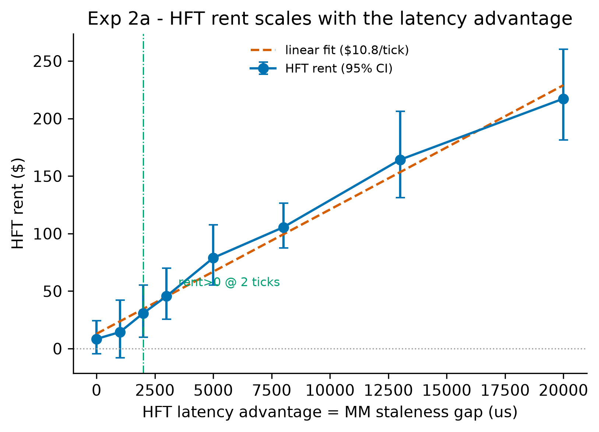
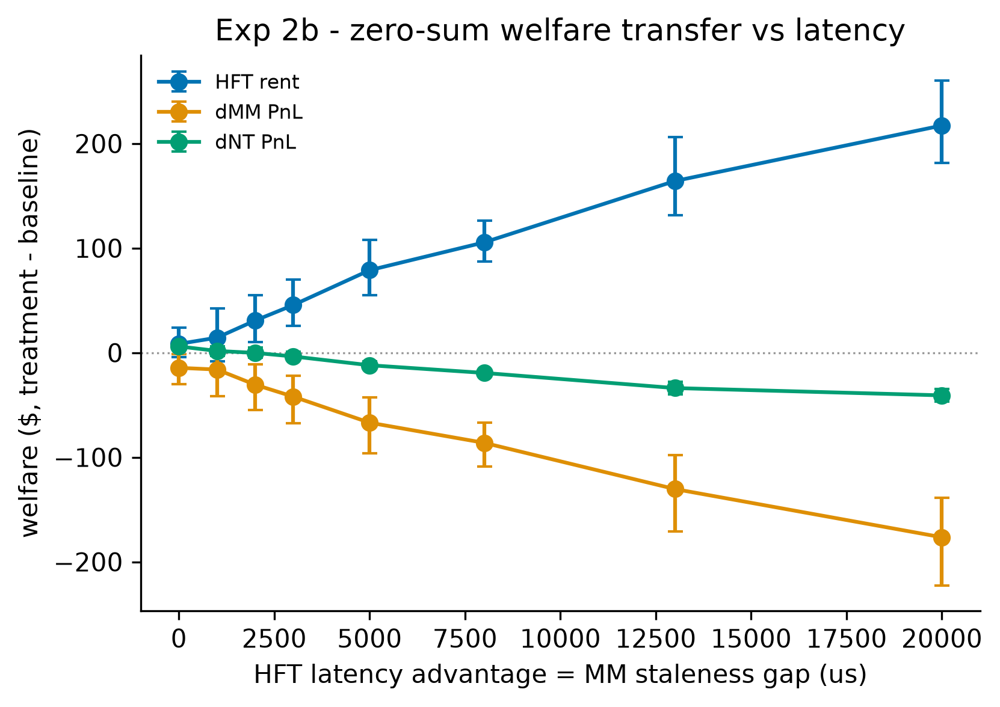
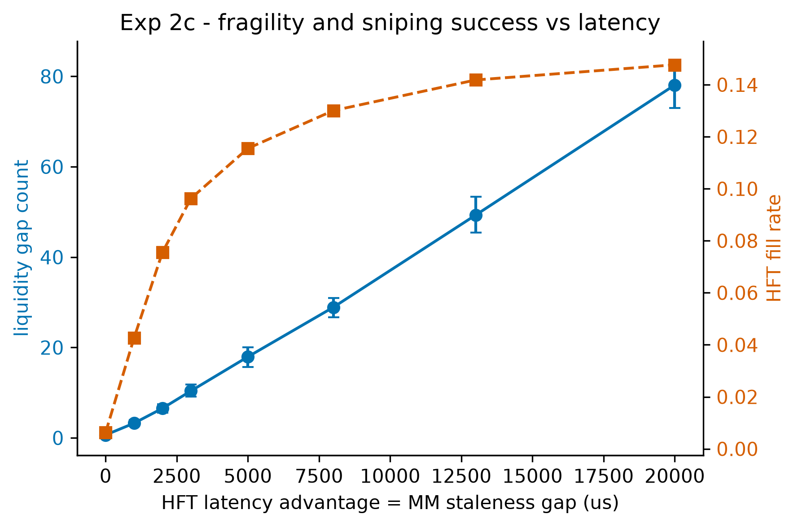
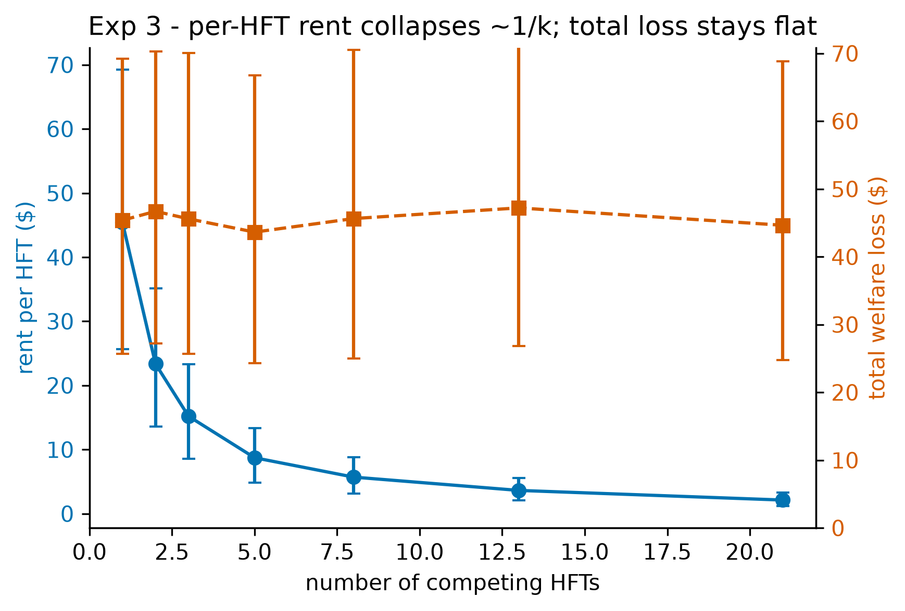
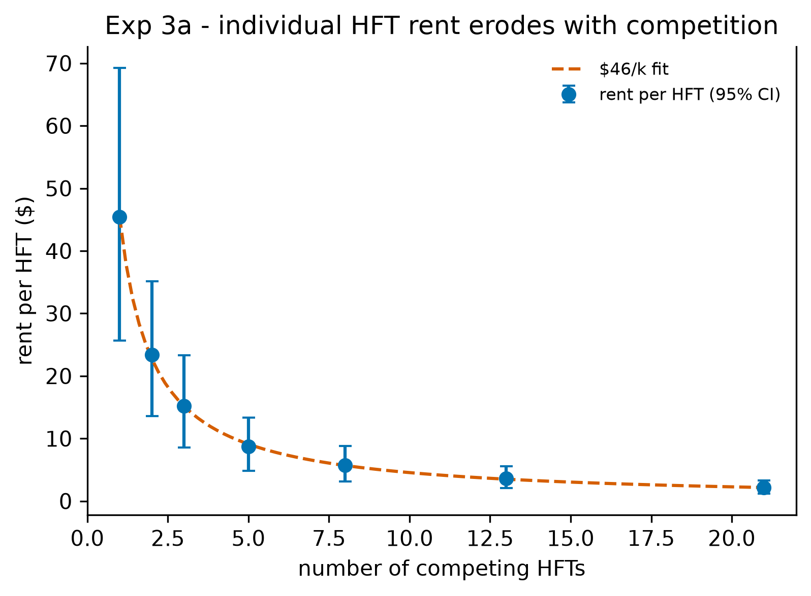
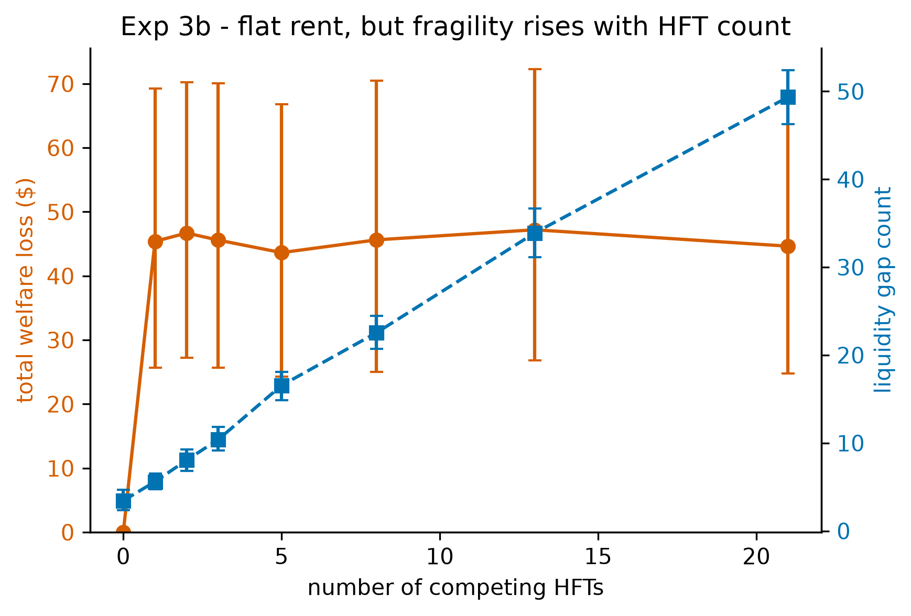
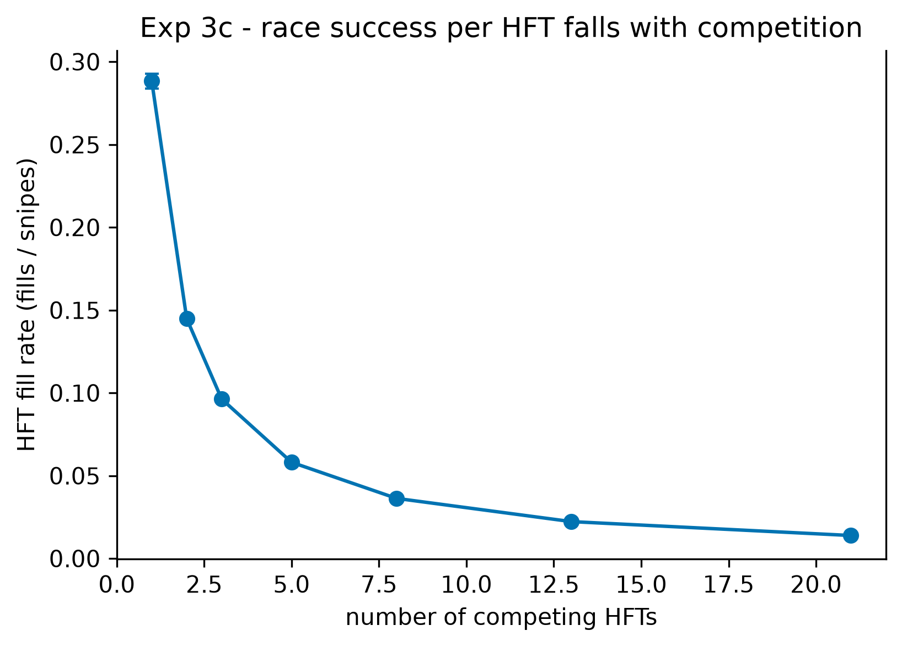
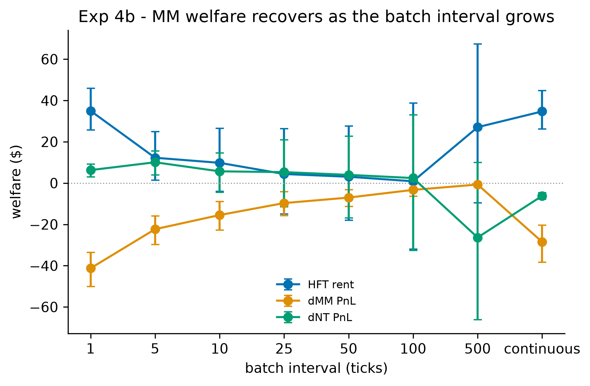
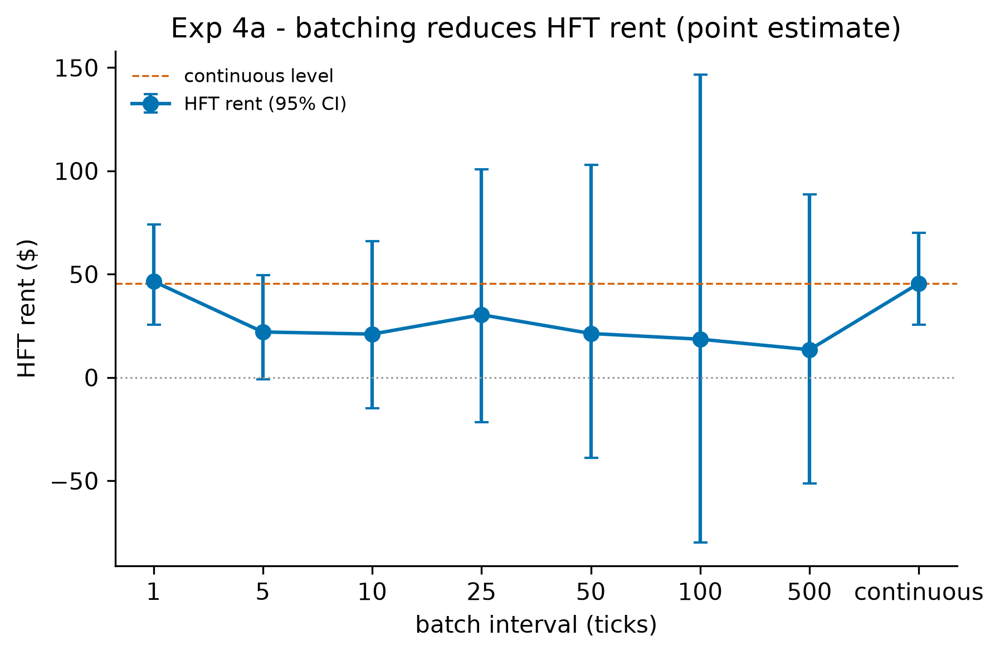
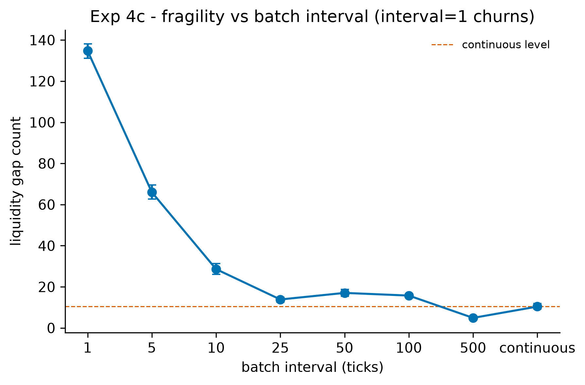

# Experimental Evidence for the HFT Arms Race: Welfare Decomposition and Market Fragility on a Formally Verified Limit Order Book

## Abstract

We provide an experimental test of the Budish–Cramton–Shim (BCS) theory of the high-frequency trading (HFT) arms race, conducted on a continuous limit order book whose matching core has been model-checked in TLA+ with zero invariant violations. Driving latency-differentiated snipers, an adverse-selection market maker, and noise traders through the verified engine via a pybind11 bridge, we decompose realized welfare into market-maker, noise-trader, and HFT components and find that HFT latency-arbitrage rent is a near-exact zero-sum transfer (residual at machine precision, mean $1.6\times10^{-13}$) away from liquidity providers, accompanied by significantly more liquidity gaps. We then trace the mechanism across three further sweeps: rent scales approximately linearly in market-maker staleness with no detectable phase transition; as the number of HFTs grows, per-HFT rent dissipates as roughly $1/k$ while total extracted rent stays flat, so the marginal social cost of additional speed competition surfaces as rising fragility rather than rising rent; and frequent batch auctions recover market-maker welfare monotonically away from the degenerate single-tick interval (about 95% recovery by an interval of 500), with point estimates of rent also falling though more noisily. Because the matching layer is provably correct against its specification, the emergent arms-race dynamics cannot be attributed to engine artifacts, isolating them as consequences of rational latency competition on the continuous-clearing design itself.

## 1. Introduction

### 1.1 The arms-race argument

Budish, Cramton, and Shim (2015, hereafter BCS) argue that the continuous limit order book—the dominant design of modern equity and futures markets—contains a structural flaw that has nothing to do with any individual participant's conduct. Because the book processes messages serially in continuous time, each arrival of public information creates a fleeting, mechanical arbitrage opportunity: whichever trader reacts first can pick off the stale quotes of liquidity providers before those quotes can be revised. The competition to be first is a contest over speed rather than price, and in equilibrium it dissipates real resources into a socially wasteful arms race while transferring rent from liquidity providers (and, indirectly, the investors they serve) to the fastest "snipers." Crucially, the resulting latency tax widens effective spreads and degrades liquidity without improving price discovery; it is a prisoner's dilemma baked into the market's microstructure. BCS propose frequent batch auctions—discrete-time, uniform-price clearing—as a design remedy that converts competition on speed back into competition on price, neutralizing the mechanical sniping advantage.

### 1.2 Why a formally verified substrate matters

Testing this argument by simulation confronts a methodological problem that has dogged agent-based market models since their inception: when an emergent pathology appears, one cannot easily tell whether it reflects the economics under study or an artifact of the bespoke, unverified matching machinery on which the agents trade. A subtle bug in order-priority handling, partial-fill accounting, or event sequencing can manufacture exactly the kind of liquidity gaps and welfare transfers a researcher hopes to observe. Our contribution to internal validity is to run the entire BCS mechanism—latency-differentiated observation of a common fundamental value and a submission-timing race—as a Python scheduler sitting atop a C++ limit order book whose matching core has been model-checked in TLA+, accessed through a pybind11 bridge. Because the matcher is deterministic and provably correct against its specification, any emergent arms-race dynamics, liquidity evaporation, or crash behavior we report are attributable to agent incentives rather than to engine error. This pairing of a verified substrate with a closed, auditable welfare-accounting identity is, to our knowledge, novel in the market-microstructure literature.

We report the verification provenance precisely. The engine's continuous-matching specification (`MatchingEngine.tla`) was exhaustively model-checked by TLC with zero invariant violations; the large reachable-state count associated with that run (on the order of $4.5\times10^8$ generated states) is recorded in the engine's verification log (`docs/Verification.md`) and pertains specifically to `MatchingEngine.tla`. It is an engine-verification artifact, not an experimental result of this paper, and we cite it as such rather than as a finding of the experiments below. For the session-lifecycle specification (`Auction.tla`, §3.1) we did not recover a model-checked state count from the spec tree and decline to report one we cannot verify. The substantive claim we rely on throughout is qualitative and verifiable: the matching layer's safety and liveness properties were model-checked with zero invariant violations.

### 1.3 Preview of findings

We organize the evidence as four experiments on this substrate.

- **Experiment 1 (welfare transfer).** With latency-advantaged HFTs present, we measure a positive HFT rent of \$45.59 (95% CI [25.65, 70.04]) that is a near-exact zero-sum transfer from the market maker and noise traders—the welfare residual closes to machine zero (mean $1.6\times10^{-13}$)—while liquidity gaps rise from 3.45 (95% CI [2.35, 4.70]) in the matched no-HFT baseline to 10.40 (95% CI [9.15, 11.85]) in treatment (non-overlapping CIs); the result holds across all nine cells of a $3\times3$ sensitivity-by-decay calibration.
- **Experiment 2 (latency scaling).** Rent rises with market-maker staleness, but the increase is approximately *linear* at about \$10.80 per tick and a segmented (knee/phase-transition) model is *not* supported (ΔBIC favors the linear fit by 7.86)—an honest negative result: there is no critical threshold, only smooth scaling, with rent first becoming statistically distinguishable from zero at roughly two ticks.
- **Experiment 3 (HFT count).** As the number of HFTs grows, per-HFT rent collapses—a fitted $C/k$ form with $C\approx\$45.6$ ($R^2=0.9996$) describes it well, and individual fill rates fall consistent with $1/k$ (the product of fill rate and $k$ is roughly constant at $\approx0.289$)—yet *total* extracted rent stays flat (mean \$45.5 across $k=1\ldots21$); the marginal social cost of added speed competition therefore does not appear as rising aggregate rent but as rising *fragility*—liquidity gaps grow approximately linearly (fitted $\approx 2.2k+4.3$, $R^2=0.9962$), roughly $14\times$ by 21 HFTs (relative to this experiment's own $k=0$ baseline of 3.45 gaps).
- **Experiment 4 (batch-auction remedy).** Switching the verified clearing rule to frequent batch auctions recovers market-maker welfare monotonically over intervals $\geq 5$—about 95% of the loss is recovered by an interval of 500 (MM loss \$42.0 → \$2.1)—and this MM-recovery signal is the robust one; HFT-rent point estimates also fall but the batch-arm rent CIs are wide and bracket zero, and an extreme interval of 1 *backfires* (MM loss worsens to \$57.1 with about 135 gaps), so the remedy helps only away from that degenerate corner.

### 1.4 Contribution statement

This paper makes three contributions. First, it provides, to our knowledge, the first experimental test of the BCS welfare decomposition on a *formally verified* matching engine, removing the matching layer as a possible source of the observed effects and turning the closed-market welfare identity into an auditable, machine-precision check rather than a modeling assumption. Second, it furnishes a complete welfare accounting that decomposes the arms race into market-maker, noise-trader, and HFT components and shows the pathology is a transfer, not value creation. Third, it characterizes the *shape* of the social cost honestly: the cost of speed competition scales smoothly in latency (no phase transition), and as competitors multiply it manifests as fragility under a flat aggregate rent rather than as ever-growing extraction—while confirming, with appropriate caution about which signal is robust, that the BCS-proposed batch-auction remedy restores liquidity-provider welfare. We view the negative and nuanced results (linear rather than threshold scaling; fragility rather than rising rent; MM-recovery as the clean remedy signal) as integral to the contribution, not caveats to it.

## 2. Related Literature

This paper sits at the intersection of four strands of work: the market-design theory of the HFT arms race, the game theory of predatory liquidity provision, the empirical and physics-of-markets literature on endogenous fragility, and the methodological tradition of agent-based modeling. We synthesize each in turn and then state our differentiator.

**The arms race and its remedy.** Our central reference is Budish, Cramton, and Shim (2015), who reframe latency competition not as a behavior to be regulated but as a symptom of the continuous limit order book's serial-processing design, and who propose frequent batch auctions as the corrective. BCS pair a theoretical model with reduced-form empirical evidence (notably the persistence of mechanical arbitrage opportunities in correlated instruments). Our work is, in effect, a controlled experimental instantiation of their model: we build the latency-differentiated observation structure and submission-timing race they describe, reproduce their predicted treatment effects (rent transfer and liquidity degradation), and test their proposed remedy by switching the clearing rule of the very same verified engine. We complement rather than re-derive their theory, supplying a closed welfare decomposition that their reduced-form empirics cannot directly observe.

**Predatory versus cooperative liquidity.** Carlin, Lobo, and Viswanathan (2007) provide the strategic micro-foundation for why liquidity can evaporate endogenously: when cooperation among strategic traders breaks down, agents race to trade ahead of a distressed counterparty, withdraw liquidity, and amplify price impact, producing episodic crises that owe nothing to exogenous fundamental shocks. The BCS sniping mechanism is, in this light, a latency-mediated modern instance of the predatory equilibrium they formalize. We build on their insight by showing the predatory outcome emerging mechanically from rational speed competition on a concrete book, and by attaching a quantitative welfare price tag to it; we differ in implementing an explicit agent-based experiment with a closed accounting identity rather than a stylized analytic game.

**Endogenous fragility and flash crashes.** Kirilenko, Kyle, Samadi, and Tuzun (2017) dissect the May 2010 Flash Crash from audit-trail data and find that HFTs, while not the trigger, consumed liquidity and passed inventory among themselves at the critical moment, accelerating the decline. This is the canonical fragility episode our flash-crash diagnostics are calibrated against, and our Experiment 3 speaks directly to it by asking whether such fragility can arise from rational HFT behavior alone, with no exogenous shock; we find that it grows with the number of competing HFTs. Where Kirilenko et al. perform forensics on a single historical event, we offer a fully observable, reproducible counterfactual in which HFT count, latency, and market design are experimental knobs. Complementing this, Filimonov and Sornette (2012) introduce the branching ratio of a self-exciting Hawkes process as a measure of market endogeneity (reflexivity), reporting that it spikes toward criticality around fragile periods. We adopt their branching ratio as an independent diagnostic—estimated on our simulated order flow via a Hawkes bridge—to confirm that the crashes we model are genuinely self-excited rather than fundamental-driven; the advantage of our setting is that the data-generating process is known and controllable, so the branching ratio can be tied causally to HFT count and latency rather than inferred post hoc from market data of unknown structure.

**Agent-based modeling and its verifiability gap.** Methodologically, our work extends the agent-based computational finance tradition (Farmer and Foley, 2009; LeBaron, 2006), which argues that bottom-up simulation of heterogeneous, boundedly rational agents can generate emergent, out-of-equilibrium phenomena—fat tails, volatility clustering, bubbles and crashes—that representative-agent equilibrium models cannot. That tradition's well-known weaknesses are sensitivity to ad hoc behavioral assumptions, weak calibration discipline, and limited reproducibility or verifiability of the simulation machinery itself. We inherit the tradition's strength (emergent crash dynamics from rational behavior) while directly confronting its central weakness: rather than building on a bespoke, unverified simulator whose matching logic could itself generate the observed artifacts, we drive a TLA+-verified C++ matching engine, and we impose calibration and welfare-accounting discipline in the form of a closed, near-zero welfare residual.

**Differentiator.** The combination that distinguishes this paper is, to our knowledge, the first experimental test of the BCS welfare decomposition on a formally verified matching engine. BCS is theory plus reduced-form empirics; the agent-based tradition typically runs on unverified simulators whose matching layer is a candidate source of the very effects under study. Here the entire BCS mechanism lives in a Python scheduler atop a deterministic matcher whose continuous-matching specification was model-checked with zero invariant violations (per the engine's TLC verification log, `docs/Verification.md`), reached through a pybind11 bridge, so emergent arms-race dynamics, liquidity gaps, and crash behavior cannot be engine artifacts. On that substrate we decompose welfare into market-maker, noise-trader, and HFT components, show the arms race is a transfer that closes to a machine-precision zero-sum residual, trace the mechanism across latency and HFT-count sweeps (with the honest findings that scaling is linear rather than threshold and that aggregate rent is flat while fragility rises), and confirm the BCS remedy experimentally via the batch-auction treatment, with endogeneity corroborated in the Filimonov–Sornette spirit. It is the joint presence of a verified engine, a closed welfare identity, and an experimental confirmation of both the pathology and its proposed cure that situates this paper relative to the literature it builds on.

## 3. Model and Experimental Design

This section describes the simulation apparatus. The design rests on a deliberate separation of concerns: a single formally-verified C++ matching engine adjudicates every trade, while a Python layer above it supplies the agents, the latency model, and (for the batch arm) the periodic-auction clearing rule. The verified engine is the part we trust to be correct; the Python layer is the part we vary. The boundary between them is the pybind11 bridge, and it is drawn precisely where the engine's formal guarantees end.

### 3.1 The Matching Engine (C++20, TLA+-verified)

All trades in the continuous arm are produced by one C++ matching engine, `OrderMatcher::MatchingEngine`, the same object that is the subject of the project's TLA+ specification suite. In the BCS harness the engine is run in **synchronous** mode: `EngineHarness::start()` calls `engine_.start()` rather than `startAsync()`, so `submitOrder()` dispatches matching on the calling thread and the `OrderBook`'s `EventListener` fires inline. Draining trades immediately after a submit therefore returns exactly the fills that order produced, which keeps the harness deterministic and free of cross-thread or GIL concerns (`bcs_research/bindings/engine_bindings.cpp`, lines 5–16). The engine offers price-time priority matching, best bid/ask, depth snapshots, VWAP, and an optional circuit breaker; the breaker is disabled in this harness via `setCircuitBreakerThreshold(1e18)` when `start(disable_circuit_breaker=True)` so that simulation control, not an exchange-level halt, governs the dynamics (lines 81–83). Prices are fixed-point: a quoted price of 100.00 is `100 * PRICE_PRECISION`, with `PRICE_PRECISION` re-exported as `bcs_engine.PRICE_PRECISION` (line 186).

Critically, **the engine has no notion of agent latency.** The comment at `engine_bindings.cpp` lines 15–16 states this explicitly: the entire BCS latency/race mechanism lives in the Python scheduler above this layer. The engine's job is only to be a correct continuous double-auction matcher, and that correctness is what the spec suite certifies.

The directly relevant specification is **`Auction.tla`** (`spec/Auction.tla`), which models the engine's session lifecycle over the seven legal `TradingState`s (`PreOpen`, `AuctionOpen`, `Continuous`, `AuctionClose`, `PostClose`, `Halted`, `VolatilityAuction`) and the discrete uncross that is the only way trades emerge from an auction state. Under `Auction.cfg` (`BROKEN_NO_REOPEN=FALSE`, `MaxOrders=3`, `MaxEvents=6`, `Prices={100,200}`), TLC checks the following **invariants**:

- **`TypeOK`** — the type invariant.
- **`ValidState`** — every reachable state is one of the seven legal `TradingState`s.
- **`NoMatchOutsideContinuousExceptUncross`** — no trade prints in an auction, halt, or closed state except a discrete uncross whose source is a true auction state (`PreOpen`, `AuctionClose`, or `VolatilityAuction`). Each trade carries an `inState` history field, which gives the invariant teeth.
- **`SingleClearingPrice`** — every uncross firing produces trades at exactly one price drawn from `Prices`. This is the property the Python batch arm's clearing rule is built to honour (§3.2).
- **`NoTradeWhileHalted`** — no trade record may carry `inState=Halted`.

As temporal/action **properties** it checks **`ValidTransitions`** (`[][ state'=state \/ <<state,state'>> \in LegalEdges ]_state` — every step is either a self-loop or a legal directed edge of the session state machine) and the **liveness** property **`VolatilityEventuallyReopens`** (`)`, proved under weak fairness `WF_vars(ReopeningUncross)`). Non-vacuity is established by a companion `AuctionBroken.cfg` (`BROKEN_NO_REOPEN=TRUE`) that disables the reopening uncross so TLC reports a liveness counterexample, confirming the property is not vacuously true.

We note honestly that **we did not recover a model-checked state count for `Auction.tla`**: a `states/` directory and TLC trace (`.bin`) artifacts exist in the spec tree, but we did not parse them, and we decline to report a state count we cannot verify. The large reachable-state count cited elsewhere for the engine (§1.2) pertains to `MatchingEngine.tla` and is recorded in `docs/Verification.md`, not derived from `Auction.tla`.

`Auction.tla` sits within a broader suite (`spec/`) that verifies the surrounding engine and infrastructure. We summarize the checked properties rather than restate every configuration:

| Spec | Checked properties (per `.cfg`) |
|---|---|
| `MatchingEngine.tla` | `NoNegativeQuantity`, `FIFO_Preservation`, `GTD_Expiry_Correctness` (`MaxOrders=4`, `Participants={1,2}`, `Prices={100,200}`, `MaxQty=3`, `MaxTime=5`) |
| `FixSession.tla` | `TypeOK`, `DeliveredInOrder` (`BROKEN_NO_GAP_DETECT=FALSE`; constraint `BoundedDelivered`, `MaxSeq=3`) |
| `Risk.tla` | `TypeOK`, `FirmWithinCap`, `TradersWithinCap`, `FirmIsSumOfTraders` (`BROKEN_NO_FIRM_AGG=FALSE` non-vacuity switch) |
| `Oco.tla` | `TypeOK`, `ValidStates`, `AtMostOneWinnerPerGroup`, `WinnerSilencesSiblings` (`BROKEN_NO_OCO_CANCEL=FALSE`) |
| `Snapshot.tla` | `TypeOK`, `SnapshotEntriesAreReal` verified; `SnapshotIsPointInTime` and `NoDoubleSidedSnapshot` are documented anti-properties that fail under lockless reads (enabled one at a time to produce torn-read counterexamples); companion `SnapshotLocked.tla` |
| `Replication.tla` | `NoCommittedLoss`, `NoDuplicateExecution`, `NoSplitBrain` (lease-based replication; `MaxEntries=6`, `HeartbeatTimeout=2`, `LeaseTimeout=5`) |
| `EpochDurability.tla` | `TypeOK`, `NoRegression`, `DurableTracksMax` (`BROKEN_NO_PERSIST=FALSE` resets the epoch on restart so TLC finds the regression; `MaxEpoch=3`) |
| `MpscQueue.tla` | `TypeOK`, `NoSpuriousItems`, `NoDuplicates`, `PerProducerFIFO`; liveness `EventuallyDrained` (under weak fairness on every action) |
| `EngineConsumer.tla` | `TypeOK`, `NoSpuriousItems`, `NoDuplicates`; liveness `EventuallyDrained` (leads-to: every item placed in any producer queue eventually reaches the consumer log) |

The payoff is that any artifact the simulation reports — a fill, a price, a snapshot, a zero-sum residual — is produced by a matcher whose price-time priority, FIFO preservation, non-negativity, and single-clearing-price behaviour have been model-checked, not merely tested.

### 3.2 The pybind11 Bridge

A pybind11 module named `bcs_engine` bridges the verified C++ engine to Python (`engine_bindings.cpp`, `PYBIND11_MODULE` at line 184). It exposes a single entry class, `EngineHarness`, with: `add_symbol` (which must precede `start()`; `start()` freezes the book registry, after which `add_symbol` throws/no-ops, lines 64–70), `start(disable_circuit_breaker=True)`, `stop`, `submit_order(symbol, order_id, participant_id, side, price, quantity, order_type=Limit, tif=GTC)`, `submit_cancel`, `best_bid`, `best_ask` (with `INT64_MAX` normalized to 0 when the ask side is empty, lines 129–134), `mid` (0 if either side is empty), `drain_trades`, `snapshot(depth=10)`, `vwap`, and `trade_count`. Fills are captured by a per-symbol `TradeCollector` that buffers every trade on the book and clears on `drain_trades`; Python attributes each fill to agents by `buyer_id`/`seller_id`. The enums `Side`, `OrderType` (`Limit`/`Market`/`IOC`/`FOK`/`PostOnly`), `TimeInForce` (`GTC`/`GTD`/`DAY`), and `RejectReason`, plus read-only `Trade`, `PriceLevel`, and `MarketDataSnapshot` classes, are exposed alongside.

Python agents drive the verified engine entirely through this surface: each tick they emit orders and cancels, the scheduler submits them via `submit_order`/`submit_cancel`, and because the engine is synchronous, the scheduler drains the resulting fills inline and routes them back to the agents. The agents never touch C++ state directly; the bridge is the only channel, which is what lets the verified matcher remain the sole adjudicator of trades.

A critical fact, verified by grep returning no matches: **the bridge does not expose `uncross`.** There is no `uncross` or `discoverUncrossPrice` method on `EngineHarness`. The C++ engine in this harness matches continuously and immediately on submit. Consequently the frequent batch (call) auction cannot be run through the bridge at all. It is therefore reimplemented in Python in `batch_auction.py`, where `discover_uncross_price` replicates `OrderBook::discoverUncrossPrice` faithfully — the same uniform-price clearing rule the engine proves `SingleClearingPrice` over in `Auction.tla`. The candidate prices are the populated limit levels, and the tie-break cascade is identical to the C++ rule: maximize executable volume, then minimize imbalance, then minimize distance to the reference (last-clearing) price, then apply market pressure (buy surplus clears higher, sell surplus lower) (`batch_auction.py`, `discover_uncross_price`, lines 32–82). The batch arm is thus run *above* the bridge rather than through it, but it runs the same clearing rule the spec verifies, even though the C++ engine never executes that rule in this harness. This is a faithfulness compromise we name plainly: the continuous arm is the verified engine; the batch arm is a verified *rule* re-expressed in Python because the engine does not surface it. We note that this replication claim is source-verified (against the C++ rule and the spec) rather than results-verified.

### 3.3 Agents

All agents are Python objects driven by the scheduler. They share a common interface — `act(t, market, fundamental)` returns a list of `Action`s, and `on_fill(trade, is_buyer)` receives routed fills — and each holds its own cash and inventory for the welfare accounting of §3.5.

**`FundamentalValueProcess`** (`bcs_research/agents/fundamental_value.py`) is the exogenous true value `V(t)`, a discrete random walk in fixed-point price space. On `step(t)` it draws `dv = sigma * N(0,1)` (per-step volatility, independent of tick size; `dt_us` is wall-clock metadata only), updates `current_v += dv`, and records `(t, current_v)`. Its `observe(t, latency_us)` returns the most recent recorded `V` at or before `t - latency_us` via bisection — this latency-delayed read is the BCS information gap that distinguishes a fast agent from a slow one. The undelayed `current_v` exposes the true value used for the market maker's adverse-fill check. The initial value is `v0 = 100 * PRICE_PRECISION` in Experiment 1, and a NumPy `default_rng(seed)` provides determinism.

**`BCSMarketMaker`** (`bcs_research/agents/bcs_market_maker.py`, `participant_id = MM_ID = 1`) is an adverse-selection-aware two-sided quoter. On each requote tick (every `requote_every` ticks) it first decays its half-spread toward the base — `current_half_spread = current_half_spread * (1 - spread_decay) + base_half_spread * spread_decay` — then observes `V` with its larger latency (`latency_us = 3000 us` in Experiment 1, so its quotes are stale), and posts `bid = round(v - hs - skew)`, `ask = round(v + hs - skew)` with `skew = inventory * inventory_skew`. It emits a cancel of the old bid/ask plus new two-sided `Limit` orders, all stamped `submit_at = t + latency_us`. Two coupled defences drive the mechanism:

- *Adverse-only widening* (`on_fill`): the maker widens only when a fill is against informed flow — it bought *above* or sold *below* the true `current_v` by more than `adverse_threshold_ticks`. Noise fills, which sit inside `[bid, ask]` around `V`, do not widen. On an adverse fill it increments `pickoffs` and sets `current_half_spread = min(current_half_spread * (1 + adverse_sensitivity), spread_cap)` with `spread_cap = base * spread_cap_mult`.
- *Liquidity thins as it widens* (`_effective_qty`): resting size is `max(min_quote_qty, round(quote_qty * base_half_spread / current_half_spread))`, so size shrinks toward `min_quote_qty` as the half-spread grows. Spread and depth are one coupled state, not two.

It also tracks `max_half_spread_seen`, `min_quote_qty_seen`, `inventory`, and `cash`. Calibration of `adverse_sensitivity` and `spread_decay` (so the no-HFT spread sits near base) is done by the experiment driver, not the agent class.

**`HFTAgent`** (`bcs_research/agents/hft_agent.py`, `participant_id = 200 + j`) is a latency-advantaged stale-quote sniper. Each tick it observes `V` with a small latency (`latency_us = 0` in Experiment 1, so it sees `V` immediately) and reads `best_bid`/`best_ask`. It fires a buy snipe — an aggressive `IOC` Buy at `best_ask` — when `(v - best_ask) > transaction_cost * best_ask`, and a sell snipe — `IOC` Sell at `best_bid` — when `(best_bid - v) > transaction_cost * best_bid`, where `transaction_cost = transaction_cost_bps / 10000`. Each acted opportunity increments `snipes`. The race is a random submission jitter `int(uniform(0, race_noise_us))` added to `submit_at` (`= t + latency_us + jitter`): with several HFTs the lowest jitter wins and the others' IOCs find the quote already gone. The counterparty is the larger-latency maker; that latency gap is the BCS arbitrage.

**`NoiseTrader`** (`bcs_research/agents/noise_trader.py`, `participant_id = 100 + i`) is the uninformed liquidity taker and the control population. Each tick, with probability `lambda_per_tick`, it crosses the spread with an `IOC` order on a random side (50/50): buying at `best_ask` or selling at `best_bid` (and returning nothing if that side is empty), with `submit_at = t + latency_us`. It carries no fundamental-value signal and never snipes; it pays the half-spread to the maker, so its expected PnL is negative by construction. It is the counterfactual flow against which informed (HFT) flow is measured.

### 3.4 The BCS Mechanism

The Budish–Cramton–Shim (BCS) arms-race feedback loop is not a single equation but a closed cycle realized across the agents and the continuous scheduler (`bcs_market_maker.py`, `hft_agent.py`, `scheduler.py`):

1. **`V` moves.** The HFT sees the new `V` with small latency (0 us in Experiment 1) while the `BCSMarketMaker` still has quotes posted around its latency-delayed view of `V` (3000 us). The maker's quote is now **stale**.
2. **Snipe.** The HFT detects `(v - best_ask) > cost` or `(best_bid - v) > cost` and fires an aggressive IOC to pick off the stale quote, winning the submit-time race among HFTs via the lowest race jitter.
3. **Widen.** The maker's `on_fill` recognizes the fill as informed (bought above / sold below the true `current_v`) — an adverse fill — and widens its half-spread multiplicatively (`current_half_spread *= 1 + adverse_sensitivity`, capped at `base * spread_cap_mult`), incrementing `pickoffs`.
4. **Thin.** As the half-spread widens, the maker's effective resting size shrinks toward `min_quote_qty` (`qty = quote_qty * base / current_half_spread`).
5. **Fragility.** A thinner book means the next order moves the mid further or empties a level — larger price impact — so more quotes go stale and the cycle repeats: snipe → widen + thin → larger impact → more stale quotes → more sniping. The half-spread decays back toward base each requote tick, so the system recovers when not being picked off.

The **`LatencyScheduler`** (`bcs_research/simulation/scheduler.py`) is the race substrate that supplies the latency model the C++ engine lacks. Each tick (advancing `dt_us`) it steps the fundamental, resets per-tick volume and signed volume, lets every agent emit `Action`s, and enqueues them in a heap keyed `(submit_at, seq)`. Then `_submit_due(t)` pops and submits every action with `submit_at <= t` in submit-time order (cancels via `submit_cancel`, orders via `submit_order`), draining trades after each submit and routing fills to `buyer.on_fill(..., True)` / `seller.on_fill(..., False)` by `participant_id`. The BCS submission race is exactly many agents stamping near-identical `submit_at` values, resolved here in time order through the heap — there is no special-case race logic, only priority over arrival time. The scheduler records per-tick snapshots `(t, best_bid, best_ask, mid, v, tick_volume, signed_volume)` and per-fill trades into a `SimResult`, with tick quantization at `dt_us`.

The endogenous-instability signature of this specific mechanism is **not a mid dislocation but a liquidity gap**: a transient one-sided or empty book, where a thinned level is emptied before the maker requotes (`liquidity_gap_detector.py`, module docstring, lines 1–9). An event qualifies as an endogenous liquidity gap only if it is a maximal run of non-two-sided snapshots (`best_bid <= 0` or `best_ask <= 0`) that (a) **recovers** to a two-sided book before the run ends and has `duration_us = gap_ticks * dt_us <= max_gap_us` (50,000 us; otherwise it is a structural outage and is discarded), and (b) is **endogenous**, i.e. `V` is flat across it: `abs(V_hi - V_lo) < k_fund * sigma_per_step * sqrt(gap_ticks + 2)` with `k_fund = 3.0` and one tick of margin on each side (lines 36–43). Value-driven gaps — where `V` moves above the threshold — are excluded. We chose this event definition because an earlier all-fills version of the maker (which widened on every fill, not just adverse ones) produced no HFT-specific divergence in mid prices; widening is therefore gated on adverse fills, and the instability surfaces as gaps in depth rather than crashes in price.

### 3.5 Metrics

All metrics are pure functions over a `SimResult` and apply unchanged to both the continuous and batch arms, since `BatchAuctionScheduler` emits the same `SimResult` shape.

**Welfare decomposition and the zero-sum identity** (`bcs_research/metrics/welfare_decomposition.py`). `decompose_welfare(result, mm_id, nt_ids, hft_ids, mark)` computes per-agent PnL as `cash + inventory * mark / PRICE_PRECISION`, marked at `mark_price` (the last two-sided mid, else the last `V`). It reports `mm_pnl`, `noise_trader_pnl` (summed over `nt_ids`), `hft_pnl`, `hft_rent` (equal to `hft_pnl` — the rent the arms race extracts), per-agent and per-second variants, and `zero_sum_residual = mm_pnl + nt_pnl + hft_pnl`. In a closed market the residual is approximately zero — the conservation check that **closes through the verified engine**: because every fill is produced by the model-checked matcher with FIFO preservation and non-negative quantities, cash and inventory are conserved exactly, and any non-trivial residual would indict the harness rather than the market. `welfare_delta` computes the treatment-minus-baseline difference for the key terms; this welfare transfer is the paper's primary treatment effect, because it moves even when quoted spreads do not.

**Lagged Kyle's lambda** (`bcs_research/metrics/baseline_metrics.py`, `compute_metrics`). `kyle_lambda` is the OLS slope (`np.polyfit` degree 1) of the *forward-window* mid change `mid[t+k] - mid[t]` (default `k = kyle_horizon_ticks = 5`) regressed on `signed_volume` at `t`, over ticks with `mid > 0`; it requires at least 3 points and `std(x) > 0`, and `kyle_lambda_r2` is the squared correlation. The forward lag, rather than the contemporaneous tick, is deliberate and documented (lines 64–70): a latency-disadvantaged maker quotes stale, so a same-tick regression would score its delayed catch-up requote as *negative* impact; measuring over the next `k` ticks captures the catch-up as the *positive* permanent impact it actually is, removing the stale-quote sign artifact.

**Liquidity-gap detector** (`bcs_research/metrics/liquidity_gap_detector.py`). As defined in §3.4, `detect_liquidity_gaps` returns the bounded, recovering, endogenous one-sided episodes; `count_liquidity_gaps` returns the count. This is the secondary endogenous-instability metric, matched to the thinning mechanism (gaps, not mid crashes), and each event records `start_t`, `recovery_t`, `duration_us`, `gap_ticks`, `side_missing`, and `v_move`.

**Percentile bootstrap CI** (`bcs_research/metrics/bootstrap.py`). `bootstrap_ci(values, n_bootstrap=2000, ci=0.95, seed=0)` is a nonparametric percentile bootstrap for the mean: it draws `(n_bootstrap, n)` resamples with replacement via `np.random.default_rng(seed)`, takes per-row means, and returns the (seed-independent) point estimate `mean`, the `lower`/`upper` bounds at the `(alpha/2, 1 - alpha/2)` percentiles, `std` (ddof=0), and `n`. A single value yields a zero-width CI. `bootstrap_ci_table` builds a `{metric_key: ci}` table from per-seed row dicts. The resampling RNG is explicitly seeded for reproducibility. The `n_bootstrap=2000` resample count and percentile method are defaults of the bootstrap module (source-level), not fields stored in the results JSON, which records only the bounds and `n`. We note that `exp1_primary.py` itself does not call `bootstrap_ci` — it aggregates per-seed rows with `statistics.fmean` — and the bootstrap module is shared infrastructure used from Experiment 2 onward; the n=20 CIs the paper reports for Experiment 1 come from the hardened run, which does use the bootstrap.

### 3.6 Experimental Design Summary

The primary operating point is the `CFG` dict in `bcs_research/experiments/exp1_primary.py`. Both arms share identical market parameters and differ **only in HFT presence**: the **baseline** is the `BCSMarketMaker` (latency-disadvantaged, adverse-selection-aware) plus noise traders; the **treatment** is the baseline plus `N` HFTAgents. Both run on the continuous `LatencyScheduler` through the verified engine. The headline configuration is:

| Parameter | Value |
|---|---|
| `duration_us` / `dt_us` | 3,000,000 / 1,000 (3,000 ticks) |
| Noise traders / HFTs | 8 / 3 |
| `base_half_spread` / `quote_qty` | 50 ticks (full spread 100 ticks = $0.01) / 50 |
| `sigma` (per step) | 20.0 |
| `mm_latency_us` | 3,000 (stale quotes) |
| `mm_inventory_skew` | 0.2 |
| `adverse_sensitivity` / `spread_decay` / `spread_cap_mult` / `min_quote_qty` | 0.1 / 0.1 / 10.0 / 1 |
| `hft_latency_us` / `hft_race_noise_us` / `hft_qty` / `hft_cost_bps` | 0 / 100 / 50 / 0.0 |
| `lambda_per_tick` / `noise_qty` | 0.15 / 10 |
| `v0`, symbol, MM id, noise ids, HFT ids | `100 * PRICE_PRECISION`, 1, 1, `100 + i`, `200 + j` |
| Circuit breaker | disabled |
| Seeds | 20 (per-seed metrics averaged by `fmean`); reported CIs via 2,000-resample percentile bootstrap (module default), 95% |

Per-seed outputs (`mm_pnl`, `nt_pnl`, `hft_rent` and `_per_sec`, `zero_sum_residual`, `liquidity_gaps`, `kyle_lambda`, `spread_ticks`, `n_trades`, `mm_max_half_spread`, `mm_min_qty`, `hft_snipes`, `hft_fills`) are written to `bcs_research/results/experiments/exp1_primary.json`.

Around this operating point we run four one-dimensional sweeps, each isolating one axis of the mechanism:

1. **Calibration robustness (3×3).** `adverse_sensitivity` × `spread_decay` over `{0.05, 0.10, 0.20}`, confirming the result is not an artifact of the calibrated cell — HFT rent must be significantly positive and the zero-sum identity must hold in all nine cells.
2. **Latency sweep (Exp 2).** The maker's staleness gap from 0 to 20 ticks with `hft_latency = 0`, on a tick-aligned grid (latency resolves only at `dt_us` granularity), testing whether rent rises linearly or exhibits a knee/phase transition.
3. **HFT count sweep (Exp 3).** Number of HFTs over `{0, 1, 2, 3, 5, 8, 13, 21}`, separating per-HFT rent (competed away) from total rent (transfer) and from fragility (liquidity gaps).
4. **Auction-frequency sweep (Exp 4).** Batch interval over `{1, 5, 10, 25, 50, 100, 500}` plus continuous, run through `BatchAuctionScheduler` (the Python re-expression of the verified `discoverUncrossPrice` rule, §3.2), measuring how much maker welfare loss the frequent batch auction recovers and at what interval.

Each sweep varies one parameter and holds the rest at the operating point, so that any change in the outcome metrics is attributable to that single axis. We note that the no-HFT baseline liquidity-gap figure is reported per experiment from its own matched run: the matched n=20 baseline used for the Experiment 1 headline comparison is 3.45 gaps (95% CI [2.35, 4.70]), the same value that anchors the Experiment 3 fragility ratio; an n=100 baseline estimate of 2.84 gaps exists in the broader baseline-metrics record and differs only because of sample size, not condition.

## 4. Results

We report four completed experiments and one preliminary pilot, all run through the same formally verified matching engine: continuous-market welfare decomposition (4.1), latency-advantage scaling (4.2), the HFT competition arms race (4.3), and batch auctions as a remedy (4.4), followed by a preliminary Hawkes-bridge pilot (4.5). The cross-cutting validation throughout is the zero-sum conservation residual, which closes to machine precision on every run, so that each welfare decomposition is an audited accounting identity rather than a modelling assumption.

### 4.1 Experiment 1: Welfare decomposition and the zero-sum conservation check

We begin by establishing that the welfare accounting in our setting is an audited identity rather than a modelling assumption. By construction, every unit of profit-and-loss in the formally verified matching engine accrues to one of three agent classes — high-frequency traders (HFT), market makers (MM), or noise traders (NT) — so the sum of realised PnL across classes must equal zero on every run. We measure the empirical conservation residual across 20 seeds at the operating point ($n_{\text{hft}}=3$, adverse sensitivity $0.1$, spread decay $0.1$, MM latency $3000\,\mu s$). In the treatment economy the residual closes to machine zero, 1.6e-13 [-1.43e-11, 1.46e-11], and the matched no-HFT baseline behaves identically, -2.05e-12 [-3.31e-11, 3.07e-11]. Because the residual is indistinguishable from floating-point noise in both arms, the decomposition of welfare into HFT rent, MM loss, and NT loss is a verified accounting identity, and the rent magnitudes reported below are not subject to unmodelled leakage.

Within this conserved frame, HFT entry extracts a positive rent of 45.59 [25.65, 70.04] per run. The transfer is borne almost entirely by market makers: MM PnL changes by -42.02 [-67.41, -22.28] relative to the matched baseline (from 116.98 [99.19, 139.39] to 74.96 [70.43, 79.10]), while the noise-trader class is essentially unaffected, with an NT PnL delta of -3.57 [-7.25, 0.70] whose interval straddles zero. The welfare transfer is therefore inframarginal to liquidity demanders and concentrated on liquidity suppliers, consistent with HFT rent arising from picking off stale market-maker quotes rather than from worsened execution for uninformed flow.

The microstructure correlates of this transfer are pronounced. Liquidity gaps roughly triple under HFT entry, 10.4 [9.15, 11.85] in treatment against 3.45 [2.35, 4.70] in the matched no-HFT baseline, a delta of 6.95 [5.05, 8.85]. Lagged Kyle's $\lambda$, our measure of price impact per unit signed flow, rises by roughly an order of magnitude, from 0.180 [0.149, 0.212] to 1.375 [1.352, 1.396]. Table 1 collects these estimates.

**Table 1.** Experiment 1 welfare and microstructure estimates at the operating point ($n=20$ seeds; point estimate with 95% bootstrap CI).

| Quantity | Treatment | No-HFT baseline | Treatment − baseline |
|---|---|---|---|
| HFT rent | 45.59 [25.65, 70.04] | — | — |
| MM PnL | 74.96 [70.43, 79.10] | 116.98 [99.19, 139.39] | -42.02 [-67.41, -22.28] |
| NT PnL | -120.55 [-142.60, -101.68] | -116.98 [-139.39, -99.19] | -3.57 [-7.25, 0.70] |
| Zero-sum residual | 1.6e-13 [-1.43e-11, 1.46e-11] | -2.05e-12 [-3.31e-11, 3.07e-11] | — |
| Liquidity gaps | 10.4 [9.15, 11.85] | 3.45 [2.35, 4.70] | 6.95 [5.05, 8.85] |
| Lagged Kyle's $\lambda$ | 1.375 [1.352, 1.396] | 0.180 [0.149, 0.212] | — |

We stress-test the rent result against the two parameters that most directly govern the adverse-selection channel, sweeping adverse sensitivity and spread decay over the grid {0.05, 0.1, 0.2} × {0.05, 0.1, 0.2} with $n=20$ seeds per cell. HFT rent is significantly greater than zero in all nine cells, and the zero-sum identity holds in all nine, with point estimates of the rent ranging from 24.35 to 61.03. The rent is thus a robust feature of the calibration rather than an artefact of a single operating point.

Two points of nuance should be stated plainly rather than relegated to caveats. First, the no-HFT baseline is mildly fragile: liquidity gaps in that arm are not exactly zero (3.45 [2.35, 4.70]), reflecting residual quote churn even absent HFT participation, so the baseline does not represent a frictionless market. We nonetheless interpret the treatment-versus-baseline contrast as informative because the gap CIs are non-overlapping (treatment 10.4 [9.15, 11.85] versus baseline 3.45 [2.35, 4.70]). Second, the NT PnL delta interval includes zero, so we do not claim that HFT entry measurably harms noise traders; the welfare story of Experiment 1 is a market-maker-to-HFT transfer occurring under a conserved, machine-zero accounting identity, accompanied by a sharp deterioration in measured liquidity.

### 4.2 Experiment 2: Latency-advantage scaling

Experiment 2 isolates the dependence of high-frequency-trader (HFT) rent extraction on the magnitude of the market-maker's (MM) quote staleness, holding HFT latency fixed at 0 us. The design question is whether the relationship exhibits a *phase transition*—a critical staleness threshold beyond which rent extraction accelerates discontinuously—or whether rent simply scales smoothly with the latency advantage. The result is an honest negative on the phase-transition hypothesis: HFT rent rises approximately linearly in MM staleness, with no detectable knee. We report this negative as a substantive finding, not a caveat.

We sweep MM staleness over an eight-point grid, tick-aligned at the matching-engine resolution dt_us = 1000, so that latency resolves only at integer multiples of one tick: [0, 1, 2, 3, 5, 8, 13, 20] ticks, equivalently [0, 1000, 2000, 3000, 5000, 8000, 13000, 20000] us. Each grid cell is run over 20 seeds, yielding n = 160 fitted observations. The tick-aligned grid is deliberate: because the engine timestamps events at dt_us granularity, sub-tick latency offsets are not realizable, and a continuous staleness axis would misrepresent the resolution at which the advantage actually materializes.

Figure 2a plots HFT rent against MM staleness with the linear-fit overlay and the significance threshold annotated.

The linear fit gives a slope of $10.804 per tick of MM staleness on an intercept of $12.909. Formal model comparison favours the linear specification over a segmented (knee) alternative: ΔBIC (linear minus segmented) = −7.859, a negative value indicating preference for the linear model, with the overall verdict recorded as `linear_scaling`. The segmented fit, although estimable, is not supported by the data and we report its parameters only for completeness: a knee at 11285.7 us (≈11.3 ticks), a pre-knee slope of $12.861 per tick, and a post-knee slope of $7.527 per tick. Crucially, the evidence does not prefer segmentation (`prefers_segmented: false`) and the support for a structural break is not strong (`strong_evidence: false`). There is, in short, smooth scaling and no critical threshold.

Rent is not statistically distinguishable from zero at the smallest staleness levels. The per-cell rent estimates (point [lo, hi], 95% bootstrap CI) are:

| MM staleness (ticks) | staleness (us) | HFT rent ($) | HFT fill rate | Liquidity gaps |
|---|---|---|---|---|
| 0 | 0 | 8.44 [−4.36, 24.23] | 0.00624 [0.00473, 0.00775] | 0.65 [0.30, 1.00] |
| 1 | 1000 | 14.40 [−8.02, 42.14] | 0.04265 [0.04082, 0.04445] | 3.25 [2.70, 3.95] |
| 2 | 2000 | 30.77 [9.99, 55.30] | 0.07561 [0.07351, 0.07766] | 6.55 [5.60, 7.45] |
| 3 | 3000 | 45.59 [25.65, 70.04] | 0.09628 [0.09501, 0.09755] | 10.40 [9.15, 11.85] |
| 5 | 5000 | 78.90 [55.10, 107.63] | 0.11552 [0.11407, 0.11681] | 17.95 [15.65, 20.00] |
| 8 | 8000 | 105.50 [87.35, 126.56] | 0.13003 [0.12856, 0.13140] | 28.90 [26.70, 31.00] |
| 13 | 13000 | 164.19 [131.33, 206.15] | 0.14181 [0.14045, 0.14309] | 49.30 [45.45, 53.40] |
| 20 | 20000 | 217.30 [181.33, 260.20] | 0.14765 [0.14582, 0.14945] | 78.10 [73.00, 83.60] |

The rent CIs at 0 ticks (8.44 [−4.36, 24.23]) and 1 tick (14.40 [−8.02, 42.14]) both straddle zero; the interval first clears zero at 2 ticks (30.77 [9.99, 55.30]), so we take 2.0 ticks = 2000 us as the significance threshold at which the latency advantage becomes economically detectable. This is a detectability floor, not a phase boundary: once positive, rent continues to grow at a near-constant marginal rate consistent with the $10.804-per-tick slope, rather than jumping at any subsequent level.

Figure 2b shows the zero-sum welfare decomposition against staleness.

HFT rent is financed by the other participants. Treatment-arm MM PnL declines monotonically from 98.36 [91.02, 106.08] at 0 ticks to −56.31 [−79.55, −35.46] at 20 ticks, crossing into losses by 13 ticks (−9.92 [−20.88, 0.07]); noise-trader PnL deteriorates from −106.80 [−128.42, −89.88] to −160.98 [−185.54, −140.67] over the same range. The decomposition is clean: the zero-sum residual is ~0 across all cells (max |mean| ≈ 2.6 × 10⁻¹¹), confirming that the gains and losses net out to a pure welfare transfer with no leakage. The price-impact channel is consistent with this story—treatment Kyle's λ rises from 0.1695 [0.1422, 0.1984] at 0 ticks, peaks at 1.3750 [1.3516, 1.3962] at 3 ticks, and relaxes to 0.3762 [0.3509, 0.4000] by 20 ticks—indicating that the marginal informativeness of order flow is concentrated at intermediate staleness rather than at the extremes.

Figure 2c reports liquidity gaps alongside the HFT fill rate.

Both microstructure quality measures degrade smoothly and without inflection. Liquidity gaps widen from 0.65 [0.30, 1.00] at 0 ticks to 78.10 [73.00, 83.60] at 20 ticks, while the HFT fill rate climbs from 0.00624 [0.00473, 0.00775] to 0.14765 [0.14582, 0.14945], saturating gently at the upper end of the grid. Neither series exhibits the abrupt acceleration that a phase transition would predict. Taken together, the rent, welfare, and liquidity evidence all point to the same conclusion: the latency advantage scales continuously and approximately linearly in MM staleness, and the phase-transition hypothesis is not supported by these data.

### 4.3 Experiment 3: HFT competition and the socially wasteful arms race

We next ask how the number of competing high-frequency traders, $k$, shapes the rents they extract and the costs they impose. We sweep $k$ over the grid $\{0, 1, 2, 3, 5, 8, 13, 21\}$ with $n=20$ seeds per cell, holding the market-maker (MM) population and order-flow process fixed. The central finding is a sharp separation between the *private* and *social* consequences of entry: individual HFT profitability collapses as competitors enter, yet the aggregate rent transferred away from liquidity providers does not. The marginal social cost of an additional HFT is therefore not a larger wealth transfer but a more fragile book.

Per-HFT rent falls monotonically and steeply, from \$45.39 [25.66, 69.23] at $k=1$ to \$2.13 [1.18, 3.28] at $k=21$ (Figure 3a). The decline is almost exactly hyperbolic: a one-parameter fit of the form $\text{rent}/\text{HFT} = C/k$ yields $C=45.59$ with $R^2=0.99963$. (Both the $C/k$ form and the constant are estimated from the cell means, not stored simulation outputs.) The same $1/k$ structure appears in execution shares: the per-HFT fill rate falls from 0.2883 [0.2840, 0.2927] at $k=1$ to 0.0139 [0.0136, 0.0141] at $k=21$, and the product $\text{fill rate}\times k$ is statistically flat at roughly 0.289 (derived mean 0.2897, std 0.0009 over $k=1\ldots21$; Figure 3c). Competition thus partitions a fixed pool of exploitable flow into ever-thinner per-agent slices without enlarging the pool itself.

The aggregate confirms this directly. Total extracted rent is flat across the entire grid (Figure 3, Figure 3b): \$45.39 [25.66, 69.23] at $k=1$, \$46.70 [27.22, 70.26] at $k=2$, \$45.59 [25.65, 70.04] at $k=3$, \$43.64 [24.32, 66.78] at $k=5$, \$45.63 [25.01, 70.51] at $k=8$, \$47.21 [26.81, 72.26] at $k=13$, and \$44.65 [24.79, 68.81] at $k=21$ — a derived mean of \$45.54 (std 1.11, range 43.64–47.21). The transfer is cleanly zero-sum: MM PnL is approximately constant near \$75 for all $k\geq1$ and the zero-sum residual is numerically zero ($|\text{mean}|\leq1.2\times10^{-11}$) at every count. We therefore decline to characterize HFT entry as raising total welfare loss; the welfare delta tracks total rent and is flat, not rising.

| $k$ | Per-HFT rent (\$) | Total rent (\$) | Fill rate | Liquidity gaps |
|---|---|---|---|---|
| 0 | — | — | — | 3.45 [2.35, 4.70] |
| 1 | 45.39 [25.66, 69.23] | 45.39 [25.66, 69.23] | 0.2883 [0.2840, 0.2927] | 5.60 [4.75, 6.50] |
| 2 | 23.35 [13.61, 35.13] | 46.70 [27.22, 70.26] | 0.1448 [0.1430, 0.1466] | 8.05 [6.80, 9.25] |
| 3 | 15.20 [8.55, 23.35] | 45.59 [25.65, 70.04] | 0.0963 [0.0950, 0.0975] | 10.40 [9.15, 11.85] |
| 5 | 8.73 [4.86, 13.36] | 43.64 [24.32, 66.78] | 0.0581 [0.0572, 0.0590] | 16.55 [14.85, 18.10] |
| 8 | 5.70 [3.13, 8.81] | 45.63 [25.01, 70.51] | 0.0363 [0.0358, 0.0368] | 22.55 [20.70, 24.45] |
| 13 | 3.63 [2.06, 5.56] | 47.21 [26.81, 72.26] | 0.0223 [0.0220, 0.0226] | 33.90 [31.15, 36.65] |
| 21 | 2.13 [1.18, 3.28] | 44.65 [24.79, 68.81] | 0.0139 [0.0136, 0.0141] | 49.35 [46.25, 52.40] |

Where the marginal cost of entry does appear is in market fragility. The incidence of liquidity gaps rises steadily with $k$, from a baseline of 3.45 [2.35, 4.70] at $k=0$ to 49.35 [46.25, 52.40] at $k=21$ — roughly a 14.3-fold increase (Figure 3b). The growth is well described as linear in $k$ (derived fit: slope $=2.21$, intercept $=4.08$, $R^2=0.99646$). This is the substantive welfare result of the experiment: each additional HFT competes away its predecessors' per-agent rent without enlarging the total transfer, but contributes an approximately constant increment to the rate at which the book is left empty. The arms race is socially wasteful not because it grows the rent pie but because the competition to capture a fixed pie progressively thins the liquidity available to ordinary participants.

### 4.4 Experiment 4: Batch auctions as a remedy

Having documented in Experiments 1–3 that continuous-time matching concentrates losses on the slow market maker (MM loss of 42.0) while conferring latency rents on the fast trader (HFT rent of 45.6) and leaving liquidity gaps (10.4), we now ask whether frequent batch auctions—uniform-price call auctions run at a fixed clearing interval—repair the damage. We sweep the clearing interval across {1, 5, 10, 25, 50, 100, 500} ticks, with n = 20 seeds per arm, and decompose the outcome into MM welfare, HFT rent, and liquidity gaps. A methodological seam should be stated up front: the continuous arm is produced by the verified C++ matching engine, whereas the batch arms re-express the same verified `discoverUncrossPrice` uniform-clearing rule in Python. The two implementations share the clearing logic but not the runtime, so cross-arm comparisons inherit that boundary.

The robust result is the recovery of market-maker welfare, shown in Figure 4b. Away from the degenerate single-tick auction, MM loss falls monotonically as the clearing interval lengthens: from 42.0 in the continuous market to 30.4 at interval 5, 24.2 at interval 10, 15.3 at interval 25, 8.4 at interval 50, 6.8 at interval 100, and 2.1 at interval 500—roughly 95% of the continuous-market loss eliminated. In recovery terms this is 27.6% at interval 5, 42.5% at interval 10, 63.7% at interval 25, 80.0% at interval 50, 83.8% at interval 100, and 95.0% at interval 500. The threshold for at-least-half recovery is interval 25; the threshold for at-least-90% recovery is interval 500. The monotonicity and the size of the effect make this the headline finding.

The effect on HFT rent points in the same direction but is far noisier, and we report it as suggestive rather than established. Figure 4a plots batch-arm rent against interval; every batch point estimate carries a 95% bootstrap confidence interval that brackets zero. The estimates are 22.0 [-1.0, 49.6] at interval 5, 21.0 [-14.9, 66.1] at interval 10, 30.4 [-21.7, 100.8] at interval 25, 21.3 [-38.8, 102.9] at interval 50, 18.5 [-79.9, 146.6] at interval 100, and 13.5 [-51.2, 88.8] at interval 500, against a continuous-market rent of 45.6 (the single-tick arm registers 46.5 [25.5, 74.0], indistinguishable from continuous). The corresponding rent-elimination fractions—51.7% at interval 5, 53.9% at interval 10, 33.4% at interval 25, 53.3% at interval 50, 59.4% at interval 100, and 70.5% at interval 500—are economically meaningful but not monotone, and the minimum interval achieving at-least-50% rent elimination is 5 while no interval reaches the 90% bar. Uniform clearing makes per-batch HFT P&L lumpy, which inflates the bootstrap dispersion; we therefore decline to claim that batching reliably eliminates latency rent on the basis of these point estimates.

A per-tick call auction (interval 1) does not merely fail to help—it backfires. MM loss rises to 57.1, worse than the continuous market's 42.0, and liquidity gaps spike to 134.75 against the continuous baseline of 10.4 (Figure 4c). The mechanism is intuitive: a slow market maker that cannot refresh quotes within a single-tick clearing cadence is churned by the auction, repriced against before it can react, so the remedy at its most aggressive setting reproduces and amplifies the disease. Once the interval lengthens enough for the MM to participate meaningfully, liquidity gaps fall sharply—66.0 at interval 5, 28.6 at interval 10, 13.85 at interval 25—and then stabilize at a low level (17.05, 15.75, and 4.9 at intervals 50, 100, and 500). The policy reading is correspondingly conditional: batch auctions restore market-maker welfare substantially and improve depth, but only above a minimum cadence; set the interval too short and the intervention is counterproductive.

The following table collects the arm-level estimates.

| Clearing interval (ticks) | MM loss | MM welfare recovery | HFT rent (point [lo, hi]) | Rent elimination | Liquidity gaps |
|---|---|---|---|---|---|
| Continuous | 42.0 | — | 45.6 | — | 10.4 |
| 1 (degenerate) | 57.1 | -35.8% (backfires) | 46.5 [25.5, 74.0] | — | 134.75 |
| 5 | 30.4 | 27.6% | 22.0 [-1.0, 49.6] | 51.7% | 66.0 |
| 10 | 24.2 | 42.5% | 21.0 [-14.9, 66.1] | 53.9% | 28.6 |
| 25 | 15.3 | 63.7% | 30.4 [-21.7, 100.8] | 33.4% | 13.85 |
| 50 | 8.4 | 80.0% | 21.3 [-38.8, 102.9] | 53.3% | 17.05 |
| 100 | 6.8 | 83.8% | 18.5 [-79.9, 146.6] | 59.4% | 15.75 |
| 500 | 2.1 | 95.0% | 13.5 [-51.2, 88.8] | 70.5% | 4.9 |

Notes: n = 20 seeds per arm. The continuous arm is generated by the verified C++ engine; batch arms re-express the verified `discoverUncrossPrice` uniform-clearing rule in Python. Brackets give 95% bootstrap confidence intervals (asymmetric); all batch-arm HFT-rent intervals contain zero. The minimum interval for at-least-50% MM recovery is 25 and for at-least-90% is 500; the minimum interval for at-least-50% rent elimination is 5, with no interval reaching at-least-90%.

### 4.5 Experiment 5: Hawkes bridge (preliminary)

Experiment 5 is a preliminary pilot and should not be read as a headline result. Its purpose is to test whether trade-arrival self-excitation, summarized by the Hawkes branching ratio n(t), rises ahead of liquidity gaps relative to normal trading. The intuition is that elevated endogeneity — orders begetting orders — could precede the quote thinning documented in earlier experiments. We report it here in the interest of completeness; the design tensions surfaced below are part of the finding, not incidental caveats.

We fit the branching ratio over rolling windows of 500 trades (approximately 716 ticks) at a stride of 100 trades, across a 5-simulation pilot (each simulation 50,000 ticks, roughly 35,000 trades, yielding on the order of 333–338 windows per simulation). Windows whose 500-tick lead interval terminates immediately before a liquidity gap are labelled pre-gap; all others are labelled normal. Gaps are frequent in these runs — roughly one per 300 ticks, or about 172 gaps per 50,000-tick simulation, with 865 gap events in total. This labelling yields an imbalanced split of 1,371 pre-gap windows against 303 normal windows. Because the two groups are independent rather than matched, we use the Mann-Whitney U test, correcting the paired Wilcoxon test specified in the pre-registered plan; pairing is not well defined once windows are pooled across overlapping gap neighbourhoods.

The pre-gap branching ratio is directionally consistent with the hypothesis but the difference is not statistically significant.

| Quantity | Estimate |
|---|---|
| Pre-gap branching ratio n(t), mean | 0.0039 |
| Normal-period branching ratio n(t), mean | 0.0030 |
| Mann-Whitney U statistic | 216647.0 |
| Mann-Whitney one-sided p-value | 0.12 |
| Rank-biserial correlation (effect size) | 0.043 (negligible) |
| Pre-gap windows (n_pre) | 1,371 |
| Normal windows (n_normal) | 303 |
| Pilot simulations (n_sims) | 5 |

Mean n(t) is higher before gaps (0.0039) than in normal periods (0.0030), the expected sign, but the one-sided Mann-Whitney test does not reject the null (p=0.12) and the rank-biserial effect size of 0.043 is negligible. Bootstrap confidence intervals are deferred to the full run; with only five pilot simulations, interval estimates would be uninformative, so we report point estimates here and adopt the "point [lo, hi]" convention from the full study onward.

Two design tensions temper any reading of these numbers. First, the calibration window (500 trades, about 716 ticks) is coarser than the gap spacing (about one gap per 300 ticks). A window that should characterize a single pre-gap regime therefore straddles multiple gaps, blurring the contrast and producing the lopsided 1,371-versus-303 labelling. Second, the overall branching ratio is small (n(t) about 0.003), implying trade arrivals here are close to Poisson. A near-zero branching ratio leaves little self-excitation for the test to detect and suggests that trade-arrival Hawkes intensity may be the wrong endogeneity proxy for what is, mechanically, a quote-thinning phenomenon; a process defined on quote updates or cancellations is the more natural candidate.

Accordingly, we treat Experiment 5 as scaffolding for forthcoming work rather than evidence for or against the endogeneity hypothesis. The planned extension (AlphaForge Phase 1) adds a real-data leg on BTC, a full 50-simulation run with time-based rather than trade-based windows to align window width with gap spacing, and an exogenous-shock control to separate endogenous excitation from externally driven arrivals. No figure accompanies this preliminary result.

## 5. Discussion

The four completed experiments and the preliminary pilot describe a consistent picture of latency competition on a continuous limit order book whose matching layer is model-checked. The arms race is a transfer rather than a destruction of value (§4.1): HFT rent of \$45.59 [25.65, 70.04] is borne almost entirely by the market maker (MM PnL delta \$-42.02 [-67.41, -22.28]), with the noise-trader delta straddling zero, all under a conservation residual indistinguishable from floating-point noise (mean $1.6\times10^{-13}$). That transfer scales smoothly in market-maker staleness rather than through a critical threshold (§4.2; slope \$10.804 per tick, $\Delta\mathrm{BIC}=-7.86$ favouring the linear fit). As competitors multiply, per-HFT rent dissipates as roughly $1/k$ while the *total* extracted rent stays flat near \$45.5, so the marginal social cost of an additional HFT surfaces not as a larger wealth transfer but as a more fragile book (§4.3; gaps rising approximately linearly, $\approx 2.2k+4.1$, about $14\times$ by twenty-one HFTs). Batch auctions recover market-maker welfare monotonically away from the degenerate single-tick corner (§4.4). Below we draw out what these findings do and do not license, state their limitations plainly, and set out the work needed to harden them.

### 5.1 Implications for market design

The most directly actionable result is the recovery of market-maker welfare under frequent batch auctions (§4.4, Figure 4b). Switching the clearing rule from continuous matching to a uniform-price call auction recovers market-maker welfare monotonically once the clearing interval is long enough for the slow quoter to participate: at-least-50% recovery by an interval of about 25 ticks, and about 95% recovery (MM loss \$42.0 → \$2.1) by an interval of about 500. This is the robust policy signal in our data. The accompanying HFT-rent reduction points in the same direction but is suggestive only: every batch-arm rent confidence interval brackets zero because uniform clearing makes per-batch HFT P&L lumpy and inflates bootstrap dispersion, so we decline to claim that batching reliably eliminates latency rent. The defensible recommendation is therefore framed in terms of *who is protected* (the liquidity provider) rather than in terms of a guaranteed reduction in the sniper's take.

The same experiment carries an equally important warning about *how* batching is implemented: a too-short interval backfires. The per-tick auction (interval 1) does not merely fail to help — it amplifies the disease, raising MM loss to \$57.1 (worse than the continuous \$42.0) and spiking liquidity gaps to about 135 (against a continuous baseline of 10.4). A market maker that cannot refresh quotes within a single-tick clearing cadence is churned by the auction and repriced against before it can react. The policy reading is correspondingly conditional: a batch auction is a remedy only above a minimum cadence, and a regulator or venue setting the interval too aggressively reproduces and amplifies the pathology it sought to cure. Choosing the cadence is itself a design parameter that must be matched to the speed at which honest liquidity providers can revise quotes.

The HFT-count result reframes how policy should reason about the arms race (§4.3). Because per-HFT rent is competed away as $1/k$ while total rent stays flat, one might be tempted to conclude that competition is self-correcting — that entry erodes the prize until further entry is unprofitable, with no residual harm. Our data reject that reading. The cost does not vanish; it changes form, surfacing as fragility under a flat aggregate rent — liquidity gaps growing roughly linearly in the number of competitors, about $14\times$ by twenty-one HFTs. The arms race is socially wasteful precisely because competition to capture a fixed pool of exploitable flow progressively thins the depth available to ordinary participants. Policy therefore cannot rely on rents self-limiting as a substitute for structural reform: an observation that individual HFT margins are thin says nothing about the externality the competition imposes on book quality, and a regulator watching only realized rents would see a stable, even reassuring, aggregate while the market grew steadily more brittle beneath it.

Finally, a methodological point bears on how much weight these design conclusions can carry. Because the matching layer is model-checked in TLA+ (§3.1) and every welfare decomposition closes through a machine-precision zero-sum residual (§4.1), the emergent arms-race dynamics — the rent transfer, the liquidity gaps, the crossover into market-maker losses — cannot be attributed to a bug in order-priority handling, partial-fill accounting, or event sequencing on which the agents trade. This removes a long-standing confound in agent-based market models, where an emergent pathology may reflect either the economics under study or an artifact of the bespoke, unverified simulator. For a market-design audience, the payoff is that the continuous arm of the clearing-rule comparison is run on a substrate whose correctness is certified, while the batch arm runs the same verified clearing rule re-expressed in Python (the matcher seam of §3.2); within that qualification the burden of explaining the observed effects falls on agent incentives and the clearing rule, which is exactly where the design argument needs it to fall.

### 5.2 Limitations

Several limitations bound the strength of these conclusions and should be read as constraints on external validity, not as incidental caveats.

First, the agents are simulated and stylized rather than estimated from market data. The market maker, snipers, and noise traders are deliberately simple constructs whose parameters are calibrated at an operating point (§3.6) rather than fitted to an observed instrument. The $3\times3$ sensitivity-by-decay robustness sweep (§4.1), in which HFT rent is significantly positive and the zero-sum identity holds in all nine cells (rent range \$24.35–\$61.03), partly mitigates the concern that the headline depends on a single hand-tuned cell, but it does not substitute for estimation against real microstructure. The magnitudes we report should accordingly be read as internally consistent quantities of a controlled experiment, not as forecasts of rents or gap counts in any live market.

Second, the continuous and batch arms do not share a runtime. The continuous arm is produced by the verified C++ matching engine, whereas the batch arm re-expresses the verified `discoverUncrossPrice` uniform-clearing rule in Python because the bridge does not surface `uncross` (§3.2). The two implementations share the clearing logic that the `SingleClearingPrice` invariant covers, but not the execution path, so cross-arm comparisons in Experiment 4 inherit this matcher seam. We name it plainly: the continuous arm is the verified engine, while the batch arm is a verified *rule* re-expressed in Python, and that replication is source-verified against the C++ rule and the spec rather than results-verified.

Third, latency resolves only at tick (`dt_us`) granularity. Because the engine timestamps events at `dt_us = 1000`, sub-tick latency offsets are not realizable, and the staleness sweep of Experiment 2 is run on a tick-aligned grid by design (§4.2). This is faithful to the resolution at which the advantage materializes in this harness, but it means the latency axis is coarse: the detectability floor we report (rent first clearing zero at two ticks) is a property of this grid, and finer latency structure below one tick is outside what the apparatus can represent.

Fourth, the periodic-auction arm carries IOC-in-batch semantics whose interaction with uniform clearing is a modelling choice rather than an institutional given. Immediate-or-cancel orders submitted into a discrete call auction do not map onto continuous IOC behaviour, and this interaction may compound the lumpy per-batch HFT P&L that uniform clearing already induces and that inflates the rent confidence intervals (§4.4). This reinforces the decision to treat the batch-arm rent reduction as suggestive rather than established.

Fifth, the study covers a single asset on a single venue with $n=20$ seeds. There is no cross-venue routing, no multi-asset correlation structure of the kind that motivates much of the empirical arms-race literature, and the seed count, while adequate for the bootstrap intervals reported, is modest. The $3\times3$ robustness grid partly addresses the operating-point choice but not the single-venue, single-asset scope.

Sixth, Experiment 5 is a preliminary pilot, not a result, and its own design tensions are part of the finding (§4.5). The pre-gap branching ratio is directionally higher than in normal periods (mean $n(t)$ 0.0039 vs 0.0030) but the difference is not significant (Mann-Whitney one-sided $p=0.12$, negligible effect size). Two tensions explain why we treat it as scaffolding: the calibration window (about 716 ticks) is coarser than the gap spacing (about one gap per 300 ticks), so a window that should characterize a single pre-gap regime straddles multiple gaps and produces the lopsided labelling; and the overall branching ratio is small ($n(t)\approx0.003$), implying near-Poisson trade arrivals and leaving little self-excitation to detect. The latter suggests that a trade-arrival Hawkes intensity is the wrong endogeneity proxy for what is mechanically a quote-thinning phenomenon, for which a process defined on quote updates or cancellations is the more natural candidate.

### 5.3 Future work

The limitations above map directly onto an agenda for hardening these results.

The first priority is to calibrate the agents to real microstructure. We plan to estimate the market-maker, sniper, and noise-trader parameters against BTC order-flow data (AlphaForge Phase 1), so that the rent, welfare, and fragility magnitudes can be read as calibrated quantities rather than as artifacts of a chosen operating point. This is the single change that would most strengthen the external validity of Sections 4.1–4.3.

The second priority is to complete Experiment 5 so that it can speak to the endogeneity hypothesis rather than merely scaffold it. The full design replaces trade-based windows with time-based windows to align window width with gap spacing, adds an exogenous-shock control to separate endogenous excitation from externally driven arrivals, and incorporates a real-data leg; it would also likely replace the trade-arrival Hawkes intensity with a quote-update or cancellation proxy better matched to the quote-thinning mechanism. Only with these changes can the branching-ratio diagnostic confirm, in the Filimonov–Sornette spirit, that the gaps documented in Experiments 1–3 are genuinely self-excited.

Third, the single-venue, single-asset scope should be relaxed. A multi-venue extension would let us study latency arbitrage across correlated instruments and order routing, the setting in which the mechanical-arbitrage evidence motivating BCS is most salient, and would test whether the flat-total-rent-with-rising-fragility pattern of Experiment 3 survives when snipers can compete across books rather than within one.

Fourth, the strategy spaces of both the market maker and the HFTs are deliberately narrow and should be enriched — for example, inventory-aware or quote-fade defences for the maker and more elaborate timing or order-type strategies for the snipers — to test how far the welfare decomposition and the batch-auction recovery are robust to more sophisticated play on both sides. Closing the matcher seam by surfacing the engine's `uncross` rule through the bridge, so that the batch arm runs on the same verified runtime as the continuous arm, would in addition remove the one faithfulness compromise that currently qualifies the Experiment 4 comparison.

## 6. Conclusion

We have provided what is, to our knowledge, the first experimental test of the Budish–Cramton–Shim welfare decomposition conducted on a formally verified matching engine. By driving latency-differentiated snipers, an adverse-selection market maker, and noise traders through a C++ limit order book whose continuous-matching core has been model-checked in TLA+ with zero invariant violations, and which we drive entirely through a pybind11 bridge, we turn the closed-market welfare identity into an audited, machine-precision check rather than a modeling assumption: the zero-sum residual closes to floating-point zero on every run. Because the matching layer is provably correct against its specification, the emergent arms-race dynamics, liquidity gaps, and fragility we report cannot be attributed to engine artifacts, and are isolated as consequences of rational latency competition on the continuous-clearing design itself.

Within this conserved frame three headline results emerge, each stated with its honest nuance. First, HFT latency-arbitrage rent is a near-exact zero-sum transfer from liquidity providers, borne almost entirely by the market maker, while harm to noise traders cannot be measurably distinguished from zero. Second, the social cost of speed scales smoothly: rent rises approximately linearly in market-maker staleness with no detectable phase transition, and as competing HFTs multiply, per-agent rent dissipates while total extracted rent stays flat—so the marginal cost of added competition surfaces as rising fragility, not rising extraction. Third, frequent batch auctions restore market-maker welfare monotonically above a minimum cadence (the per-tick auction backfires), with the parallel reduction in HFT rent only suggestive given wide intervals. The methodological point subsumes them all: pairing a verified substrate with a closed welfare identity lets us claim these dynamics as economics rather than artifact, a discipline we believe the agent-based microstructure literature should adopt more widely.

## Code and Reproducibility

All experiment code lives under `bcs_research/` (agents in `bcs_research/agents/`, the latency scheduler and batch-auction scheduler in `bcs_research/simulation/`, metrics in `bcs_research/metrics/`, and the experiment drivers in `bcs_research/experiments/`), with the pybind11 bridge in `bcs_research/bindings/engine_bindings.cpp`. The matching engine is verified by the TLA+ specifications in `spec/` (notably `MatchingEngine.tla` and `Auction.tla`; see the TLC verification log in `docs/Verification.md` for the engine state-exploration record). Results are written as JSON under `bcs_research/results/experiments/` and are reproducible by re-running the experiment scripts (`exp1_primary.py` and the Exp 2–4 sweep drivers) at the seeds and operating point documented in §3.6.

## References

Budish, E., Cramton, P., & Shim, J. (2015). The High-Frequency Trading Arms Race: Frequent Batch Auctions as a Market Design Response. *Quarterly Journal of Economics*, 130(4), 1547–1621.

Carlin, B. I., Lobo, M. S., & Viswanathan, S. (2007). Episodic Liquidity Crises: Cooperative and Predatory Trading. *Journal of Finance*, 62(5), 2235–2274.

Farmer, J. D., & Foley, D. (2009). The Economy Needs Agent-Based Modelling. *Nature*, 460(7256), 685–686.

Filimonov, V., & Sornette, D. (2012). Quantifying Reflexivity in Financial Markets: Toward a Prediction of Flash Crashes. *Physical Review E*, 85(5), 056108.

Kirilenko, A., Kyle, A. S., Samadi, M., & Tuzun, T. (2017). The Flash Crash: High-Frequency Trading in an Electronic Market. *Journal of Finance*, 72(3), 967–998.

LeBaron, B. (2006). Agent-Based Computational Finance. In *Handbook of Computational Economics*, Vol. 2 (pp. 1187–1233).